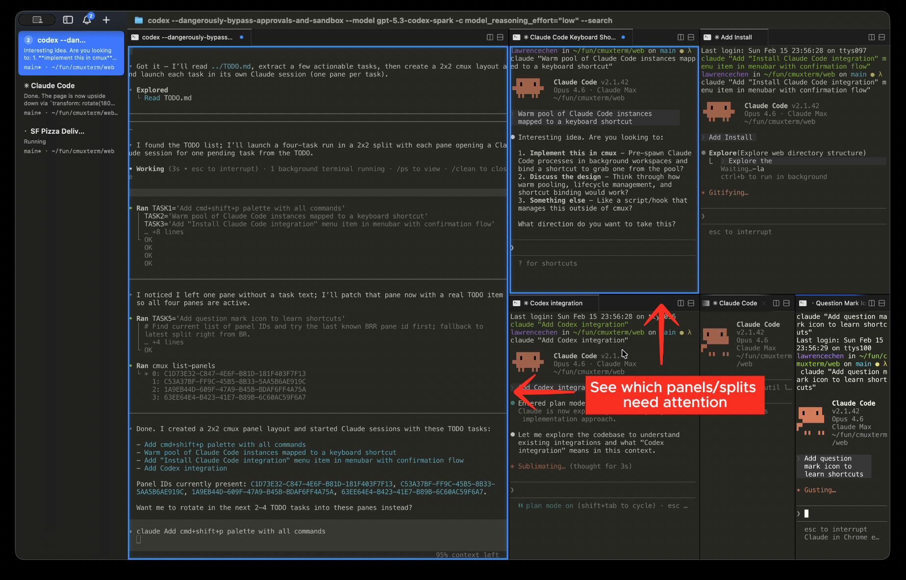
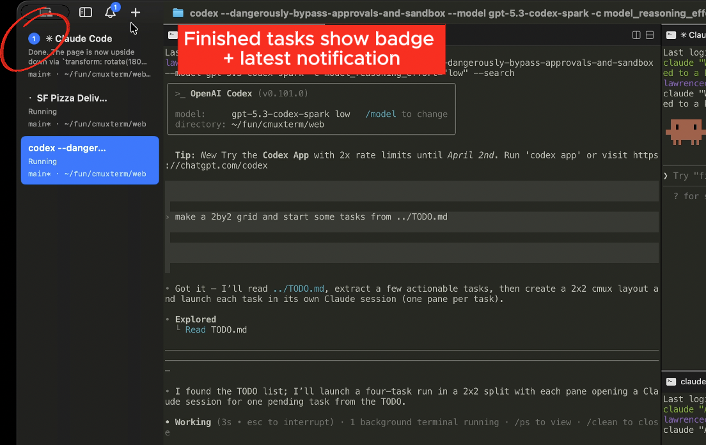
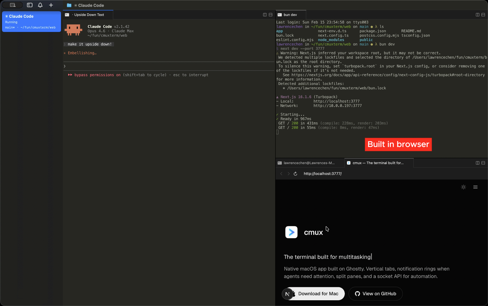
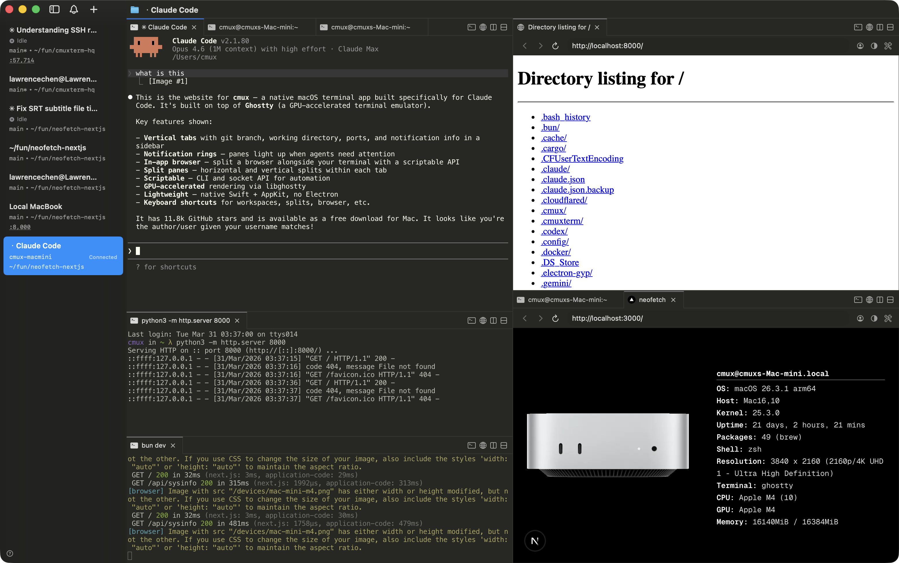
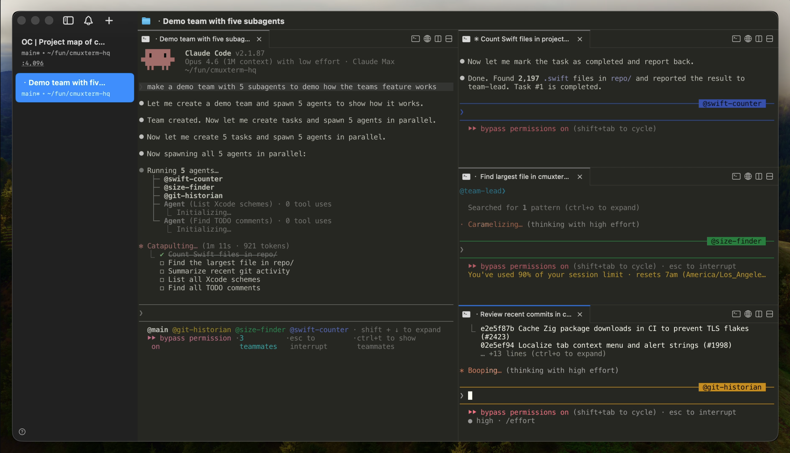

<h1 align="center">cmux</h1>
<p align="center">En Ghostty-baserad macOS-terminal med vertikala flikar och notiser för AI-kodningsagenter</p>

<p align="center">
  <a href="https://github.com/manaflow-ai/cmux/releases/latest/download/cmux-macos.dmg">
    
  </a>
</p>

<p align="center">
<a href="README.md">English</a> | <a href="README.ja.md">日本語</a> | <a href="README.vi.md">Tiếng Việt</a> | <a href="README.zh-CN.md">简体中文</a> | <a href="README.zh-TW.md">繁體中文</a> | <a href="README.ko.md">한국어</a> | <a href="README.de.md">Deutsch</a> | <a href="README.es.md">Español</a> | <a href="README.fr.md">Français</a> | <a href="README.it.md">Italiano</a> | <a href="README.da.md">Dansk</a> | Svenska | <a href="README.pl.md">Polski</a> | <a href="README.ru.md">Русский</a> | <a href="README.bs.md">Bosanski</a> | <a href="README.ar.md">العربية</a> | <a href="README.no.md">Norsk</a> | <a href="README.pt-BR.md">Português (Brasil)</a> | <a href="README.th.md">ไทย</a> | <a href="README.tr.md">Türkçe</a> | <a href="README.km.md">ភាសាខ្មែរ</a> | <a href="README.uk.md">Українська</a>
</p>

<p align="center">
  <a href="https://x.com/manaflowai"></a>
  <a href="https://discord.gg/xsgFEVrWCZ"></a>
</p>

<p align="center">
  
</p>

<p align="center">
  <a href="https://www.youtube.com/watch?v=i-WxO5YUTOs">▶ Demovideo</a> · <a href="https://cmux.com/blog/zen-of-cmux">The Zen of cmux</a>
</p>

## Funktioner

<table>
<tr>
<td width="40%" valign="middle">
<h3>Notisringar</h3>
Paneler får en blå ring och flikar lyser upp när kodningsagenter behöver din uppmärksamhet
</td>
<td width="60%">

</td>
</tr>
<tr>
<td width="40%" valign="middle">
<h3>Notispanel</h3>
Se alla väntande notiser på ett ställe, hoppa till den senaste olästa
</td>
<td width="60%">

</td>
</tr>
<tr>
<td width="40%" valign="middle">
<h3>Inbyggd webbläsare</h3>
Dela en webbläsare bredvid terminalen med ett skriptbart API porterat från <a href="https://github.com/vercel-labs/agent-browser">agent-browser</a>
</td>
<td width="60%">

</td>
</tr>
<tr>
<td width="40%" valign="middle">
<h3>Vertikala + horisontella flikar</h3>
Sidopanelen visar git-branch, länkad PR-status/-nummer, arbetskatalog, lyssnande portar och senaste notistexten. Dela horisontellt och vertikalt.
</td>
<td width="60%">

</td>
</tr>
<tr>
<td width="40%" valign="middle">
<h3>SSH</h3>
<code>cmux ssh user@remote</code> skapar en arbetsyta för en fjärrmaskin. Webbläsarpaneler routas via fjärrnätverket så att localhost fungerar direkt. Dra en bild till en fjärrsession för att ladda upp via scp.
</td>
<td width="60%">

</td>
</tr>
<tr>
<td width="40%" valign="middle">
<h3>Claude Code Teams</h3>
<code>cmux claude-teams</code> kör Claude Codes teammate-läge med ett enda kommando. Teammedlemmar startas som inbyggda delningar med metadata i sidopanelen och notiser. Ingen tmux krävs.
</td>
<td width="60%">

</td>
</tr>
</table>

- **Import av webbläsardata** — Importera cookies, historik och sessioner från Chrome, Firefox, Arc och 20+ webbläsare så att webbläsarpaneler startar autentiserade
- **Anpassade kommandon** — Definiera projektspecifika åtgärder i [`cmux.json`](https://cmux.com/docs/custom-commands) som startas från kommandopaletten
- **Skriptbar** — CLI och socket-API för att skapa arbetsytor, dela paneler, skicka tangenttryckningar och automatisera webbläsaren
- **Native macOS-app** — Byggd med Swift och AppKit, inte Electron. Snabb uppstart, låg minnesanvändning.
- **Ghostty-kompatibel** — Läser din befintliga `~/.config/ghostty/config` för teman, typsnitt och färger
- **GPU-accelererad** — Drivs av libghostty för mjuk rendering

## Installera

### DMG (rekommenderas)

<a href="https://github.com/manaflow-ai/cmux/releases/latest/download/cmux-macos.dmg">
  
</a>

Öppna `.dmg` och dra cmux till mappen Program. cmux uppdateras automatiskt via Sparkle, så du behöver bara ladda ner en gång.

### Homebrew

```bash
brew tap manaflow-ai/cmux
brew install --cask cmux
```

För att uppdatera senare:

```bash
brew upgrade --cask cmux
```

Vid första starten kan macOS be dig bekräfta att du vill öppna en app från en identifierad utvecklare. Klicka på **Open** för att fortsätta.

## Varför cmux?

Jag kör många Claude Code- och Codex-sessioner parallellt. Jag använde Ghostty med en massa delade paneler och förlitade mig på inbyggda macOS-notiser för att veta när en agent behövde mig. Men Claude Codes notistext är alltid bara "Claude is waiting for your input" utan kontext, och med tillräckligt många öppna flikar kunde jag inte ens läsa titlarna längre.

Jag testade några kodningsorkestrerare men de flesta var Electron-/Tauri-appar och prestandan störde mig. Jag föredrar också terminalen eftersom GUI-orkestrerare låser dig till deras arbetsflöde. Så jag byggde cmux som en Native macOS-app i Swift/AppKit. Den använder libghostty för terminalrendering och läser din befintliga Ghostty-konfiguration för teman, typsnitt och färger.

De viktigaste tilläggen är sidopanelen och notissystemet. Sidopanelen har vertikala flikar som visar git-branch, länkad PR-status/-nummer, arbetskatalog, lyssnande portar och den senaste notistexten för varje arbetsyta. Notissystemet fångar upp terminalsekvenser (OSC 9/99/777) och har ett CLI (`cmux notify`) som du kan koppla till agent-hooks för Claude Code, OpenCode med flera. När en agent väntar får dess panel en blå ring och fliken lyser upp i sidopanelen, så jag kan se vilken som behöver mig över delningar och flikar. Cmd+Shift+U hoppar till den senaste olästa.

Den inbyggda webbläsaren har ett skriptbart API porterat från [agent-browser](https://github.com/vercel-labs/agent-browser). Agenter kan ta ögonblicksbilder av accessibility-trädet, hämta elementreferenser, klicka, fylla formulär och köra JS. Du kan dela en webbläsarpanel bredvid terminalen och låta Claude Code interagera direkt med din utvecklingsserver.

Allt är skriptbart via CLI och socket-API — skapa arbetsytor/flikar, dela paneler, skicka tangenttryckningar och öppna URL:er i webbläsaren.

## Zen med cmux

cmux är inte normerande kring hur utvecklare använder sina verktyg. Det är en terminal och webbläsare med ett CLI, och resten är upp till dig.

cmux är en byggsten, inte en färdig lösning. Den ger dig en terminal, en webbläsare, notiser, arbetsytor, delningar, flikar och ett CLI för att styra allt detta. cmux tvingar dig inte in i ett åsiktsdrivet sätt att använda kodningsagenter. Vad du bygger med byggstenarna är ditt.

De bästa utvecklarna har alltid byggt sina egna verktyg. Ingen har ännu kommit fram till det bästa sättet att arbeta med agenter, och teamen som bygger slutna produkter har definitivt inte gjort det heller. Utvecklarna som står närmast sina egna kodbaser kommer att lista ut det först.

Ge en miljon utvecklare komponerbara byggstenar och de kommer tillsammans att hitta de mest effektiva arbetsflödena snabbare än något produktteam kan designa uppifrån och ner.

## Dokumentation

För mer information om hur du konfigurerar cmux, [gå till vår dokumentation](https://cmux.com/docs/getting-started?utm_source=readme).

## Kortkommandon

### Arbetsytor

| Genväg | Åtgärd |
|----------|--------|
| ⌘ N | Ny arbetsyta |
| ⌘ 1–8 | Hoppa till arbetsyta 1–8 |
| ⌘ 9 | Hoppa till sista arbetsytan |
| ⌃ ⌘ ] | Nästa arbetsyta |
| ⌃ ⌘ [ | Föregående arbetsyta |
| ⌘ ⇧ W | Stäng arbetsyta |
| ⌘ ⇧ R | Byt namn på arbetsyta |
| ⌘ B | Växla sidopanel |

### Ytor

| Genväg | Åtgärd |
|----------|--------|
| ⌘ T | Ny yta |
| ⌘ ⇧ ] | Nästa yta |
| ⌘ ⇧ [ | Föregående yta |
| ⌃ Tab | Nästa yta |
| ⌃ ⇧ Tab | Föregående yta |
| ⌃ 1–8 | Hoppa till yta 1–8 |
| ⌃ 9 | Hoppa till sista ytan |
| ⌘ W | Stäng yta |

### Delade paneler

| Genväg | Åtgärd |
|----------|--------|
| ⌘ D | Dela åt höger |
| ⌘ ⇧ D | Dela nedåt |
| ⌥ ⌘ ← → ↑ ↓ | Fokusera panel i riktning |
| ⌘ ⇧ H | Visa fokuserad panel kort |

### Webbläsare

Webbläsarens kortkommandon för utvecklarverktyg följer Safaris standard och kan anpassas i `Settings → Keyboard Shortcuts`.

| Genväg | Åtgärd |
|----------|--------|
| ⌘ ⇧ L | Öppna webbläsare i delning |
| ⌘ L | Fokusera adressfält |
| ⌘ [ | Tillbaka |
| ⌘ ] | Framåt |
| ⌘ R | Ladda om sida |
| ⌥ ⌘ I | Växla utvecklarverktyg (Safari-standard) |
| ⌥ ⌘ C | Visa JavaScript-konsol (Safari-standard) |

### Notiser

| Genväg | Åtgärd |
|----------|--------|
| ⌘ I | Visa notispanel |
| ⌘ ⇧ U | Hoppa till senaste olästa |

### Sök

| Genväg | Åtgärd |
|----------|--------|
| ⌘ F | Sök |
| ⌘ G / ⌘ ⇧ G | Sök nästa / föregående |
| ⌘ ⇧ F | Dölj sökfält |
| ⌘ E | Använd markering för sökning |

### Terminal

| Genväg | Åtgärd |
|----------|--------|
| ⌘ K | Rensa scrollback |
| ⌘ C | Kopiera (med markering) |
| ⌘ V | Klistra in |
| ⌘ + / ⌘ - | Öka / minska textstorlek |
| ⌘ 0 | Återställ textstorlek |

### Fönster

| Genväg | Åtgärd |
|----------|--------|
| ⌘ ⇧ N | Nytt fönster |
| ⌘ , | Inställningar |
| ⌘ ⇧ , | Ladda om konfiguration |
| ⌘ Q | Avsluta |

## Nattliga byggen

[Ladda ner cmux NIGHTLY](https://github.com/manaflow-ai/cmux/releases/download/nightly/cmux-nightly-macos.dmg)

cmux NIGHTLY är en separat app med eget bundle-ID, så den körs sida vid sida med den stabila versionen. Byggs automatiskt från den senaste `main`-committen och uppdateras automatiskt via ett eget Sparkle-flöde.

Rapportera buggar i nattliga byggen via [GitHub Issues](https://github.com/manaflow-ai/cmux/issues) eller i [#nightly-bugs på Discord](https://discord.gg/xsgFEVrWCZ).

## Sessionsåterställning (nuvarande beteende)

Vid omstart återställer cmux för närvarande endast applayout och metadata:
- Fönster-/arbetsyte-/panellayout
- Arbetskataloger
- Terminalens scrollback (i bästa fall)
- Webbläsar-URL och navigeringshistorik

cmux återställer **inte** tillståndet för aktiva processer i terminalappar. Till exempel återupptas aktiva Claude Code-/tmux-/vim-sessioner ännu inte efter omstart.

## Stjärnhistorik

<a href="https://star-history.com/#manaflow-ai/cmux&Date">
 <picture>
   <source media="(prefers-color-scheme: dark)" srcset="https://api.star-history.com/svg?repos=manaflow-ai/cmux&type=Date&theme=dark" />
   <source media="(prefers-color-scheme: light)" srcset="https://api.star-history.com/svg?repos=manaflow-ai/cmux&type=Date" />
   
 </picture>
</a>

## Bidra

Så här kan du engagera dig:

- Följ oss på X för uppdateringar [@manaflowai](https://x.com/manaflowai), [@lawrencecchen](https://x.com/lawrencecchen) och [@austinywang](https://x.com/austinywang)
- Gå med i samtalet på [Discord](https://discord.gg/xsgFEVrWCZ)
- Skapa och delta i [GitHub-issues](https://github.com/manaflow-ai/cmux/issues) och [diskussioner](https://github.com/manaflow-ai/cmux/discussions)
- Berätta för oss vad du bygger med cmux

## Community

- [Discord](https://discord.gg/xsgFEVrWCZ)
- [GitHub](https://github.com/manaflow-ai/cmux)
- [X / Twitter](https://twitter.com/manaflowai)
- [YouTube](https://www.youtube.com/channel/UCAa89_j-TWkrXfk9A3CbASw)
- [LinkedIn](https://www.linkedin.com/company/manaflow-ai/)
- [Reddit](https://www.reddit.com/r/cmux/)

## Founder's Edition

cmux är gratis, öppen källkod och kommer alltid att vara det. Om du vill stötta utvecklingen och få tidig tillgång till det som kommer härnäst:

**[Skaffa Founder's Edition](https://buy.stripe.com/3cI00j2Ld0it5OU33r5EY0q)**

- **Prioriterade funktionsönskemål/buggfixar**
- **Tidig tillgång: cmux AI som ger dig kontext för varje arbetsyta, flik och panel**
- **Tidig tillgång: iOS-app med terminaler synkade mellan dator och mobil**
- **Tidig tillgång: Cloud VMs**
- **Tidig tillgång: Voice mode**
- **Mitt personliga iMessage/WhatsApp**

## Licens

cmux är öppen källkod under [GPL-3.0-or-later](LICENSE).

Om din organisation inte kan följa GPL finns en kommersiell licens tillgänglig. Kontakta [founders@manaflow.com](mailto:founders@manaflow.com) för mer information.
