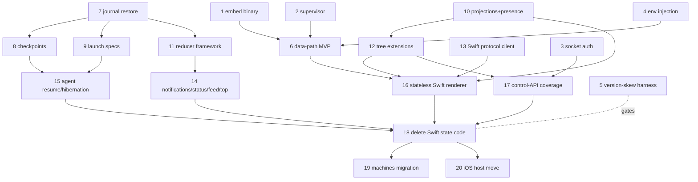

# GUI frontend migration

Status: draft, accepted direction (2026-08-18).

This document owns the migration of the Swift macOS GUI onto the cmux-tui
daemon. The daemon becomes the true owner of most application state; Swift
becomes a renderer plus macOS integration and deprecates as much of its own
state code as possible. The WebKit browser stays Swift. The spec records the
agreed decisions, restart-survival tiers, state ownership, core primitives,
and the build graph. Contracts already owned by other specs are referenced,
not restated.

## Decisions

1. Session mapping: one daemon session per app instance, named by build tag
   (`main` for release, `<tag>` for dev builds).
2. Supervisor: a launchd user agent owns the daemon. The GUI never parents it.
3. Layout: the daemon tree is canonical. Swift renders it. No Swift layout
   state.
4. Data path: the shipped data path is the native CMTH renderer in GhosttyKit
   (see [`terminal-host.md`](terminal-host.md)). A PTY-in-PTY bridge
   (`cmux-tui attach --terminal <id>` as the Ghostty surface command) exists
   only as a throwaway tier-A spike behind a dev flag; it never ships.
   Deletion criterion: the bridge is removed when the native CMTH data-path
   MVP (item 6) lands, and no bridge code appears in a release build.
5. Durable key: the cmux-tui `terminal_id` is the identity everywhere. Swift
   surface IDs become derived.
6. CLI: the cmux-tui noun-first CLI (`cmux.protocol/2`, see
   [`cli.md`](cli.md) and [`resource-api-v2.md`](resource-api-v2.md)) is
   canonical. The Swift socket keeps GUI-render verbs during migration only.
   Swift gets a native typed protocol client via codegen, not a Rust client
   library for control.
7. Browser: WebKit stays Swift. The daemon holds an opaque placeholder
   resource per browser panel so layout and persistence stay in the tree.
8. Persistence: the daemon journal
   ([`session-journal.md`](session-journal.md)) is the only store.
   `AppSessionSnapshot` is deleted, not bridged.

## Restart survival tiers

- Tier A (quit the GUI, update Swift): free once the daemon is
  launchd-supervised. The daemon and per-PTY hosts keep running; a new GUI
  reattaches.
- cmux-tui update: daemon handoff. `shutdown-daemon` exits the old daemon and
  the replacement adopts running terminal hosts. PTYs survive. Invariant to
  test: CMTH version compatibility between the new daemon and old hosts still
  running the previous binary ([`terminal-host.md`](terminal-host.md)).
- Tier B (macOS reboot): the journal replays topology, terminal checkpoints
  restore renderable scrollback, shells respawn with cwd and env, and agents
  relaunch with native `--resume` under the approval policy.

## Resize and layout sharing

The policy is already specified in
[`session-journal.md`](session-journal.md#focus-layout-resize-and-content)
and [`native-frontend.md`](native-frontend.md):

- Journaled, shared, replayable intent: split tree, committed split ratios,
  committed viewport column widths, pane and tab ordering, zoom and stack
  modes, canonical grid size, active workspace, screen, pane, and tab.
- Frontend-scoped, never session authority: client window size, mirrored
  viewport, hover, drag preview, selection, scroll position.
- Drag resize: frontends coalesce raw pointer samples and append one final
  accepted mutation (no-op receipts allowed). Animation records intent and
  settlement, not frames.

Consequently a settled pane resize is persisted to the journal and shared
across frontends as a proportional ratio, not pixels. Live drag stays
client-side. Pixel and viewport geometry (mac window frames, dock width) live
in the frontend projection as a restoration preference only.

## SSH persistence: cmux-tui replaces cmuxd-remote

cmux-tui is the better fit. It already has the remote daemon story (Noise,
Iroh, WebSocket, relay, device enrollment, machines; see
[`remote-daemon.md`](remote-daemon.md)) plus per-PTY hosts and the same
journal and checkpoint recovery remotely. cmuxd-remote duplicates PTY
persistence, attach and detach, and tmux compatibility in a second codebase
with none of the journal recovery. Converging removes a whole Go daemon.

Caveats before flipping: cmuxd-remote is battle-tested in the `cmux ssh`
bootstrap and is a small static Go binary; cmux-tui needs cross-compiled
Rust plus Zig (ghostty-vt) artifacts per remote platform, and the bootstrap
and size story must match. Phase 1 keeps cmuxd-remote. The machines migration
is its own project with a tmux-compat corpus parity gate
([`daemon/remote/TMUX_CORPUS.md`](../../daemon/remote/TMUX_CORPUS.md)).

## State ownership

| State | Owner | cmux-tui work needed | Today |
|---|---|---|---|
| PTY, child process, VT state, scrollback, kitty graphics | daemon (per-PTY host) | none | done |
| Terminal identity (`terminal_id`) | daemon | none; Swift adopts as durable key | done |
| Split trees, panes, tabs, screens, niri columns | daemon | tree events complete enough for a stateless Swift renderer | done (core) |
| Committed split ratios and column widths | daemon journal | none (specified and journaled) | done |
| Live drag, hover, scroll, selection | frontend (ephemeral) | presence stream for following | partial |
| Workspaces | daemon | add groups, pinning, ordering | partial |
| Windows (GUI windows, workspace membership) | daemon | window resource, `(frontend_id, window_id)` typed projections plus generation fencing (specified) | pending |
| Dock (right-sidebar tree per workspace) | daemon | first-class secondary region | missing |
| Non-terminal panels (markdown, todo, canvas, file preview) | daemon | generic panel resource types | missing |
| WebKit browser panels | Swift renders; daemon placeholder resource | opaque placeholder resource type | missing |
| CDP browser panes (tui) | daemon | none; unused by mac GUI | done |
| Presentation prefs (focus, scroll, sidebar widths, window frames) | frontend projection in daemon SQLite | typed presentation-only projections | partial |
| Topology persistence (replaces `AppSessionSnapshot`) | daemon journal | finish journal-based full restore (specified) | pending |
| Reboot scrollback recovery | daemon | terminal checkpoints | pending |
| Daemon-update survival | daemon | versioned CMTH host compat, tested | partial |
| Daemon lifecycle | launchd | detached `server start` under supervisor | missing |
| Per-workspace env plus `CMUX_*` identity injection | daemon | env contract on `terminal create` | missing |
| Agent resume (`--resume`, approval policy) | daemon | port from Swift (`RestorableAgentSession`) | missing |
| Agent hibernation | daemon | port memory-pressure kill and restore | missing |
| Agent hook events | daemon journal | extend to feed status lanes | partial |
| Notification store, history, gating | daemon | durable store plus gating; GUI renders and posts to Notification Center | missing (events only) |
| Status lanes, Feed, `top` agent detection | daemon | port process-tree and prompt-turn detection | missing |
| Control API for GUI verbs (`read-screen`, `send-key`, `surface-health`, pills) | daemon (`cmux.protocol/2`) | cover the Swift CLI contract ([`docs/cli-contract.md`](../../docs/cli-contract.md)) | partial |
| Socket auth | daemon | password or keychain-equivalent local auth | missing |
| Config, keyboard shortcuts (`cmux.json`) | daemon serves; Swift renders settings UI | adopt or map the GUI config schema | partial |
| SSH and remote workspace persistence | cmuxd-remote now, tui machines later | machines migration plus tmux-compat parity gate | deferred |
| iOS streaming host | daemon (`terminal-bytes-v1`) | move the host role from the mac app to the daemon | partial |
| Rendering, input, IME, TCC, Notification Center posting | Swift | none | n/a |

Reverse parity: Swift must also gain screens, niri viewport columns,
`SplitId` dividers, multi-placement tabs, and layout undo rendering.

## Core abstractions

The journal is the model: one generic primitive, many features fall out.
These six are built as primitives; features then become thin.

| Primitive | What it is | Powers | Status |
|---|---|---|---|
| Journal | Append-only authoritative intent log; replay classes (required, advisory, never), receipts, authorization envelope ([`session-journal.md`](session-journal.md)) | everything durable | exists; full restore pending |
| Checkpoint | Materialized state snapshot that bounds replay (journal is intent, checkpoint is state) | reboot scrollback recovery, fast restore, reducer snapshots | missing |
| Reducer (materialized view) | Durable derived state over journal events with its own cursor and snapshot | notification store, status lanes, Feed, agent-session ledger | missing; highest leverage |
| Launch spec (respawn contract) | Journaled replayable recipe to (re)start a child: cmd, cwd, env, resume-arg derivation | tier-B shell respawn, agent `--resume`, hibernation; replaces Swift `AgentRelaunchCommandBuilder` as data, not code | missing |
| Typed frontend projection | Generation-fenced `(frontend_id, window_id)` presentation doc ([`native-frontend.md`](native-frontend.md)) | mac windows, presentation prefs, follow | specified, pending |
| Presence stream | Ephemeral lease-scoped live state that dies with its connection (view-size leases, hover, drag, follow); the deliberate anti-journal | live resize, following, no paint-rate data in the journal | specified, partial |

Supporting: adoptable hosts (exists for PTY; reuse, do not generalize early),
principal and lease auth envelope (the journal has it; extend to the local
socket), capability negotiation plus a version-skew test harness (CMTH
old host, new daemon).

## Build table

| # | Item | Rides on | Depends on | Where |
|---|---|---|---|---|
| 1 | Embed pinned cmux-tui artifact in the app bundle | GhosttyKit packaging pattern | none | hq/cmux build |
| 2 | Detached `server start` plus launchd supervisor | adoptable hosts | none | tui |
| 3 | Local socket auth (principals) | auth envelope | none | tui |
| 4 | Env and identity injection on `terminal create` | resource model | none | tui |
| 5 | Version-skew harness (CMTH host and daemon) | capability negotiation | none | tui CI |
| 6 | Data-path MVP behind a beta flag (attach bridge or native CMTH) | terminal-bytes / attach | 1, 2, 4 | swift |
| 7 | Journal full restore (replay engine) | journal | none | tui |
| 8 | Terminal checkpoints | checkpoint | 7 | tui |
| 9 | Launch specs | journal | 7 | tui |
| 10 | Typed projections plus presence stream | projection, presence | none | tui |
| 11 | Reducer framework | journal | 7 | tui |
| 12 | Tree extensions: window resource, dock region, panel resources, WebKit placeholder | resource model | 10 (windows) | tui |
| 13 | Swift `cmux.protocol/2` client (typed codegen) | protocol spec | none | swift |
| 14 | Notification store, status lanes, Feed, top | reducer | 11 | tui |
| 15 | Agent resume plus hibernation plus approval policy | launch spec, checkpoint | 8, 9 | tui |
| 16 | Stateless Swift renderer (incl. screens, niri columns, SplitId, multi-placement tabs, layout undo) | projections plus tree | 6, 10, 12, 13 | swift |
| 17 | Control-API coverage of [`docs/cli-contract.md`](../../docs/cli-contract.md) | resource model | 3, 12 | tui |
| 18 | Delete `AppSessionSnapshot` plus Swift layout, persistence, and agent code | none | 14, 15, 16, 17 | swift |
| 19 | Machines migration (retire cmuxd-remote), tmux-corpus parity gate | machines | 18 stable | tui |
| 20 | iOS host moves to the daemon | terminal-bytes-v1 | 18 stable | tui/ios |

## Build order

Parallel lanes: items 1 to 5 are the foundation lane; 7, 8, 9, 11 the journal
lane; 10, 12 the tree lane; 13, 6 the Swift lane. Critical path to "quit and
update Swift" (tier A): 1, 2, 6. Critical path to reboot recovery (tier B):
7, 8, 9, 15. Critical path to deprecating Swift state code: 10, 12, 16, 18.

## Starting slice

Four parallel tracks, each independently PR-able:

1. Migration spec: this document. First, cheapest, unblocks assignment.
2. Item 7, journal full restore: the longest lead-time dependency (8, 9, 11,
   and 15 all sit behind it), pure tui, no mac coupling.
3. Items 1 and 2, packaging plus supervisor: embed the pinned artifact
   (GhosttyKit pattern) and detached `server start` under launchd. The only
   blockers for tier A.
4. Tier-A spike (throwaway, dev flag only): daemon `terminal create` plus a
   Ghostty surface running `cmux-tui attach --terminal <id>`; quit the GUI,
   relaunch, shell alive. Validates supervision, reattach, and exit semantics
   in days. Subject to the decision 4 deletion criterion above.

Not first: reducers, tree extensions, notifications, and the agent block.
That work is large and cheaper after restore and projections land.
