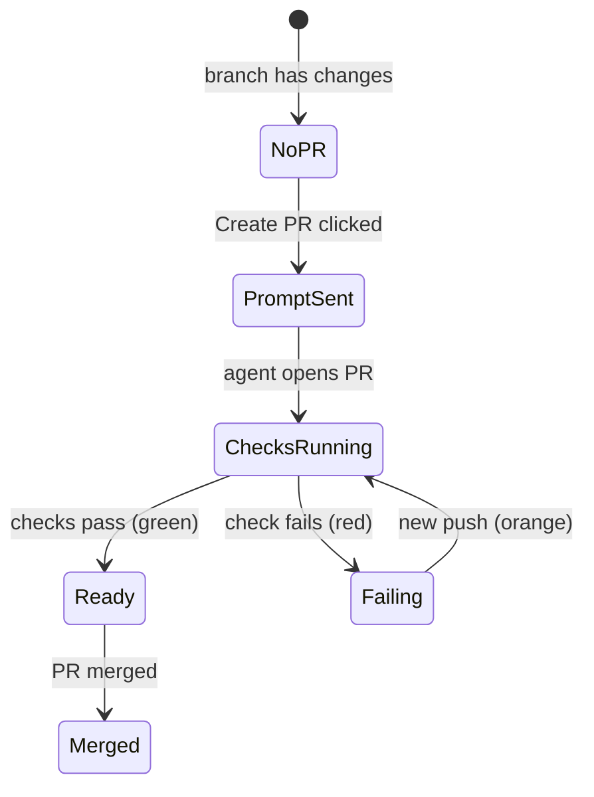

# Live Changes Panel with PR Sync

## Summary

Add a live **Changes** tab to the right sidebar showing the workspace's changed files versus its base branch — committed plus uncommitted — with per-file and total +/− line counts. Clicking a file opens the existing diff viewer jumped to that file. A header above the list shows the linked PR's live status (color-coded by CI state) or a **Create PR** button that posts a PR-creation prompt into the workspace's agent session.

---

## Problem Frame

cmux users running coding agents accumulate changes across a session but have no at-a-glance view of what changed. The Files tab colors changed files, but they are scattered through the full tree with no line counts and no way to see only the changes. The diff viewer exists but must be invoked manually per look. Conductor's Changes panel solves this with a live changed-files list, +/− counts, PR status, and one-click PR creation — and that workflow is the model here.

---

## Key Decisions

- **Baseline is the branch's merge-base with the default branch, plus uncommitted changes.** This is PR-shaped: agents commit as they go, and an uncommitted-only view would empty at every commit.
- **The view is a new right-sidebar tab**, a sibling of Files / Find / Vault, with the same pop-out-as-pane ability.
- **Row click opens the full branch diff scrolled to that file**, reusing one viewer panel across clicks, rather than per-file diffs — preserves the scroll-through-everything review flow.
- **Create PR prompts the agent rather than calling `gh` directly.** The agent has full session context and writes a better title and description than a templated call.
- **Reuse existing surfaces**: the diff viewer (with its review comments), the file-watcher refresh pattern, the git-status color palette, and the PR polling pipeline — extended with CI check state, which is not fetched today.

---

## Requirements

**Changes list**

- R1. A Changes tab appears in the right sidebar alongside Files, Find, and Vault, scoped to the focused workspace's working directory.
- R2. The list contains only changed files: everything differing from the merge-base with the repository's default branch, covering committed, staged, unstaged, and untracked changes.
- R3. Each row shows the file path, change status (added / modified / deleted / renamed / untracked), and line counts as `+N −M`.
- R4. A totals line shows changed-file count and aggregate +/− counts.
- R5. The list updates live as edits and commits land, without manual refresh.
- R6. Clicking a row opens the diff viewer with the full branch diff scrolled to that file; subsequent clicks reuse the same viewer panel.
- R7. Row status colors match the Files tab's existing git-status coloring.
- R8. A workspace directory that is not a git repository shows an explanatory empty state.

**PR header and Create PR**

- R9. When the branch has no associated PR, the header shows a Create PR button.
- R10. Create PR posts a PR-creation prompt into the workspace's focused (most recently active) agent terminal; the agent pushes the branch and creates the PR.
- R11. When a PR exists for the branch, the header shows the PR number and state, linking to the PR.
- R12. The header color reflects live CI state: orange while checks run, green when all checks pass, red when a check fails.
- R13. PR state and CI state refresh automatically while the panel is visible.
- R14. On the default branch itself, the PR header area is hidden; the list shows uncommitted changes only.

---

## Key Flows

- F1. Review loop
  - **Trigger:** An agent (or the user) edits files in the workspace.
  - **Steps:** List updates with new counts; user scans the totals; user clicks a file; diff viewer opens jumped to that file; user reviews and optionally leaves comments.
  - **Covers:** R2–R7.
- F2. Create PR
  - **Trigger:** Branch has changes and no PR; user clicks Create PR.
  - **Steps:** Prompt posts into the focused agent terminal; agent pushes and opens the PR; on the next refresh the header swaps to PR number + status.
  - **Covers:** R9–R11, R13.
- F3. CI sync
  - **Trigger:** PR open with checks running.
  - **Steps:** Header shows orange; checks complete; header turns green (or red on failure) without user action.
  - **Covers:** R12–R13.

---

## Acceptance Examples

- AE1. **Covers R2.** Given an agent commits mid-session, when the commit lands, then the committed files remain in the list with unchanged counts.
- AE2. **Covers R2, R3.** Given a new untracked file with 40 lines, then it appears as untracked with `+40 −0`.
- AE3. **Covers R14.** Given the workspace is on the default branch, then the list shows only uncommitted changes and no PR header renders.
- AE4. **Covers R8.** Given the workspace directory has no git repository, then the tab shows an empty state instead of an error.
- AE5. **Covers R12.** Given a PR whose checks are still running, then the header is orange; when the last check passes, it turns green.

---

## Scope Boundaries

- No Checks tab (per-check CI list) — CI appears only as the header color.
- No Review mode — review comments already exist inside the diff viewer.
- No git actions from the panel (stage, unstage, commit, discard) — the panel is a viewer.
- No base-branch picker — the default branch is auto-detected.
- No change-count badges on left-sidebar workspace rows.
- No agent-terminal target picker for Create PR — focused terminal only in v1.

---

## Dependencies / Assumptions

- GitHub auth reuses the existing token probing (`GH_TOKEN` / `gh auth token`). Without auth, the PR header degrades gracefully; Create PR still works since the agent performs the creation.
- CI check state is not fetched by the current PR polling (verified: it tracks open/merged/closed only) and must be added.
- Line counts are net-new data: nothing in the app computes per-file added/deleted counts today (verified).
- Assumption: the focused agent terminal is an acceptable Create PR target; the existing pending-submission path used by diff review comments is the precedent for posting text into agent sessions.

---

## Outstanding Questions

**Deferred to planning**

- Poll cadence and API choice for CI check state, relative to the existing 15-second PR poll cache.
- Exact wording of the Create PR prompt.
- Behavior on detached HEAD (likely: treat as uncommitted-only, hide PR header).

---

## Sources / Research

- `Sources/RightSidebarPanelView.swift` — `RightSidebarMode` enum; insertion point for the new tab.
- `Sources/FileExplorerStore.swift` — git status fetch, debounced file-watcher refresh, and the git-status color palette to reuse.
- `Packages/CmuxFileWatch` — the debounced directory watcher pattern.
- `Packages/CmuxGit` — `GitMetadataService` (watched `.git` paths for cheap change detection) and `PullRequestProbeService` (PR polling to extend with check state).
- `CLI/cmux_open.swift` and `webviews/src/diff-stream.ts` — the diff viewer; the webview already computes per-file +/− stats when rendering a patch.
- `Sources/Panels/DiffCommentsBridge.swift` and `DiffCommentSubmissionPool` — existing path for queuing text into agent sessions; precedent for the Create PR prompt.
