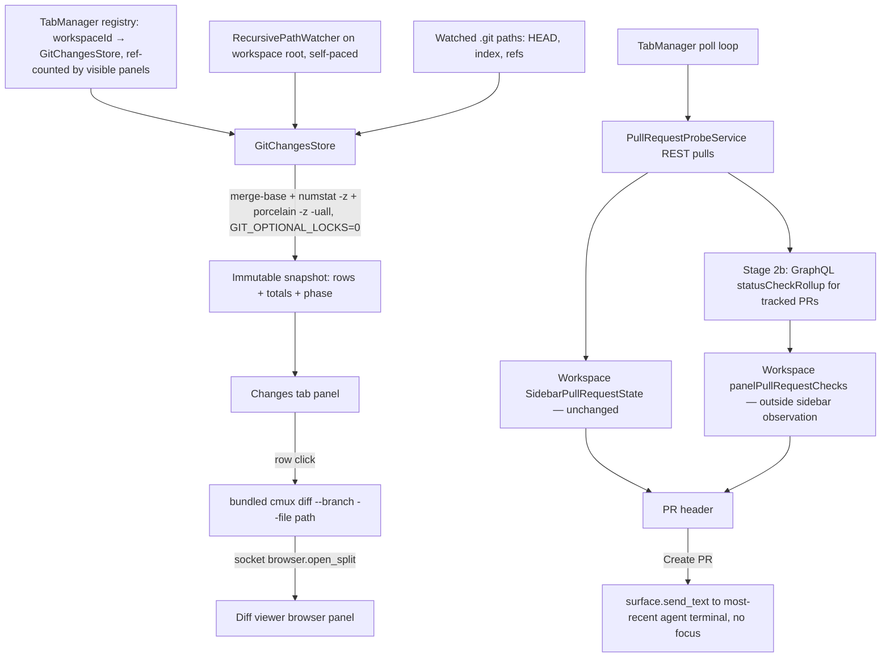
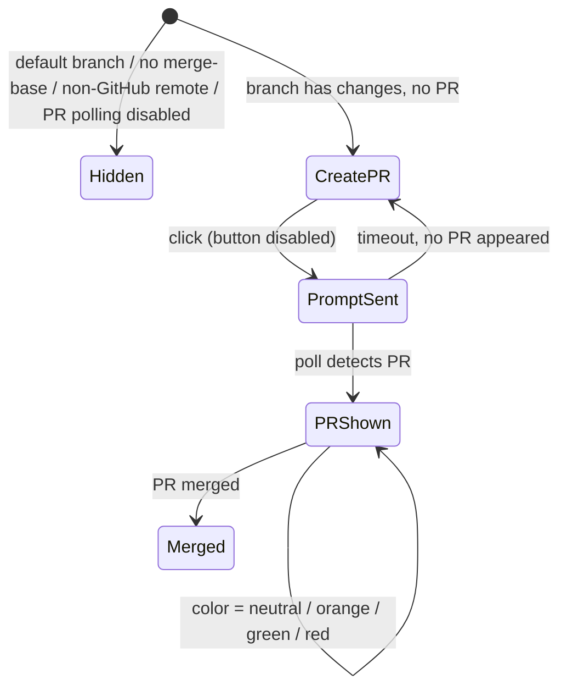

# feat: Live Changes panel with PR sync

## Summary

Add a `changes` mode to the right sidebar: a live list of files changed versus the merge-base with the default branch (plus uncommitted and untracked), each with `+N −M` line counts and a totals header. Clicking a row opens the existing diff viewer scrolled to that file. A header shows the linked PR color-coded by CI state (via GitHub GraphQL `statusCheckRollup`), or a Create PR button that posts a prompt into the workspace's most-recently-active agent terminal.

---

## Problem Frame

Agents commit work throughout a session, but cmux has no at-a-glance view of what changed — the Files tab colors changed files inside the full tree without line counts, and the diff viewer must be invoked manually. The origin document models the fix on Conductor's Changes panel (see origin: docs/brainstorms/2026-06-11-changes-panel-requirements.md).

---

## Requirements

R1–R14 carry forward from the origin document (R6, R8, and R13 carry plan-level refinements: the viewer-reuse condition, additional list states, and polling exceptions); R15+ were added by flow analysis and research.

**Changes list**

- R1. A Changes tab appears in the right sidebar alongside Files / Find / Vault, scoped to the focused workspace's working directory.
- R2. The list contains only changed files: everything differing from the merge-base with the default branch, covering committed, staged, unstaged, and untracked changes (individual files, not collapsed directories).
- R3. Each row shows the repo-root-relative path, change status (added / modified / deleted / renamed / untracked), and `+N −M` counts.
- R4. A totals line shows changed-file count and aggregate +/− counts.
- R5. The list updates live as edits and commits land — including edits deep in the tree — without manual refresh.
- R6. Clicking a row opens the diff viewer with the full branch diff scrolled to that file; subsequent clicks reuse the workspace's existing diff-viewer panel when one is still showing a diff.
- R7. Row status colors match the Files tab's existing git-status palette.
- R8. A non-git workspace directory shows an explanatory empty state; a clean branch shows a distinct "no changes" state; initial load shows a loading state.

**PR header and Create PR**

- R9. When the branch has no associated PR, the header shows a Create PR button.
- R10. Create PR posts a PR-creation prompt into the workspace's most-recently-active agent terminal; the agent pushes the branch and creates the PR.
- R11. When a PR exists for the branch, the header shows the PR number and state, linking to the PR.
- R12. The header color reflects CI state: orange while checks run, green when all checks pass, red when a check fails.
- R13. PR state and CI state refresh automatically while the panel is visible; a hidden panel suspends accelerated polling and refreshes on re-select. Accepted exceptions: refresh deferral during mobile-host activity, and the user-level PR-polling toggle (R30).
- R14. On the default branch, the PR header area is hidden and the list shows uncommitted changes only.
- R15. Without a usable GitHub token, or when the head commit has no checks (`statusCheckRollup == null`), the header renders neutral — never green or red. PR number/state still show when the existing REST polling knows them.
- R16. Create PR targets agent terminal sessions only; when the workspace has no agent terminal, the button is disabled with an explanatory tooltip.
- R17. After a Create PR click, the button enters a disabled "prompt sent" state until the PR appears via polling or a timeout elapses; repeated clicks — from any window or pane showing the workspace — never queue duplicate prompts. If the send path queues because the terminal is busy, the queued send still counts as sent.
- R18. Non-GitHub or absent remotes hide the entire PR header (including Create PR); the list keeps working.
- R30. When the user has disabled PR polling in Settings (`pullRequestPollingEnabled` off), the PR header is hidden; the list keeps working.

**Robustness and lifecycle**

- R19. Binary files show a binary marker instead of counts and are excluded from line totals.
- R20. Renames render as one row (`old → new`) with the rename diff's counts.
- R21. Submodule pointer changes render as a submodule row without line counts.
- R22. When no merge-base resolves (unborn HEAD, shallow clone, unrelated histories, no detectable default branch), the list degrades to uncommitted + untracked changes and the PR header is hidden.
- R23. Worktree checkouts (`.git` as a file) work; the panel root follows the workspace `currentDirectory`'s resolved repo root.
- R24. Refreshes are single-flight with trailing coalescing; results from a superseded root or branch are discarded.
- R25. Branch switches, rebases, and commits re-resolve the merge-base, list, and PR header automatically (`.git` paths are watched).
- R26. Remote (SSH) workspaces show a dedicated "Changes is not yet available for remote workspaces" state — not the non-repo state.
- R29. The git watcher and refresh loop run only while a Changes panel is visible (sidebar or open pane, any window); re-selecting the tab triggers one immediate refresh.

**Platform policy**

- R27. The tab has a keyboard shortcut registered in `KeyboardShortcutSettings`, editable in Settings, configurable via `~/.config/cmux/cmux.json`, and documented.
- R28. Every new user-facing string is localized (en + ja) in `Resources/Localizable.xcstrings`.

---

## Key Technical Decisions

- **New `GitChangesStore` spawning git directly, read-only by construction.** Composition per refresh: `git merge-base HEAD <base>`, `git diff --numstat -z <merge-base>`, `git status --porcelain -z -uall`. Every spawn sets `GIT_OPTIONAL_LOCKS=0`: without it, background `status`/`diff` opportunistically rewrite `.git/index`, which (a) re-fires our own `.git` watcher in a self-perpetuating loop and (b) takes `index.lock` races against the agent's own git commands. `-z` everywhere (renames arrive as two NUL-separated paths; `core.quotepath` escaping never fires); `-uall` because default porcelain collapses untracked directories to `dir/`, breaking R2. Git runner gets a ~10s timeout and SIGTERM cancellation on generation change — safe because every command is read-only (`ProcessTerminationGate` precedent in `Sources/FileExplorerStore.swift`; the `runGit` it otherwise mirrors blocks on `waitUntilExit` forever — do not copy that).
- **Split the composition by trigger source.** Merge-base and default-branch only change on `.git` events — resolve and cache them on `.git`-watcher fires; workspace-tree fires run only `numstat` + `status`.
- **Default-branch resolution chain:** `git symbolic-ref --quiet --short refs/remotes/origin/HEAD` → local `main`/`master` heads → no base (uncommitted-only mode, header hidden). Never `git remote show origin` in the refresh path (network call). Port from the CLI's `resolvedGitBranchDiffBaseRef` (`CLI/cmux_open.swift`). The panel's resolved base is the single authority for header visibility — a deliberate divergence from `PullRequestProbeService.shouldSkipLookup`'s hardcoded main/master.
- **Untracked line counts computed in-process, not via subprocess.** An untracked file's numstat is its newline count plus git's NUL-in-first-8000-bytes binary sniff; read and count on the utility queue with a per-`(path, size, mtime)` cache so unchanged files are never recounted. Skip counts above ~1MB (row renders without counts); cap enumeration, not just counting. Replaces per-file `git diff --no-index` (≈10ms/spawn → ~2s at 200 files, and it fails outright on symlink paths). Never `git add -N` — it mutates the index.
- **Watcher: `RecursivePathWatcher` (FSEvents), not `FileWatcher`.** `FileWatcher` is a single-fd kqueue watch that fires only for direct children of the root — deep edits would never refresh the list and R5 silently fails. `RecursivePathWatcher` (already used by TabManager for `.git` metadata) throttles leading-edge and keeps yielding during sustained churn, so pair it with self-pacing: next refresh no earlier than `max(300ms, 3 × last refresh wall time)`, resetting after a quiet window. This bounds refresh duty to roughly a third of one core regardless of repo size.
- **Publish-on-change snapshots.** The store publishes one immutable snapshot struct (rows + totals + phase) through a single `@Published` property; old vs new compared off-main and the main hop skipped entirely when equal. Do not copy `refreshGitStatus`'s unconditional whole-dictionary assignment — that per-cycle `objectWillChange` pattern is what issue #2586 and the reverted sidebar-capping work paid for.
- **Store ownership: a TabManager-owned registry `[workspaceId: GitChangesStore]`.** View ownership (the `FileExplorerStore` precedent — one per ContentView plus one per pop-out pane) cannot dedupe across windows; generation tokens inside a view-owned store only protect that instance. Lifecycle: lazy creation on first attach; ref-counted observers across sidebar(s) and pane(s) in all windows; watcher and refresh fully suspended at zero observers (R29); teardown on workspace close or remote transition. This deliberately diverges from the FileExplorerStore precedent; TabManager already owns per-workspace git machinery (`workspaceGitMetadataWatchersByKey`).
- **CI state via a bounded GraphQL query, modeled separately from the REST items.** `performRequest` in CmuxGit is GET-only with a hardcoded REST URL — add a sibling POST GraphQL helper, reusing `authHeaderValue()`. Query only the tracked PRs (aliased `repository { pullRequest(number:) }` fields with `commits(last:1) { commit { oid statusCheckRollup { state } } }`, `mergeable`, `mergeStateStatus`, `isDraft`, `rateLimit`) — never "all open PRs", which is unbounded and would re-implement selection. New `PullRequestCheckState` model cached as `checkStatesByHeadSHA` on `WorkspacePullRequestRepoCacheEntry` (the REST `GitHubPullRequestProbeItem` stays REST-pure); merged into `WorkspacePullRequestResolvedItem` at the existing stage 3. The probe is declared stage 2b of the pipeline, issued inside the per-repo-slug fetch path so the existing global single-flight refresh task and 3-keys-per-cycle batching dedupe it for free. Cache rule: terminal rollups (SUCCESS/FAILURE/ERROR) are long-lived per head SHA; non-terminal (PENDING/EXPECTED/null) are fresh only within the 15s `repoCacheLifetime`.
- **Check state publishes outside the sidebar observation stream.** A new `@Published` property on `Workspace` (e.g., `panelPullRequestChecks`), deliberately excluded from `makeSidebarObservationPublisher()` — that publisher dedupes on the whole Equatable state, so CI transitions and `mergeStateStatus` flaps would otherwise invalidate left-sidebar rows that render none of it (the typing-latency hazard family of #2586). Leave a comment in `Sources/WorkspaceSidebarObservation.swift` stating the exclusion is intentional. Folding CI color into sidebar badges is a future deliberate decision.
- **Color mapping:** rollup `SUCCESS` → green, `PENDING`/`EXPECTED` → orange, `FAILURE`/`ERROR` → red, `null` or no token → neutral. `mergeable: UNKNOWN` keeps the current color (GitHub computes it lazily). Review-aware green (`mergeStateStatus == CLEAN`) is deferred; the field is fetched and stored for that follow-up.
- **Row click opens the diff viewer through the bundled CLI** (`launchDiffViewerProcess` pattern in `Sources/AppDelegate.swift`), passing `diff --branch --file <path>`. A pure-Swift diff-HTML path does not exist; the CLI already implements merge-base branch diffs. `--file` is a new CLI flag flowing into `DiffViewerConfig` (`webviews/src/types.ts`) and an initial `scrollToItem` effect in `webviews/src/App.tsx` — the in-page scroll primitive already exists.
- **Create PR via the `surface.send_text` socket method** (`TerminalController.shared.handleSocketLine`, the Feed pattern at `Sources/Feed/FeedCoordinator.swift`), per the shared-behavior policy. `surface.send_text` is a non-focus command — the button must not focus or raise the agent terminal (socket policy). Target selection: most-recently-active *agent* session in the workspace (agent kind is known per terminal) — never a plain shell, where the prompt text would execute as commands. The "prompt sent" pending state lives in the workspace-scoped store, not the view, so two windows showing the same workspace cannot double-send.
- **Snapshot boundary for the file list.** Rows receive immutable value snapshots (`path, status, added, deleted`) plus a closure bundle; no `ObservableObject` below the `ForEach`; rows are `Equatable` and applied with `.equatable()`. Reference: `IndexSectionActions` in `Sources/SessionIndexView.swift`.

---

## High-Level Technical Design

PR header states (extends the origin state diagram with the degraded and transitional states):

---

## System-Wide Impact

- **Left-sidebar observation stream.** `SidebarPullRequestState` is untouched; check state flows through a separate published property excluded from `makeSidebarObservationPublisher()`. CI polling must never invalidate sidebar rows.
- **TabManager.** Gains the store registry plus a visibility register/unregister API — one ref-count serves both the git-refresh lifecycle (R29) and CI-poll cadence (R13). The existing global PR refresh task, per-repo-slug grouping, and cache stay the orchestration backbone; the GraphQL leg rides inside it.
- **PR polling Settings toggle.** `pullRequestPollingEnabled` off bails the poll loop and clears PR metadata — the header hides (R30) rather than showing stale or unknowable state.
- **`FileExplorerRootSyncPolicy` is not reused.** It gates the *FileExplorerStore* (the file tree, which Changes does not render); `.changes` returns false there, and the Changes store attaches through its own registry path. Setting it true would make the file-explorer store burn git/FS work whenever the Changes tab is visible.
- **Session restore.** Pop-out panes persist mode via `SessionRightSidebarToolPanelSnapshot` (unknown raw values decode to nil — downgrade-safe). A restored Changes pane must attach to the registry at launch.
- **Socket policy.** `surface.send_text` is non-focus; Create PR preserves focus. If the terminal is busy the send path queues — queued still counts as sent for R17.
- **Index safety.** `GIT_OPTIONAL_LOCKS=0` keeps the store from racing the agent's git commands for `index.lock` and from re-triggering its own watcher.

---

## Implementation Units

### U1. Changed-files data layer

- **Goal:** A registry-owned, per-workspace `GitChangesStore` producing live changed-file snapshots with line counts, bounded under agent churn.
- **Requirements:** R2–R5, R14 (list half), R19–R25, R29. Realizes origin F1 (data half).
- **Dependencies:** none.
- **Files:** `Sources/GitChangesStore.swift` (new: store, git runner, parsers, default-branch resolver, untracked counter), `Sources/TabManager.swift` (registry + visibility registration), `cmuxTests/GitChangesStoreTests.swift` (new; wire into `cmux.xcodeproj/project.pbxproj`).
- **Approach:** Main-thread `ObservableObject` publishing one immutable snapshot, utility-queue git execution with `GIT_OPTIONAL_LOCKS=0`, 10s timeout, SIGTERM on generation change. `RecursivePathWatcher` on the root with `max(300ms, 3 × last refresh duration)` self-pacing, plus the `GitMetadataService.watchedPaths` set for `.git` churn (which alone re-resolves merge-base/default-branch). Single-flight with trailing coalescing; generation token carries (root, HEAD). Merge numstat (tracked) and porcelain `-uall` (status, untracked) into one snapshot; untracked counts in-process with `(path, size, mtime)` cache and 1MB skip threshold. Publish only when the snapshot differs.
- **Patterns to follow:** `ProcessTerminationGate` in `Sources/FileExplorerStore.swift` (termination), `RecursivePathWatcher` usage in `Sources/TabManager.swift`, `CLI/cmux_open.swift` `readGitDiffInput`/`resolvedGitBranchDiffBaseRef` (merge-base and base-ref logic). Do not copy `runGit`'s unbounded `waitUntilExit` or `refreshGitStatus`'s unconditional publish.
- **Test scenarios:**
  - Numstat parsing: plain modify, added, deleted; rename (`-z` two-path form) renders `old → new` with counts; binary (`-\t-`) marked binary and excluded from totals; path with spaces/Japanese characters.
  - Porcelain merge: untracked file counted in-process; untracked symlink renders without crashing; untracked directory expands to individual files (`-uall`); conflicted (`UU`) renders status without counts; staged + unstaged same file collapses to one row.
  - Untracked bounds: file >1MB renders without counts; unchanged untracked file is not re-read on the next refresh (cache hit by size/mtime).
  - Default-branch chain: `origin/HEAD` set → used; unset with local `main` → used; neither → uncommitted-only mode flag set.
  - Merge-base failures: unborn HEAD, shallow clone (`merge-base` non-zero) → degraded mode, no crash.
  - Worktree: `.git` file checkout resolves repo root and watches the right paths.
  - Watch coverage: an edit three directories deep triggers a refresh (kqueue regression guard).
  - No self-trigger: a refresh cycle does not fire the `.git` watcher (optional-locks guard).
  - Concurrency: refresh during refresh coalesces to one trailing run; stale generation result discarded after root swap; sustained churn paces refreshes at ≥3× refresh duration; hung git is killed at timeout.
  - Publish discipline: identical back-to-back snapshots produce one `objectWillChange`.
  - Lifecycle: zero observers suspends the watcher; re-attach refreshes once immediately.
  - Submodule pointer change renders as submodule row, no counts.
- **Verification:** Unit tests pass. Against the cmux repo itself (worktrees + submodules): this plan's own files listed with correct counts; refresh wall time ≤500ms with a 50-commit branch diff; during sustained file churn, utility-queue duty stays bounded (pacing observable in logs) and zero subprocess spawns are attributable to untracked counting after warm cache.

### U2. Changes tab UI and wiring

- **Goal:** The Changes mode exists in the sidebar and pop-out pane, rendering U1 snapshots.
- **Requirements:** R1, R3–R5, R7, R8, R26, R27, R28. Realizes origin F1 (presentation half).
- **Dependencies:** U1.
- **Files:** `Sources/RightSidebarPanelView.swift`, `Sources/RightSidebarMode+Availability.swift`, `Sources/RightSidebarToolPanel.swift`, `Sources/ContentView.swift` (attach/detach call sites), `Sources/GitChangesPanelView.swift` (new), `Sources/KeyboardShortcutSettings.swift`, `Packages/CmuxSettings/Sources/CmuxSettings/Values/ShortcutAction.swift` (+ `ShortcutAction+Defaults.swift` and category switches), `Resources/Localizable.xcstrings`, `docs/configuration.md`, keyboard-shortcut docs under `web/app/[locale]/docs/keyboard-shortcuts`, `cmuxTests/GitChangesPanelTests.swift` (new; pbxproj-wired).
- **Approach:** Add `RightSidebarMode.changes` with label/symbol/`switchRightSidebarToChanges` shortcut (Ctrl+6 default — verified unbound in `ShortcutAction+Defaults.swift`; the context-dependent Ctrl+digit overlap with `selectSurfaceByNumber` already applies to Ctrl+1–5), availability always-on, `FileExplorerRootSyncPolicy` **false** (the Changes store attaches through the TabManager registry, not the file-explorer sync path), pane eligibility in `paneModes`, and routing in `contentForMode` plus `RightSidebarToolPanel.content`/`focus()`. Panel view: totals header + flat list; rows are `Equatable` value snapshots with a closure bundle. Four non-list states: loading, no-changes, not-a-repo, remote-unavailable. Visibility changes (tab select/deselect, pane open/close, window close) drive registry attach/detach.
- **Patterns to follow:** Snapshot boundary per `IndexSectionActions` in `Sources/SessionIndexView.swift`; mode plumbing per the existing `feed`/`dock` cases; no state mutation from `body` projections.
- **Test scenarios:**
  - Covers AE3 (origin). Default-branch workspace → uncommitted-only list, no PR header.
  - Covers AE4 (origin). Non-repo directory → not-a-repo state; SSH root → remote-unavailable state (distinct strings).
  - Row snapshot equality: unrelated store publish does not re-evaluate row bodies.
  - Mode persistence: `FileExplorerState.mode` round-trips; pane snapshot (`SessionRightSidebarToolPanelSnapshot`) round-trips `.changes`; unknown-mode snapshot decodes to nil (downgrade path); a restored Changes pane attaches to the registry at launch.
  - Attach/detach: selecting another tab detaches (store suspends per U1); re-select attaches and refreshes.
  - Shortcut action appears in Settings and resolves from `cmux.json`.
- **Verification:** Tab renders in sidebar and as pane; switching workspaces re-roots; localization audit confirms en + ja entries for every new key; shortcut visible in Settings and docs updated.

### U3. Diff viewer jump-to-file

- **Goal:** Row click opens the branch diff scrolled to the clicked file, reusing the viewer panel.
- **Requirements:** R6. Realizes origin F1 (review step).
- **Dependencies:** U1 (paths), U2 (click site).
- **Files:** `CLI/cmux_open.swift` (new `--file` flag on `diff`), `webviews/src/types.ts` (`DiffViewerConfig` field), `webviews/src/App.tsx` (initial `scrollToItem` effect), `Sources/AppDelegate.swift` (branch-diff launcher variant), `Sources/GitChangesPanelView.swift` (click wiring), `cmuxTests/CMUXOpenCommandTests.swift` (extend).
- **Approach:** Extend `runDiffCommand` to accept `--file <repo-relative-path>` and embed it in the viewer config JSON; in `App.tsx`, on first render with a configured initial file, call the existing `scrollToItem` once the tree contains it (missing file → no-op, scroll to top). In-app launch mirrors `openDiffViewerForFocusedWorkspace` but with `--branch` and `--file`; reuse rule: if the workspace already has a browser panel whose URL is a `cmux-diff-viewer` URL, target it (`diffViewerSessionComponents()` precedent in `Sources/Panels/BrowserPanel.swift`), else open a split.
- **Test scenarios:**
  - CLI: `--file` round-trips into config JSON (fixture test alongside existing `CMUXOpenCommandTests` base-ref tests); flag without value errors cleanly.
  - Viewer: initial file present → scrolled into view; initial file absent from diff → renders at top without error.
  - Reuse: second row click navigates the existing viewer panel instead of opening a new split; viewer manually navigated away → next click opens a fresh one.
- **Verification:** Clicking through several files in a real branch diff reuses one panel and lands on each file.

### U4. CI check-state probe

- **Goal:** Per-PR aggregate check state flows into workspace state without touching the sidebar observation stream.
- **Requirements:** R12 (data half), R13, R15 (data half), R30 (data half). Realizes origin F3 (data half).
- **Dependencies:** none (parallel with U1–U3).
- **Files:** `Packages/CmuxGit/Sources/CmuxGit/Probe/PullRequestProbeService+Checks.swift` (new: GraphQL POST helper + `PullRequestCheckState` model + stage 2b), `Packages/CmuxGit/Sources/CmuxGit/Model/` (extend `WorkspacePullRequestRepoCacheEntry` with `checkStatesByHeadSHA`; extend `WorkspacePullRequestResolvedItem` with check state; add `sha` to `WorkspacePullRequestRESTItem.Ref` (required by the head-SHA cache rule)), `Sources/TabManager.swift` (stage 2b call inside the per-repo fetch; cadence), `Sources/Workspace.swift` (new `panelPullRequestChecks` published property), `Sources/WorkspaceSidebarObservation.swift` (intentional-exclusion comment), `Packages/CmuxGit/Tests/` (probe tests with fixture JSON).
- **Approach:** Sibling POST GraphQL helper next to `performRequest` (which is GET-only), reusing `authHeaderValue()`. One aliased query per repo per poll covering only the tracked PR numbers, fetching rollup state, head oid, `mergeable`, `mergeStateStatus`, `isDraft`, and `rateLimit`. No token → skip GraphQL entirely (REST-only neutral). Stage 2b runs inside the per-repo-slug fetch path so the existing global single-flight task, 3-key batching, and 15s repo cache govern it; panel re-select serves cached check state unless the head SHA changed. Cadence: 15s floor while any tracked PR is PENDING/EXPECTED, 60s when all terminal; back off on low `rateLimit.remaining` and 403/429 `Retry-After`. Results land in `Workspace.panelPullRequestChecks`, excluded from the sidebar observation publisher.
- **Patterns to follow:** `PullRequestProbeService+Fetch.swift` request/decoding shape, caller-owned cache, `+Selection.swift` PR-per-branch selection (the bounded query takes its PR numbers from that selection — never re-selects).
- **Test scenarios:**
  - Decode fixtures: rollup SUCCESS / PENDING / FAILURE / ERROR / EXPECTED; `statusCheckRollup: null`; `mergeable: UNKNOWN`.
  - No token → probe returns REST-only result with `.unknown` check state, no GraphQL call recorded.
  - Cache: terminal rollup at same SHA served beyond the 15s lifetime; PENDING rollup at same SHA refetched after lifetime; head SHA change invalidates immediately.
  - GraphQL errors / fine-grained token lacking Checks-read (null nodes + errors array) → `.unknown`, never red.
  - Backoff: all-terminal states stretch next-poll; PENDING keeps the floor.
  - Polling toggle off → no GraphQL calls, check state cleared.
  - Sidebar isolation: a check-state transition does not emit a sidebar observation.
- **Verification:** Against a live repo with running checks, state transitions PENDING → SUCCESS within one poll interval of CI finishing; left-sidebar rows show no extra invalidations during CI flaps.

### U5. PR header and Create PR

- **Goal:** Header renders PR/CI state and Create PR posts the agent prompt.
- **Requirements:** R9–R18, R30 (UI halves), R28. Realizes origin F2 and F3 (presentation half).
- **Dependencies:** U2, U4.
- **Files:** `Sources/GitChangesPanelView.swift` (header section), `Sources/GitChangesStore.swift` (Create PR pending state + target selection), `Resources/Localizable.xcstrings`, `cmuxTests/GitChangesCreatePRTests.swift` (new; pbxproj-wired).
- **Approach:** Header reads `workspace.pullRequest`/`panelPullRequests` plus `panelPullRequestChecks`; color mapping per the KTD with neutral for `.unknown`. Hidden when on default branch, in degraded (no merge-base) mode, when the remote isn't GitHub (no resolvable slug — `repositorySlugs(forDirectory:)` precedent), or when PR polling is disabled (R30). Create PR: resolve most-recently-active agent session in the workspace; compose a short prompt (push current branch, create a PR with a descriptive title/body, report the URL — exact wording at implementation); send via `surface.send_text` with trailing CR, no focus change; pending state lives in the store, cleared when polling reports a PR for the branch or after a 5-minute timeout. No agent session → disabled button + tooltip.
- **Patterns to follow:** `FeedJumpResolver.sendText` → `AppDelegate.handleFeedRequestSendText` (socket path, focus etiquette per `cmux-socket-policy`); existing localized button/tooltip key patterns.
- **Test scenarios:**
  - Covers AE5 (origin). Pending rollup → orange; pass → green; fail → red.
  - Neutral cases: null rollup, no token, `.unknown` → neutral, never green.
  - Target selection: workspace with one agent + one shell terminal → agent chosen regardless of focus; no agent → button disabled.
  - Idempotency: double-click sends one prompt; clicks from two views of the same workspace send one prompt (store-level pending); busy-terminal queued send counts as sent; pending clears on PR detection and on timeout.
  - Header hidden on default branch, degraded mode, non-GitHub remote, and polling-disabled.
  - Focus: sending the prompt does not change first responder or raise a window.
- **Verification:** Live flow on a test branch: click Create PR, agent opens the PR without the terminal stealing focus, header flips to PR number with orange→green CI colors; localization audit for all header/button/tooltip strings (en + ja).

---

## Scope Boundaries

Carried from origin: no Checks tab (per-check list), no Review mode, no git actions (stage/commit/discard), no base-branch picker, no left-sidebar change badges, no Create PR target picker.

### Deferred to Follow-Up Work

- Remote (SSH) workspace support for the Changes list (explicit unavailable state ships in v1; `fetchStatusSSH` precedent exists when picked up).
- Review-aware green (`mergeStateStatus == CLEAN`) and a draft-PR badge — the data is fetched and stored in U4.
- CI-colored PR badges in the left sidebar (requires deliberately folding check state into the sidebar observation stream).
- Required-vs-optional check distinction in the red state.
- GitHub Enterprise hosts (treated as non-GitHub in v1).
- List virtualization beyond simple caps for 10k+-file diffs (v1 caps untracked counting and renders large lists plainly).

---

## Acceptance Examples

Origin AE1–AE5 remain binding (commit keeps files listed; untracked `+40 −0`; default-branch behavior; non-repo empty state; orange→green transition). Added:

- AE6. **Covers R26.** Given an SSH-rooted workspace, the tab shows the remote-unavailable message, not the non-repo one.
- AE7. **Covers R19.** Given a changed `.png`, its row shows a binary marker and totals exclude it.
- AE8. **Covers R21.** Given the ghostty submodule pointer moved, the list shows one submodule row without counts.
- AE9. **Covers R15.** Given no `GH_TOKEN` and no `gh` login, an open PR shows its number with neutral color.
- AE10. **Covers R16.** Given a workspace whose only terminal is a plain zsh, Create PR is disabled with a tooltip; no text is ever sent to the shell.
- AE11. **Covers R25.** Given the agent runs `git checkout -b` mid-session, the list and header re-resolve within one debounce window.
- AE12. **Covers R29.** Given the Changes tab is deselected in every window, no git subprocesses spawn until it is selected again.

---

## Risks & Dependencies

- **Index interference (mitigated by design).** Without `GIT_OPTIONAL_LOCKS=0`, the store's own git commands rewrite `.git/index` — re-firing its own watcher in a loop and racing the agent for `index.lock`. The optional-locks guard plus the no-self-trigger test make this a regression-proof invariant.
- **Refresh load under agent churn (budgeted).** Measured on this repo: numstat ≈36ms small diff, ≈385ms for a 50-commit submodule-heavy diff; status 20–140ms. Budget: refresh ≤500ms wall on a 10k-file repo; self-pacing bounds duty to roughly a third of a core; zero untracked-counting subprocesses after warm cache.
- **GitHub auth variance.** Fine-grained PATs may lack Checks read permission (GraphQL returns null nodes + errors) — must degrade to neutral, never red. `gh auth token` default scopes (`repo`) cover everything.
- **Rate limits.** GraphQL budget is separate (5,000 points/hr; ~1 point per bounded query; worst case ≈240 queries/hr/repo at the 15s floor). The existing global single-flight refresh task and per-repo batching prevent per-workspace multiplication.
- **Typing-latency paths.** The panel must not add work to `WindowTerminalHostView.hitTest()` or `TerminalSurface.forceRefresh()`; the snapshot-boundary rule and the sidebar-observation exclusion are both mandatory.
- **Phantom-pending rollups.** A queued check suite with zero runs can pin PENDING; acceptable for v1 (orange), noted for the follow-up.
- **`mergeable: UNKNOWN`** is a lazy background computation — keep current color, re-poll.

---

## Documentation / Operational Notes

- Shortcut docs (`docs/configuration.md`, web keyboard-shortcuts page) and Settings exposure per the shortcut policy (R27).
- Localization audit required before handoff: every new key in `Resources/Localizable.xcstrings` has en + ja entries (R28).
- New test files require pbxproj wiring (`scripts/lint-pbxproj-test-wiring.sh` enforces in CI).
- The PR header depends on the existing `pullRequestPollingEnabled` setting; document the interaction wherever that setting is documented.

---

## Sources / Research

- `Sources/RightSidebarPanelView.swift` (`RightSidebarMode`, `FileExplorerRootSyncPolicy`), `Sources/RightSidebarMode+Availability.swift`, `Sources/RightSidebarToolPanel.swift`, `Sources/SessionPersistence.swift` (`SessionRightSidebarToolPanelSnapshot`) — tab, pane, and restore wiring.
- `Sources/FileExplorerStore.swift` (`GitStatusProvider`, `ProcessTerminationGate`, git color palette); `Packages/CmuxFileWatch` (`RecursivePathWatcher` vs `FileWatcher` semantics) — refresh plumbing and its known pitfalls.
- `Packages/CmuxGit` (`GitMetadataService.watchedPaths`, `PullRequestProbeService` + `+Fetch`/`+Selection`, `repositorySlugs`, `WorkspacePullRequestRepoCacheEntry`) — polling, cache, and `.git` observation.
- `Sources/TabManager.swift` (global PR refresh task, per-repo batching, `workspaceGitMetadataWatchersByKey`, `pullRequestPollingEnabled` bail-out) — orchestration home for the registry and stage 2b.
- `Sources/WorkspaceSidebarObservation.swift` (`makeSidebarObservationPublisher` whole-state dedupe) — why check state stays out of the sidebar stream.
- `CLI/cmux_open.swift` (`runDiffCommand`, `readGitDiffInput`, `resolvedGitBranchDiffBaseRef`), `Sources/AppDelegate.swift` (`openDiffViewerForFocusedWorkspace`), `Sources/Panels/BrowserPanel.swift` (`CmuxDiffViewerURLSchemeHandler`, `diffViewerSessionComponents`) — diff viewer pipeline.
- `webviews/src/App.tsx` (`scrollToItem`), `webviews/src/diff-stream.ts`, `webviews/src/types.ts` — viewer scroll and config surface.
- `Sources/Feed/FeedCoordinator.swift` (`FeedJumpResolver.sendText`), `Sources/TerminalController.swift` (`surface.send_text`, queued-send logging) — prompt injection path.
- `Sources/SessionIndexView.swift` (`IndexSectionActions`) — snapshot-boundary reference.
- GitHub API: [statusCheckRollup / StatusState (GraphQL schema)](https://docs.github.com/en/graphql), [commit statuses REST](https://docs.github.com/en/rest/commits/statuses), [check runs REST](https://docs.github.com/en/rest/checks/runs), [REST best practices (conditional requests, serial requests)](https://docs.github.com/en/rest/using-the-rest-api/best-practices-for-using-the-rest-api), [GraphQL rate limits](https://docs.github.com/en/graphql/overview/rate-limits-and-node-limits-for-the-graphql-api), [gh auth scopes](https://cli.github.com/manual/gh_auth_login), [cli/cli#7421 (rollup timeouts, count fields)](https://github.com/cli/cli/issues/7421).
