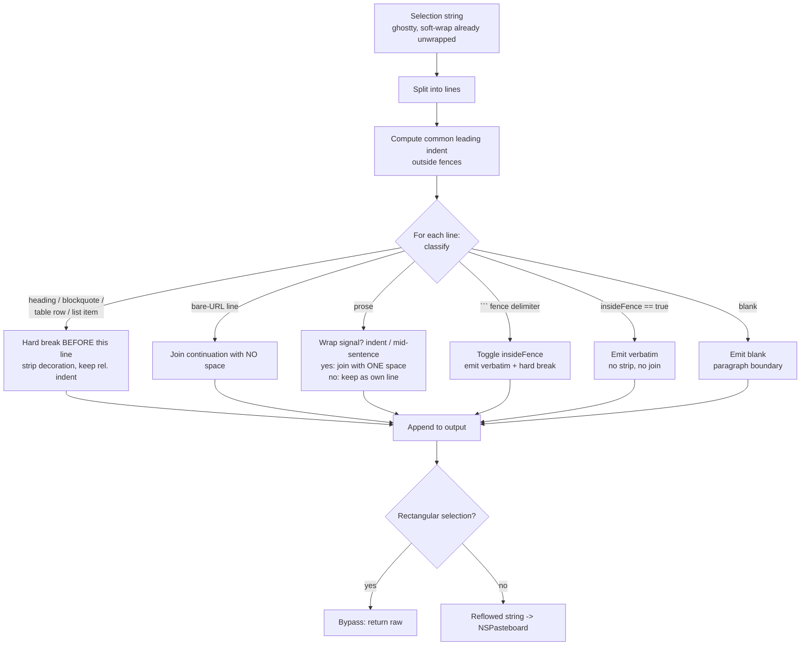

# feat: Terminal copy reflow (clean copy) for hard-wrapped output

**Target repo:** `cmux` (`manaflow-ai/cmux`). All paths below are repo-relative to that repo.

---

## Summary

Copying multi-line content out of a cmux terminal preserves every line break the
*application* inserted when it word-wrapped its own output - real `\n` characters plus
an N-space continuation indent. Pasting elsewhere yields mid-sentence breaks and
double-indented text (the exact symptom in issue #3096's comments: "new lines and a
2 space indention on everything every time").

This plan adds a **reflow ("clean copy") transform** that rejoins
application-hard-wrapped paragraph lines and strips continuation indentation, while
**preserving structure** (code fences, tables, blockquotes, nested lists, headings,
URLs, intentional blank lines). The logic lives in a **new, pure, unit-testable
SwiftPM package** so it stays out of the 13.9k-line `Sources/GhosttyTerminalView.swift`
and can be tested without launching the app.

Reflow is exposed as explicit **Copy** / **Copy Raw** actions (right-click menu +
separately-bindable shortcuts). **Reflow is the default `Cmd+C` behavior**, with raw copy
one keystroke away on `Cmd+Shift+C` and a setting to turn reflow off entirely. This
matches what users already expect from iTerm2 / Terminal.app (which unwrap on copy) and
fixes the problem for everyone, not just users who discover a hidden toggle. The deliberate
de-risking versus #4138 is elsewhere: a conservative join heuristic that leaves
line-oriented output (logs, file lists, error columns) alone, a pure tested package instead
of inline logic, and an always-available raw escape - not a timid default.

---

## Problem Frame

### What the user hits
A long agent/TUI message rendered in a cmux terminal is word-wrapped by the *rendering
program* (Claude Code's TUI, a markdown pager, etc.), which emits literal newlines and a
2-space continuation indent to fit the viewport. Selecting and copying that text carries
those literal newlines onto the clipboard. Pasting into a PR comment, chat box, or editor
produces broken-looking prose with mid-sentence breaks and stair-stepped indentation.

### Why this is NOT already solved (research findings)
- **ghostty soft-wrap is already handled.** Vanilla ghostty's `selectionString`
  (`ghostty/src/terminal/Screen.zig`) passes `.unwrap = true` to its `ScreenFormatter`
  (`ghostty/src/terminal/formatter.zig`), which suppresses the newline at true soft-wrap
  continuation rows (`if (!row.wrap or !self.opts.unwrap) blank_rows += 1`). There is a
  passing upstream test ("Page plain single line soft-wrapped unwrapped"). So the literal
  single-long-line repro in #3096 is the *autowrap* case and is largely covered already.
- **The residual, user-visible case is application hard-wrap.** When the program emits
  real `\n` + indent, the grid genuinely contains newlines. ghostty faithfully preserves
  them - there is **no wrap flag to honor**, because they are not soft-wraps. The 2-space
  indent in the reported symptom is the tell: ghostty autowrap never inserts indentation;
  the application did.
- **No clean-copy setting exists on `main`** (grep for `cleanCopy|rewrap|joinWrapped`
  returns nothing in `Sources/` or `web/data/cmux.schema.json`). The user does not have a
  feature toggled off - it does not exist.
- **The clipboard API gives Swift a flat string.** `ghostty_surface_read_text` fills a
  `ghostty_text_s` that is just `{ tl_px_x, tl_px_y, offset_start, offset_len, text,
  text_len }` - a flat UTF-8 buffer with no per-row wrap metadata
  (`ghostty/include/ghostty.h`). So a Swift-side fix for the hard-wrap case is inherently
  a **heuristic reflow** over text. That is acceptable precisely because it is opt-in and
  the raw path is always available.

### Prior art to build on (not revive)
PR #4138 ("Add clean copy as default terminal copy behavior", by @bbowser) targets #3096
with the right idea but stalled: it is **2,451 commits behind `main`**, it **changes the
default `Cmd+C`** (contentious), it inlines the logic into `GhosttyTerminalView.swift`
(violates a cmux coding guideline), and it carries **~14 unresolved CodeRabbit/Greptile
correctness findings** in its heuristic. This plan ships a **fresh PR** that keeps
behavior opt-in, extracts the logic into a tested package, and pre-empts every one of
those findings. The PR body should credit #4138 and close #3096.

---

## Goals / Non-Goals

**Goals**
- Rejoin application-hard-wrapped paragraph lines into continuous prose on copy.
- Strip the continuation indentation that the wrapping program added.
- Preserve code fences, tables, blockquotes, nested lists, headings, bare/inline URLs,
  and intentional blank lines verbatim.
- Keep the raw, byte-for-byte copy available at all times (per-copy on `Cmd+Shift+C`, and
  globally via a setting that turns reflow off).
- Make reflow the default so everyone benefits, while a conservative join heuristic avoids
  mangling line-oriented output (logs, file lists, error columns).
- Keep all heuristic logic in a pure package with a thorough unit-test matrix.

**Non-Goals**
- Changing ghostty's Zig soft-wrap/unwrap handling (already correct).
- Reflowing line-oriented terminal output (logs, file listings, error columns). The
  heuristic must leave these alone; when in doubt it does not join.
- Fixing the agent/TUI that hard-wraps its own output (out of cmux's control).
- Paste-side reflow.
- Reviving or rebasing the #4138 branch.

---

## Requirements

- **R1** Copying a hard-wrapped paragraph yields one continuous line per logical
  paragraph, with continuation indentation removed and lines joined by a single space.
- **R2** Reflow never merges or mutates content inside fenced code blocks
  (```` ``` ````), table rows, blockquotes, headings, or across blank lines.
- **R3** Nested list structure and relative indentation are preserved; list items stay on
  their own lines, wrapped continuations of a single item rejoin.
- **R4** A line that *is* a bare URL (optionally behind a single list/quote marker) joins
  its wrapped continuation with **no** inserted space; a line that merely *mentions* a URL
  joins with a normal space.
- **R5** Single-word continuation lines join with a space (never `Hello`+`world` ->
  `Helloworld`).
- **R6** Terminal decoration glyphs (e.g. `●◆▶`) at the start of a line are stripped only
  after common-indent removal and only outside code fences.
- **R7** Raw (verbatim) copy is always available via an explicit action and shortcut
  (`Cmd+Shift+C`).
- **R8** Reflow is the default `Cmd+C` behavior. A setting turns reflow off globally
  (restoring raw `Cmd+C`).
- **R9** Rectangular/block selections are copied raw (never reflowed) to preserve columns.
- **R10** All reflow logic is pure (no AppKit/SwiftUI/Ghostty deps), `nonisolated`, and
  unit-tested without launching the app.
- **R11** The join heuristic is conservative: it joins a line to the previous one only on a
  clear wrap signal (a continuation indent, or an obvious mid-word/mid-sentence break). A
  set of equal-length, independently-meaningful short lines (logs, paths, columns) is left
  unchanged. False negatives (leaving a wrap unjoined) are preferred over false positives
  (joining intentional newlines).

---

## Key Technical Decisions

### KTD1 - Home the logic in a new pure SwiftPM package
Create `Packages/CMUXTerminalCopyReflow/` mirroring the existing package convention
(e.g. `Packages/CMUXPasteboardFidelity/`, `Packages/CMUXDebugLog/`). Pure Swift, zero
AppKit/SwiftUI/Ghostty imports. **Rationale:** directly satisfies the cmux coding
guideline the bots cited on #4138 ("Do not implement feature logic directly in the app
target's root `Sources/` path when the logic is independent of cmux app lifecycle and can
compile/test without AppKit, SwiftUI view state, Ghostty") and both bots' P2 "extract to
`TerminalTextCleaner`" findings. Keeps `Sources/GhosttyTerminalView.swift` (already
~13.9k lines, the hottest file in the repo) nearly untouched, which also minimizes rebase
churn - the failure mode that buried #4138.

### KTD2 - Reflow as an explicit line-classification state machine
Classify each line into a `LineKind` (blank, fence delimiter, inside-fence, heading,
blockquote, table row, list item, bare-URL line, prose) carrying an explicit `insideFence`
state, then drive join/break decisions from the classification. **Rationale:** every
#4138 correctness finding traces to ad-hoc string checks that lacked state (no
`insideFence` flag, `isHardBreakLine` missing headings/blockquotes, `containsURL` matching
"mentions anywhere"). A state machine makes the rules auditable and the failure matrix
exhaustive. See High-Level Technical Design.

### KTD3 - Reflow is the default; raw is always one keystroke away
Make reflow the default `Cmd+C` behavior. Bind raw copy to `Cmd+Shift+C`, and add a
setting (proposed key `terminal.copy.reflow`, default `on`) that turns reflow off
globally. Provide explicit **Copy Reflowed** and **Copy Raw** actions in the right-click
menu and as separately bindable shortcuts. **Rationale:** this is a universal pain point
(issue #3096), and a hidden opt-in setting helps almost no one - most users never find it.
Mainstream terminals (iTerm2, Terminal.app) already unwrap on copy by default, so
default-on matches expectation, not surprise. The safety that justified caution is not the
default itself but heuristic quality: a conservative join rule (KTD6 / R11) that never
touches line-oriented output, plus an always-available raw escape on `Cmd+Shift+C`. The
earlier "what stalled #4138 was the default change" framing was an unverified inference;
the evidenced blockers were the heuristic-correctness findings and the file-placement
guideline, both addressed here. Whether to ship default-on immediately or stage it
(default-off for one release, then flip) is a rollout call for the maintainer (OQ1) - the
code path is identical either way; only the setting's default value changes.

### KTD4 - Reflow consumes ghostty's already-unwrapped selection string
Read the current selection via the existing `ghostty_surface_read_text` path (the helper
in `Sources/TerminalController.swift` around the `readSelectionSnapshot()` /
`ghostty_text_s` usage), which already returns soft-wrap-unwrapped text, then apply the
reflow transform and write to `NSPasteboard` directly - instead of delegating to
`performBindingAction("copy_to_clipboard")` (which makes ghostty write the clipboard
itself). **Rationale:** soft-wrap is already handled upstream, so cmux only needs to
address the residual application hard-wrap; reusing the existing read path keeps selection
semantics (scrollback, trim) consistent. The raw path keeps calling the ghostty binding
action unchanged.

### KTD5 - Pure functions are `nonisolated static`
Mark the package's entry points `nonisolated` so they are reachable off the main actor
and carry no `@MainActor` coupling (pre-empts the Greptile Swift-6 isolation finding on
#4138).

### KTD6 - Conservative join: only join on a clear wrap signal
Because reflow is the default, the join rule must bias hard toward *not* joining when
unsure (R11). A continuation line joins the previous line only when there is positive
evidence it was wrapped - the dominant signal being a **continuation indent** relative to
the paragraph's first line (exactly the 2-space indent the reported symptom shows), and
secondarily an obvious mid-word/mid-sentence break (previous line ends without terminal
punctuation and this line begins lowercase). A block of equal-shape, independently-meaningful
lines with no continuation indent (logs, file paths, `make` output, value columns) is left
untouched. **Rationale:** the only real risk of default-on is silently joining intentional
newlines in line-oriented output; making the join evidence-driven removes that risk while
still fixing wrapped prose. This signal set is itself part of the U3 test matrix.

---

## High-Level Technical Design

Reflow is a single pass over the selection's lines, driven by a small state machine. The
only persistent state is `insideFence`; everything else is a per-line classification.



Key invariants encoded by the machine (each maps to a #4138 finding):
- A fence delimiter both toggles `insideFence` *and* forces a hard break, so fence bodies
  never enter the join loop.
- Headings (`#`..`######`), blockquotes (`>`), table rows (`|`), and list markers are hard
  breaks for the **current** line, not only the next line.
- Decoration stripping runs **after** common-indent removal and is suppressed inside
  fences.
- Residual (relative) indentation is preserved after common-indent removal, so nested
  bullets keep their depth.
- "Is this a URL line" tests `startsWith(http|https|www)` after stripping at most one
  leading list/quote marker - not "contains a URL anywhere".

This is directional design for review, not an implementation spec.

---

## Output Structure

```
Packages/CMUXTerminalCopyReflow/
  Package.swift
  Sources/CMUXTerminalCopyReflow/
    LineKind.swift            # line classification enum + classifier
    CopyReflow.swift          # public reflow entry point (nonisolated)
    ReflowOptions.swift       # decoration set, indent policy, url policy
  Tests/CMUXTerminalCopyReflowTests/
    ClassifierTests.swift
    ReflowParagraphTests.swift
    ReflowStructureTests.swift # fences, tables, quotes, lists, headings, urls
```

The per-unit **Files** sections remain authoritative; the implementer may adjust the
internal file split.

---

## Implementation Units

### U1. Scaffold the `CMUXTerminalCopyReflow` package
**Goal:** Stand up a new pure SwiftPM package and wire it into the build/project as a
dependency of the app target, with no behavior yet.
**Requirements:** R10
**Dependencies:** none
**Files:**
- `Packages/CMUXTerminalCopyReflow/Package.swift` (create)
- `Packages/CMUXTerminalCopyReflow/Sources/CMUXTerminalCopyReflow/CopyReflow.swift` (create, stub)
- `Packages/CMUXTerminalCopyReflow/Tests/CMUXTerminalCopyReflowTests/SmokeTests.swift` (create)
- `cmux.xcodeproj/project.pbxproj` and/or the workspace package list (modify - add the local package)
**Approach:** Mirror an existing small package (`Packages/CMUXDebugLog`,
`Packages/CMUXPasteboardFidelity`) for `Package.swift` shape, platforms, and test-target
naming. Expose a placeholder `public nonisolated func reflowCopiedText(_:options:) ->
String` returning input unchanged. Add the package to the app target's dependencies the
same way existing `CMUX*` packages are referenced.
**Patterns to follow:** existing `Packages/CMUX*` packages.
**Test scenarios:** `Test expectation: none -- scaffolding; SmokeTests only asserts the
package builds and the stub returns input unchanged.`
**Verification:** Package resolves and its test target builds; app target still builds.

### U2. Line classifier (`LineKind`)
**Goal:** Pure classification of a single line (with running `insideFence` state) into the
`LineKind` cases that drive reflow.
**Requirements:** R2, R3, R4, R6
**Dependencies:** U1
**Files:**
- `Packages/CMUXTerminalCopyReflow/Sources/CMUXTerminalCopyReflow/LineKind.swift` (create)
- `Packages/CMUXTerminalCopyReflow/Tests/CMUXTerminalCopyReflowTests/ClassifierTests.swift` (create)
**Approach:** Define `enum LineKind { case blank, fenceDelimiter, insideFence, heading,
blockquote, tableRow, listItem, urlLine, prose }`. Classifier takes the raw line, the
common-indent width, and current `insideFence`; returns the kind and the
indent-normalized text. Heading match covers `#` through `######`. Blockquote match is a
leading `>`. List markers cover `-`, `*`, `+`, and `\d+.`/`\d+)`. Table row is a line
whose trimmed form starts and ends with `|` (or contains a `---|---` separator). URL line
tests `http://`, `https://`, `www.` at the start after stripping at most one leading
list/quote marker.
**Patterns to follow:** keep functions `nonisolated`, no Foundation-heavy regex if simple
prefix checks suffice.
**Test scenarios:**
- Covers R2. ` ```swift ` and bare ` ``` ` classify as `fenceDelimiter`; a line while
  `insideFence == true` classifies as `insideFence` regardless of its content (even if it
  looks like a heading or bullet).
- Covers R2. `# H1` .. `###### H6` classify as `heading`; `#nothashtag` (no following
  space) classifies as `prose`.
- Covers R2. `> quoted` classifies as `blockquote`; `-> arrow` does not.
- Covers R3. `- item`, `* item`, `+ item`, `1. item`, `2) item` classify as `listItem`;
  `  - child` reports preserved relative indent depth.
- Covers R2. `| a | b |` and `|---|---|` classify as `tableRow`.
- Covers R4. `https://x.io/a`, `www.x.io`, `- https://x.io` classify as `urlLine`;
  `see https://x.io here` classifies as `prose` (mentions, not is).
- Covers R6. Decoration prefixes `●`, `◆`, `▶` are reported for stripping only when
  outside a fence and after indent normalization.
- Empty / whitespace-only line classifies as `blank`.

### U3. Reflow engine
**Goal:** Consume classified lines and emit the reflowed string honoring every join/break
rule.
**Requirements:** R1, R2, R3, R4, R5, R6
**Dependencies:** U2
**Files:**
- `Packages/CMUXTerminalCopyReflow/Sources/CMUXTerminalCopyReflow/CopyReflow.swift` (modify)
- `Packages/CMUXTerminalCopyReflow/Sources/CMUXTerminalCopyReflow/ReflowOptions.swift` (create)
- `Packages/CMUXTerminalCopyReflow/Tests/CMUXTerminalCopyReflowTests/ReflowParagraphTests.swift` (create)
- `Packages/CMUXTerminalCopyReflow/Tests/CMUXTerminalCopyReflowTests/ReflowStructureTests.swift` (create)
**Approach:** Single pass. Compute `commonIndent` over non-fence lines first. Maintain
`insideFence`. For each line: if fence delimiter -> flush current paragraph, emit verbatim,
toggle state; if inside fence -> emit verbatim; if blank/heading/blockquote/tableRow/
listItem -> flush paragraph (hard break before), then emit this line (decoration-stripped
outside fences, relative indent preserved); if prose/url continuation -> append to the
current paragraph buffer joined by a single space, **or no space when the paragraph's
first line is a `urlLine`**. Strip decoration only after indent removal and only outside
fences.
**Execution note:** Implement test-first - the test matrix below is the specification;
each scenario is a #4138 finding turned into a guardrail.
**Patterns to follow:** classification from U2; keep the engine `nonisolated`.
**Test scenarios:**
- Covers R1. Two hard-wrapped prose lines with 2-space continuation indent rejoin into one
  line with a single space and no indent. (The reported real-world symptom.)
- Covers R5. `Hello\nworld` (single-word lines) -> `Hello world`, not `Helloworld`.
- Covers R2. A fenced block with multiple code lines is emitted byte-for-byte; inner lines
  are never merged and inner decoration glyphs are never stripped.
- Covers R2. `## Summary\nThe files updated.` -> two lines, not `## Summary The files
  updated.` (current line break for headings).
- Covers R2. `> quoted text\nnormal sentence` -> two lines (blockquote current-line break).
- Covers R2. A markdown table (`| a | b |` rows + separator) is preserved row-per-line.
- Covers R3. `- parent\n  - child` keeps both bullets with child indented (relative indent
  preserved, not flattened).
- Covers R3. A wrapped single bullet (`- a long item that\n  wrapped`) rejoins into one
  bullet.
- Covers R4. `https://example.com/very/long\n/path/continues` -> joined with no space.
- Covers R4. `- https://example.com/a\n/b` (URL behind a list marker) -> joined with no
  space.
- Covers R4. `See https://x.io for details.\nMore info.` -> joined with a single space
  (mention, not bare URL).
- Covers R6. `    ▶ note` (indented decoration) -> decoration stripped after indent
  removal; `▶` inside a fence is preserved.
- Blank lines between paragraphs are preserved (paragraph boundaries survive).
- Idempotence: reflowing already-clean prose (no hard wraps) returns it unchanged.
- Covers R11. A block of equal-shape lines with **no** continuation indent (e.g. three
  file paths, or three `make` log lines) is returned unchanged - never joined.
- Covers R11. A line that ends with terminal punctuation followed by a capitalized line
  (two complete sentences on their own lines, no indent) is NOT joined.
- Covers R11. A continuation line WITH the paragraph's continuation indent IS joined; the
  same text without the indent is NOT - the indent is the deciding signal.

### U4. Wire reflow into the terminal copy paths
**Goal:** Make cmux's copy entry points read the selection, optionally reflow, and write
the clipboard - preserving an always-raw path.
**Requirements:** R7, R8, R9
**Dependencies:** U3
**Files:**
- `Sources/GhosttyTerminalView.swift` (modify - `@IBAction func copy(_:)` and the
  keyboard-copy-mode `copyCurrentViewportLinesToClipboard`)
- `Sources/TerminalController.swift` (modify - reuse/extend the `ghostty_surface_read_text`
  selection-read helper near `readSelectionSnapshot()`)
**Approach:** Add a `copyReflowed` vs `copyRaw` distinction. Raw keeps calling
`performBindingAction("copy_to_clipboard")` unchanged. Reflowed: read the current
selection text via the existing `ghostty_surface_read_text` path (already soft-wrap
unwrapped), pass it through `reflowCopiedText`, and write the result to
`NSPasteboard.general`. `Cmd+C` runs reflow by default unless the U5 setting is off;
`Cmd+Shift+C` always runs raw. If the current selection is rectangular, force raw (R9).
Keep the change to this file as small as possible - all heuristics live in the package.
**Patterns to follow:** existing `NSPasteboard` writes in `Sources/GhosttyTerminalView.swift`
(e.g. the `WorkspaceSurfaceIdentifierClipboardText.copy` helpers and the `writeObjects`
sites); existing `ghostty_surface_read_text` usage in `Sources/TerminalController.swift`.
**Test scenarios:**
- Covers R8. With the setting on (default), `Cmd+C` of a hard-wrapped paragraph produces
  reflowed text.
- Covers R7/R8. `Cmd+Shift+C` produces byte-identical output to the current raw path for a
  representative selection (regression guard), regardless of the setting.
- Covers R8. With the setting turned off, `Cmd+C` produces byte-identical raw output
  (restores legacy behavior).
- Covers R9. A rectangular selection copied with the setting on is still raw (columns
  preserved).
- The explicit "Copy Raw" action produces raw output even with reflow on; the explicit
  "Copy Reflowed" action produces reflowed output even with the setting off.
- Note: end-to-end clipboard assertions may need a small testable seam (a function that
  returns the string to be written) so the decision logic is unit-testable without a live
  `NSPasteboard`; cover the seam here and leave true GUI clipboard checks to U7.

### U5. Setting + schema + Settings UI
**Goal:** Add the `terminal.copy.reflow` setting (default off) end to end.
**Requirements:** R8
**Dependencies:** U4
**Files:**
- `web/data/cmux.schema.json` (modify - add the setting key + default)
- the Swift settings model that mirrors the schema (modify - same module #4138 touched;
  confirm exact file at execution time, e.g. under `Sources/Settings/`)
- `Sources/Settings/` Settings UI view (modify - add the toggle)
**Approach:** Add a boolean (or enum `on|off`) defaulting to **on** (reflow). Surface a
toggle in the terminal/keyboard area of Settings labeled to make the behavior obvious
("Reflow wrapped text when copying (Cmd+C); raw copy stays on Cmd+Shift+C"). Mirror the
schema<->Swift settings pattern already used for other terminal settings.
**Patterns to follow:** an existing terminal/clipboard boolean setting in
`web/data/cmux.schema.json` and its Swift mirror.
**Test scenarios:**
- Covers R8. Default value resolves to on (reflow) when no user override is present.
- Setting round-trips: schema default on, user override off, override back to on.
- `Test expectation:` UI wiring verified manually in U7; logic-level default covered here.

### U6. Menu items + keyboard shortcuts + localization
**Goal:** Expose explicit Copy Reflowed / Copy Raw actions in the right-click menu and as
bindable shortcuts.
**Requirements:** R7
**Dependencies:** U4
**Files:**
- `Sources/AppDelegate.swift` (modify - menu wiring; the file #4138 touched)
- `Sources/KeyboardShortcutSettings.swift` (modify - register the new bindable actions)
- `Sources/TabManager.swift` (modify - action routing, per #4138's touch set)
- `Resources/Localizable.xcstrings` (modify - new strings)
**Approach:** Register "Copy Raw" (suggested `Cmd+Shift+C`) and keep "Copy" honoring the
setting; add both to the terminal right-click context menu. Make both separately bindable
in Keyboard Shortcut settings so a user can map them however they like. Mirror #4138's
wiring across exactly these files but without changing the default `Cmd+C` binding.
**Patterns to follow:** existing context-menu construction and
`applyConfiguredMenuShortcut` usage in `Sources/GhosttyTerminalView.swift`; existing
shortcut registration in `Sources/KeyboardShortcutSettings.swift`.
**Test scenarios:**
- Covers R7. "Copy Raw" appears in the right-click menu and in Keyboard Shortcuts and is
  configurable (mirror the existing shortcut-settings test pattern, e.g.
  `cmuxTests/KeyboardShortcutSpaceKeyTests.swift`).
- A configured custom shortcut for "Copy Reflowed" routes to the reflow path.

### U7. Integration tests + manual verification matrix
**Goal:** Lock the behavior with package + app tests and a documented manual GUI checklist.
**Requirements:** R1-R9
**Dependencies:** U3, U4, U5, U6
**Files:**
- `cmuxTests/TerminalCopyReflowWiringTests.swift` (create - decision/seam-level tests in
  the app target)
- `Packages/CMUXTerminalCopyReflow/Tests/CMUXTerminalCopyReflowTests/` (extend - any gaps
  from U2/U3)
**Approach:** App-target tests cover the raw-vs-reflow decision and rectangular bypass via
the testable seam from U4. Package tests own the heuristic matrix. Add a short manual
checklist (the #4138 test plan, adapted) for true clipboard end-to-end since app-host UI
suites are gated to CI and hang locally.
**Execution note:** Run package unit tests directly (`swift test` in the package, or the
package's test target) - they need no app and no Zig build. For app-target tests use
`-only-testing` with the class name; the app-host UI suites are CI-gated.
**Test scenarios:**
- Full heuristic matrix from U3 passes in the package test target.
- Wiring tests: setting off == raw; setting on == reflow; rectangular == raw; explicit
  actions override the setting.
- Manual checklist (documented, run via a `reload.sh` debug build): copy wrapped
  paragraph, wrapped URL, bullet list, fenced code, table, blockquote, decorated line;
  verify paste fidelity and that Copy Raw still yields verbatim text.
**Verification:** Package tests green without launching the app; targeted app-target tests
green; manual checklist passes on a local debug build.

---

## Scope Boundaries

### In scope
- The reflow package, its tests, the copy-path wiring, the opt-in setting, menu/shortcut
  surfaces.

### Rollout choice (maintainer-owned)
- This plan ships reflow **default-on**. The maintainer may prefer to ship default-off for
  one release and flip after the heuristic proves out in the wild (see OQ1). Same code
  path; only the setting's default value differs.

### Deferred to Follow-Up Work
- Optional "smart" detection that auto-enables reflow only for agent-output panes.
- A preview/diff affordance showing reflowed vs raw before paste.

### Outside this product's scope
- Changing ghostty's Zig soft-wrap/unwrap behavior (already correct upstream).
- Fixing the wrapping done by the source application/TUI.
- Paste-side reflow or transforming inbound clipboard.

---

## Risks & Mitigations

- **Default-on silently joins intentional newlines in line-oriented output** (logs, file
  lists, columns). This is the primary risk of making reflow the default. *Mitigation:* the
  conservative join heuristic (KTD6 / R11) joins only on a continuation-indent or clear
  mid-sentence signal and leaves unindented line blocks untouched; raw copy is always on
  `Cmd+Shift+C`; the failure matrix includes explicit "must not join" cases.
- **Heuristic corrupts structured content** (code, tables, quotes). *Mitigation:*
  structure-preserving classification (KTD2) with the #4138-derived failure matrix as
  regression tests; raw escape always available.
- **Maintainer prefers a staged rollout.** *Mitigation:* the default is a single setting
  value; OQ1 lets the maintainer ship default-off first with zero code change.
- **Selection-read semantics drift from ghostty's own copy** (scrollback, trim,
  rectangular). *Mitigation:* reuse the existing `ghostty_surface_read_text` read path;
  force raw for rectangular selections (R9).
- **Touching the 13.9k-line `GhosttyTerminalView.swift` invites rebase conflicts** (what
  buried #4138). *Mitigation:* keep that file's change minimal (read + branch + write);
  all logic lives in the package.
- **Local build friction** (zig 0.15.2 vs Xcode SDK; app-host UI suites hang locally).
  *Mitigation:* package unit tests run with no app and no Zig build; use
  `CMUX_SKIP_ZIG_BUILD=1` for app builds and `-only-testing` for targeted app-target tests
  per the repo's known setup.

---

## Open Questions

- **OQ1 (maintainer, rollout):** This plan ships reflow **default-on** (raw on
  `Cmd+Shift+C`). Does the maintainer want it default-on immediately, or default-off for one
  release then flipped once the heuristic proves out? Identical code path; only the setting
  default changes. Raise it in the PR rather than assuming.
- **OQ2 (execution-time):** Exact file + key path for the Swift settings mirror of
  `web/data/cmux.schema.json` - confirm against the current settings module (the same area
  #4138 modified) when wiring U5.
- **OQ3 (execution-time):** Cleanest testable seam in U4 so the raw-vs-reflow decision and
  the output string are unit-testable without a live `NSPasteboard`.

---

## Sources & Research

- Issue `manaflow-ai/cmux#3096` - the bug report + comments establishing the hard-wrap +
  2-space-indent symptom.
- PR `manaflow-ai/cmux#4138` - prior art; its ~14 CodeRabbit/Greptile findings became the
  U2/U3 test matrix; its touched-file set informs U5/U6 wiring.
- `ghostty/src/terminal/Screen.zig` (`selectionString`, `.unwrap = true`) and
  `ghostty/src/terminal/formatter.zig` (`ScreenFormatter`, wrap/newline emission) - proof
  that ghostty soft-wrap is already handled and the residual case is application hard-wrap.
- `ghostty/include/ghostty.h` (`ghostty_text_s`, `ghostty_surface_read_text`) - the flat
  string the Swift side receives, with no wrap metadata.
- `Sources/GhosttyTerminalView.swift` (`@IBAction func copy`,
  `copyCurrentViewportLinesToClipboard`, `performBindingAction("copy_to_clipboard")`) and
  `Sources/TerminalController.swift` (`ghostty_surface_read_text` usage) - the copy paths
  to wire.
- `Packages/CMUXPasteboardFidelity/`, `Packages/CMUXDebugLog/` - package-shape convention
  for U1.
- cmux coding guideline (cited by the #4138 reviews): keep feature logic independent of
  the app lifecycle out of the app target's root `Sources/` path.
