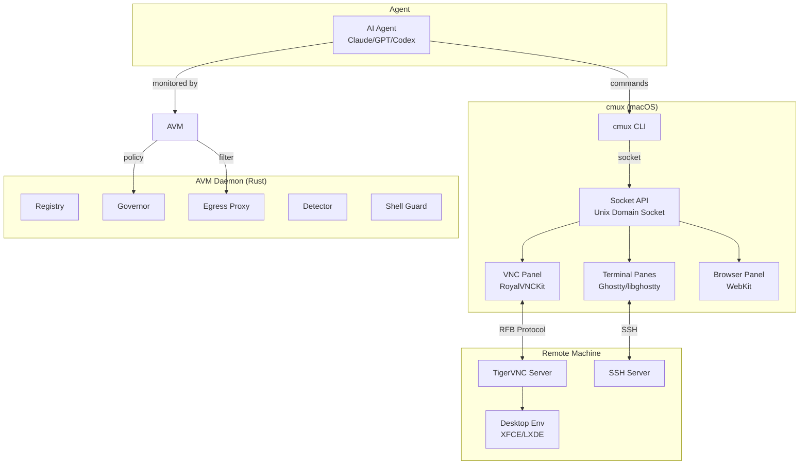
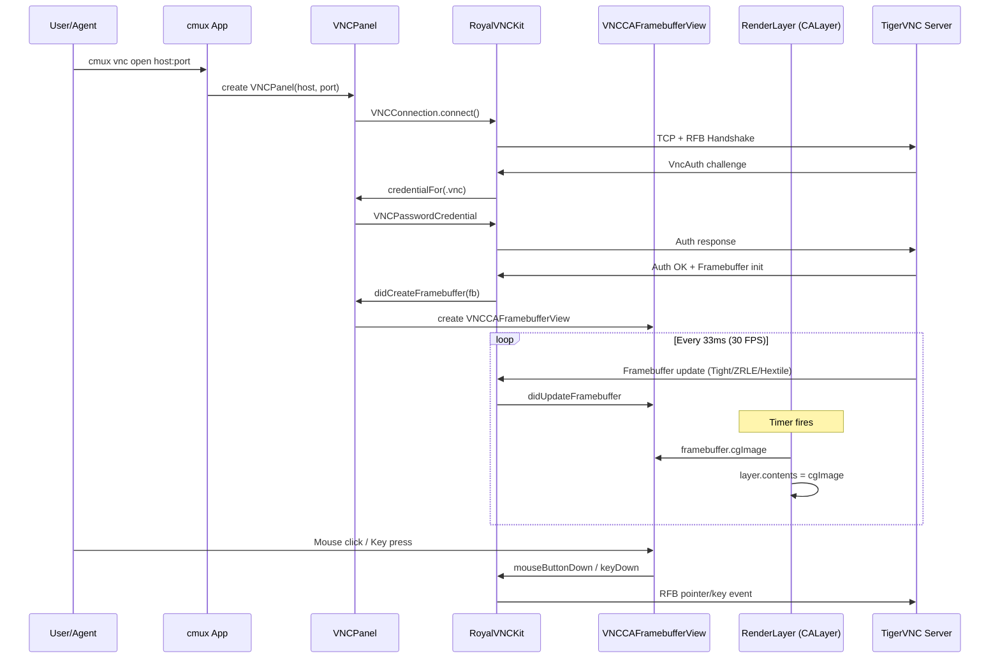
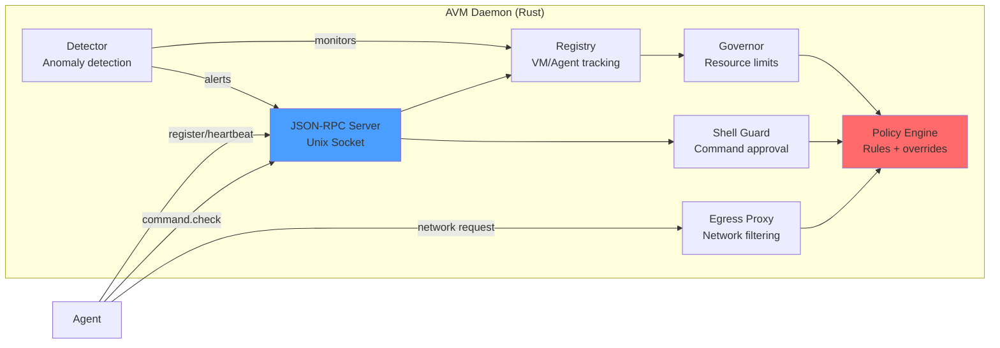
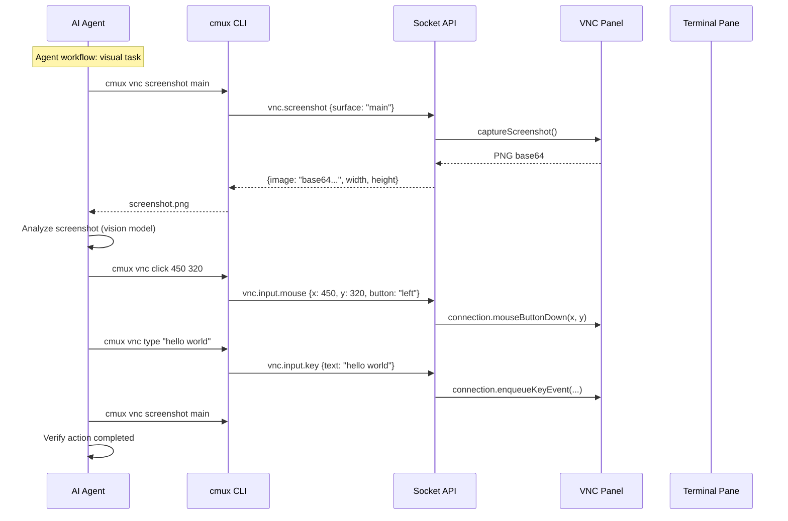

# VNC Remote Desktop — Architecture

## Why agents need GUI access

Terminal-only access covers most coding workflows, but AI agents increasingly need to interact with graphical interfaces. Computer-use agents (Claude, GPT-4o with tools, Manus) need to click UI elements, fill web forms, verify rendered output, and test applications visually. Legacy enterprise apps often have no CLI — the GUI is the only interface. Running these tasks inside a sandboxed VM with VNC access gives agents a disposable visual workspace while keeping the host machine safe.

cmux's VNC panel brings this capability directly into the terminal multiplexer. An agent running in a terminal pane can programmatically screenshot an adjacent VNC pane (`cmux vnc screenshot`), analyze the visual output, and send mouse/keyboard input — all without leaving cmux. This eliminates the need for separate VNC clients, screen-sharing apps, or complex RDP setups.

The combination of terminal + VNC + scriptable API makes cmux a complete agent host: code in the terminal, interact with GUIs through VNC, orchestrate both via the socket API.

## System Overview

## VNC Data Flow

## AVM Daemon Architecture

## Agent Interaction Model

## Component Files

| Component | File | Purpose |
|-----------|------|---------|
| VNC Panel Model | `Sources/Panels/VNCPanel.swift` | Connection lifecycle, auth, screenshot capture |
| VNC Panel View | `Sources/Panels/VNCPanelView.swift` | SwiftUI form + NSViewRepresentable framebuffer |
| Keychain Store | `Sources/Panels/VNCKeychainStore.swift` | Secure credential storage via macOS Keychain |
| SSH Reconnect | `Sources/SSHReconnectionController.swift` | Auto-reconnect with exponential backoff |
| Terminal Controller | `Sources/TerminalController.swift` | Programmatic terminal session management |
| AVM Server | `avm/src/server.rs` | JSON-RPC server for agent management |
| AVM Registry | `avm/src/registry.rs` | VM/agent registration and tracking |
| AVM Governor | `avm/src/governor.rs` | Resource limits and quota enforcement |
| AVM Proxy | `avm/src/proxy.rs` | Egress network filtering |
| AVM Shell Guard | `avm/src/shell.rs` | Dangerous command detection and approval |
| VNC Installer | `scripts/setup-vnc-server.sh` | One-line TigerVNC setup for remote hosts |
