# Apple Messages (iOS 27) reference spec

Measured on the iPhone 17 Pro simulator (iOS 27, 402 x 874 pt, @3x) on 2026-10-08/09.
All geometry is in points (pixels / 3). Colors are sampled from `simctl io screenshot` PNGs
(sRGB). Colors sampled from **video** frames are slightly lifted (white reads `#FCFCFC`),
so every color token below comes from a still screenshot.

Raw media (not in git): `~/nxios-ref/imessage/` (screenshots), `~/nxios-ref/imessage/vid/`
(recordings, extracted native frames, `times.txt` with per-frame PTS). Helper scripts:
`~/nxios-ref/bin/` (`bubbles2.py`, `navtrack.py`, `kbtrack.py`, `fit.py`, `sheet.py`).
Comparison tool for implementation parity: [`tools/framediff.py`](tools/framediff.py).

Confidence tags: **[M]** measured from pixels or the accessibility tree, **[V]** measured from
video (timing from simulator PTS; see caveats), **[K]** from platform knowledge, not
reproducible in this simulator.

---

## 0. Global tokens

### Typography (SF Pro, default Dynamic Type = Large) [M]

Font sizes were derived from cap heights (SF Pro cap height = 0.705 em) and AX line heights.

| Use | Size / weight | Line height | Evidence |
| --- | --- | --- | --- |
| List large title "Messages" | 34 bold | 40.7 | cap 24.0, AX h 40.7 |
| Inline nav title (collapsed) | 17 semibold | | ink 15.0 high |
| Row title (name/number) | 17 semibold | 20.3 | digit height 12.0 |
| Row preview | 15 regular, max 2 lines | 18 / line | cap 11.0, AX 2-line box 43 |
| Row date ("Yesterday") | 15 regular | 18 | cap 10.7 |
| Bubble text | 17 regular | **20.0** pitch | cap 12.3, 7-line bubble = 40 + 6 x 20 |
| Thread header name pill | 17 semibold | | digit 12.0 |
| "Today 9:45 PM" separator | 11; "Today" semibold, time regular | 13.3 | cap 7.7 |
| "iMessage / Encrypted" header | 11 regular (2 lines) | ~13 | |
| "Delivered" / "Read" | 11 semibold | | cap 7.7 |
| Swipe-revealed timestamp | 11 regular | | cap 8.0 |
| Composer text / placeholder | 17 regular | 20.3 | |
| Context menu / tapback menu items | 17 regular | row 42 | AX |
| Avatar initials | 0.45-0.47 x diameter, bold, white | | 45 pt avatar -> ~20 pt; 60 pt -> ~28 pt |

### Color tokens

| Token | Light | Dark | Notes |
| --- | --- | --- | --- |
| List background | `#FFFFFF` | `#000000` | [M] |
| Thread background | `#FFFFFF` | `#000000` | [M] |
| Primary label | `#000000` | `#FFFFFF` | [M] |
| Secondary label (preview, date, footers) | `#8A8A8E` | `#8D8D93` | [M] |
| Tertiary (row chevron) | `#C5C5C7` | `#464649` | [M] |
| Row separator | `#E8E8E8` | `#2A2A2C` | [M] 1 pt tall at @3x (3 px) |
| Separator under large title | `#F4F4F5` | `#151517` | [M] x 16-386, y 168 |
| Row pressed highlight | `#D1D1D6` | [K] `#3A3A3C` | [M] light |
| Swipe card background | `#E5E5EA` | [K] `#2C2C2E` | [M] light |
| Sent bubble | vertical gradient, see below | gradient | [M] |
| Received bubble | `#E9E9EB` | `#262629` | [M] flat, no gradient |
| Received bubble text | `#000000` | `#FFFFFF` | [M] |
| Sent bubble text | `#FFFFFF` | `#FFFFFF` | [M] |
| Send button / tint | `#0088FF` | `#0088FF` (K) | [M] |
| Mark-unread action | `#0088FF` | | [M] |
| Mute action (indigo) | `#6155F5` | | [M] |
| Delete action (red) | `#FF383C` | | [M] |
| Glass controls (back button, name pill, search, + button, field) | `#F9F9F9`-`#FDFDFD` | `#1F1F1F`-`#212121` | [M] plus 1 px light stroke and soft shadow |
| Composer placeholder "iMessage" | `#C0C0C2` | | [M] |
| Context menu backdrop (dim + blur of list) | `#BABABA`-`#CBCBCB` | | [M] |
| Tapback backdrop (dim only) | `#CCCCCC` (white x 0.80) | | [M] |
| Monogram avatar gradient | top `#A7BFDF` -> bottom `#7580B9` | top `#555066` -> bottom `#32284A` | [M] |

**Sent bubble gradient** [M]: color depends on the bubble's *screen* y (the gradient is pinned
to the viewport, bubbles act as masks; scrolling a bubble changes its color).

| Screen y (pt) | Light | Dark |
| --- | --- | --- |
| 155 | `#4DBCFA` | |
| 180 | `#4ABAFB` | `#359AFF` |
| 230 | `#45B6FB` | `#3299FF` |
| 480 | `#2DA3FD` | `#2196FF` |
| 580 | `#219BFE` | `#1994FF` |
| 680 | `#1492FE` | `#0F93FF` |
| 760 | `#078CFF` | `#0591FF` |

Linear approximation (light): `R = 0x5E - 0.115*y`, `G = 0xC8 - 0.080*y`, `B = 0xF9 + 0.008*y`,
clamped; i.e. a top stop `#5FC9F9` at y=0 and bottom stop `#0089FF` at y=874. Dark: top
`#3C9CFF` -> bottom `#0090FF`. The contrast is much lower in dark mode.

---

## 1. Conversation list

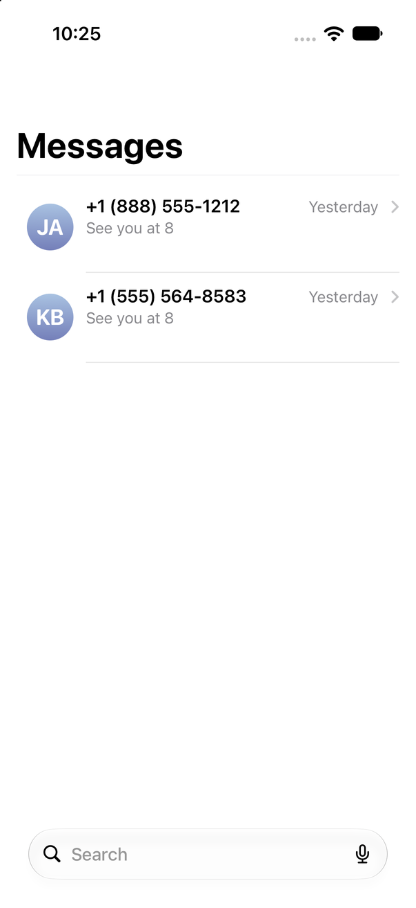 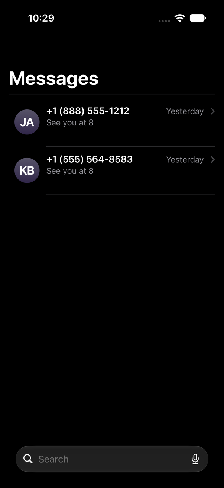

```
y=0    ┌────────────────────────────────────────────┐
       │ 9:41                         status bar    │  (no nav-bar items in iOS 27 sim:
       │                                            │   no Edit / filter / compose buttons
119.7  │ Messages  (34 bold, x=16, h=40.7)          │   rendered at the top)
168    │ ──────────────────────────────── (x16-386) │  separator #F4F4F5
176    ├────────────────────────────────────────────┤  row 1 (h 86.7)
188    │ (●)  +1 (888) 555-1212        Yesterday  › │  title y188 h20.3; date x297.7..365.7
196    │  45  See you at 8                          │  preview y197.7 (2 lines max, w303)
       │                                            │
262.7  │      ────────────────────────── (x83-386)  │  separator 1pt
       └────────────────────────────────────────────┘
798    (  🔍 Search                          🎙  )    glass capsule x28..374, h48, r24
874
```

### Row geometry [M] (AX + pixels)

| Item | Value |
| --- | --- |
| Row height | **86.7** (fixed, 2-line preview slot even for 1-line previews) |
| First row top | 176 (8 pt below title separator at 168) |
| Avatar | 45 x 45 circle at x=26, vertically centered (y+20 in row) |
| Text column x | 83 (avatar right 71 + 12) |
| Title | 17 semibold, top y = row+12, width up to 212.7 |
| Date | 15 regular secondary, right edge 365.7, top row+14 (baseline aligned with title) |
| Chevron "›" | 10.3 x 14 symbol at x=375.7, right edge 386 (16 pt margin), color tertiary |
| Preview | 15 regular secondary, starts row+21.7, 2 lines max, width 303 (to x=386) |
| Separator | from x=83 to 386, 1 pt (3 px), at row bottom |
| Unread dot | [K] 10 pt `#0088FF` dot centered in the 26 pt leading gutter (x≈8..18), vertically centered on the title line. Not reproducible (no incoming unread). |
| Pinned grid | [K] Not reproducible: the Pin action had no effect in this simulator. iOS 26/27 layout: 3 columns, avatar ~96 pt (3 pins) shrinking to ~72 pt for 4-9 pins, name 13 pt below, grid inset 16, row spacing ~16. Treat as unverified. |

### Bottom search bar (glass) [M]

Capsule x 28-374 (w 346), y 798-846 (h 48, radius 24), 28 pt from screen bottom, 28 pt side
insets. Fill `#F9F9F9`-`#FDFDFD` with a 1 px rim and a soft drop shadow (light); `#202020`
(dark). Magnifier glyph at x 40 (20.7 x 19.3), placeholder "Search" 17 regular secondary at
x≈69, dictation mic 17.3 x 22 at x 341.7.

### Large-title collapse on scroll [V]

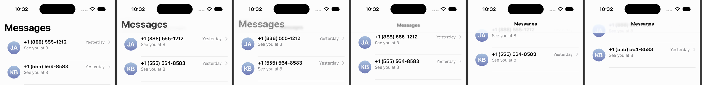

* The large title scrolls 1:1 with content (no shrink). Measured: title top 128 -> 73.7 while
  the first avatar moves 196 -> 134 (content offset ≈ 54-62 pt).
* At offset ≈ 54 pt (title cap top reaches y≈74) the large title cross-fades out over ~2-3
  frames (35-50 ms) and the inline title "Messages" (17 semibold, centered, ink y 78-93)
  fades in over ~4 frames.
* There is **no opaque nav-bar material**: content scrolling under the top edge gets the
  iOS 26 scroll-edge effect (progressive blur + fade to background, roughly the top 100 pt).
* On over-scroll release the list springs back (rubber band) and the title cross-fades back
  in at the same threshold.

---

## 2. Row interactions

### Tap highlight [M]/[V]

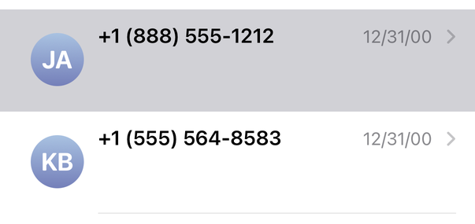

Full-width row fill `#D1D1D6` (light), no inset, appears on touch-down (no delay visible) and
stays through the push; it is removed when the list reappears after pop (fade ≈ 200 ms).

### Swipe left (trailing actions) [M]/[V]


| Item | Value |
| --- | --- |
| Actions | Mute ("notifications off", `#6155F5`), Delete (trash, `#FF383C`) |
| Button shape | **50 x 50 circles**, white SF Symbol glyphs ~20 pt |
| Layout | trailing margin 10, inter-button gap 10, vertically centered in row |
| Open offset | row content translates **-130** (= 10 + 50 + 10 + 50 + 10) |
| Row card while swiped | row gets background `#E5E5EA` with ~26 pt continuous corner radius on its trailing corners |
| Reveal | buttons appear progressively: the trailing (delete) circle scales in from ~0.25 once ≈ 80 pt is exposed; mute appears once ≈ 134 pt is exposed |
| Release snap | from overshoot -134.6 back to -130 in ≈ 450 ms (soft, critically damped) |
| Full swipe | [K] past ~60% width the delete circle stretches into a capsule that fills the exposed area, then the row deletes (height collapses to 0 over ~300 ms while rows below move up) |

### Swipe right (leading action) [M]

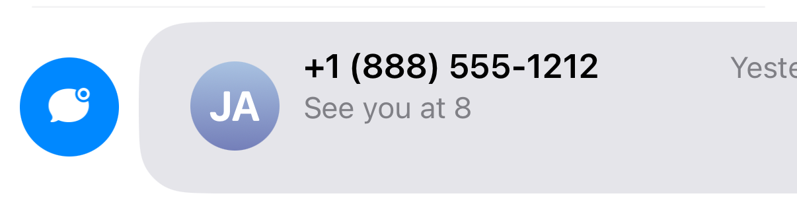

Single action: Mark as Unread, 50 pt `#0088FF` circle at x=10. Row content offset **+70**
(10 + 50 + 10). Same `#E5E5EA` rounded card on the leading corners. Pin is not a swipe action;
it is in the context menu.

### Long-press context menu [M]/[V]

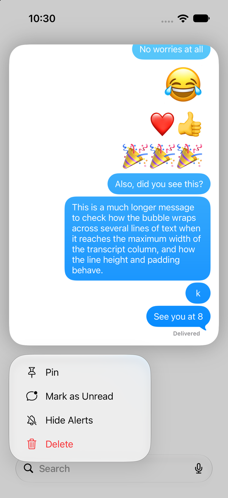

| Item | Value |
| --- | --- |
| Preview | thread preview card x 16-386 (w 370), y 78-606, corner radius **30** (circular fit), white |
| Menu | glass panel x 16-266 (w **250**), items 42 tall: Pin, Mark as Unread, Hide Alerts, Delete (red) |
| Menu position | 16 below the preview, left-aligned to preview; icon column at x≈56, text x≈80 |
| Backdrop | list blurred and dimmed to `#BABABA`-`#CBCBCB` |

Timeline (t=0 at touch-down, simulator PTS):

| t (ms) | Event |
| --- | --- |
| 0 | row highlight `#D1D1D6` |
| ~250 | highlight fades |
| ~570 | row lifts (white, shadow, small scale-up) |
| ~780 | backdrop dim/blur starts, preview starts expanding from the row rect |
| ~880 | preview at near full size; menu scales in from the row |
| ~980 | peak overshoot (+6 pt on bottom edge, ≈1.2%) |
| ~1150 | settled |

Fit: spring **response ≈ 0.25 s, damping ≈ 0.80** for the preview expansion; backdrop dim
≈ 220 ms ease-out.

### Pin and delete animations [K]

Not reproducible here (Pin had no effect; deleting would have destroyed the only fixtures).
Use the platform defaults: pinned conversation flies from its row to the grid cell with a
spring (response ~0.45, damping ~0.85) while the list closes the gap.

---

## 3. Push / pop transitions

### Push (tap row -> thread) [V]

Thread slides in from the right, 1:1 full-width translation; the list parallaxes left by 30%
and is dimmed.

Measured thread x (page left edge) vs time from onset (bubble tracking, row y=530):

| t ms | 17 | 30 | 47 | 82 | 94 | 119 | 135 | 154 | 180 | 217 | 264 | 300 | 355 | 550 |
| ---- | -- | -- | -- | -- | -- | --- | --- | --- | --- | --- | --- | --- | --- | --- |
| progress | .12 | .27 | .41 | .63 | .71 | .78 | .83 | .87 | .93 | .96 | .98 | .99 | .996 | 1 |

Fit: **spring response 0.28 s, damping 1.0** (critically damped), 99% at ≈ 295 ms
(18 frames @ 60 fps), long low tail to ~550 ms.

### Pop (back button) [V]

Same curve mirrored: **response 0.27 s, damping 1.0**, 99% at ≈ 285 ms (17 frames).

* List parallax: list x offset = **-0.30 x 402 x (1 - p)** (checked at p = 0.48, 0.68, 0.85:
  error < 1 pt).
* List dim: black overlay alpha = **0.10 x (1 - p)** (list white reads `#E8E8E8` at p=0.2).
* Thread page casts a soft left shadow (≈ 20 pt wide).

### Nav bar / header morph [V]

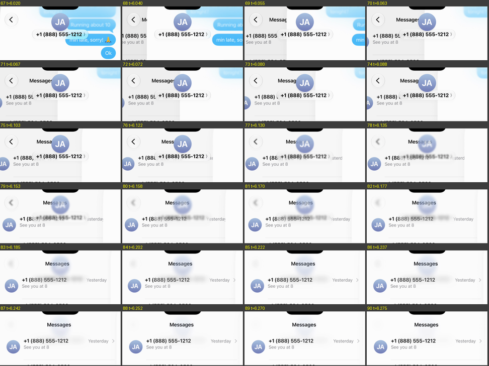

* The header (60 pt avatar + name pill) and back button do **not** slide with the page. They
  stay in place for ≈ 100 ms, then blur and fade out over ≈ 60 ms (Gaussian blur grows to
  ~10 pt while opacity -> 0).
* The list's inline title "Messages" blurs in at its final position over the same window.
* Items never translate horizontally (iOS 26 glass bar behavior).

### Interactive edge swipe back [V]

* The page tracks the finger 1:1 (finger x 160 -> page offset 160).
* Release with velocity: completion ran p 0.40 -> 1.0 in ≈ 60-75 ms (velocity-projected
  spring). A slow release below ~50% cancels with the same spring as push.
* `axe` could not hold a stationary partial edge drag, so partial-progress holding and
  cancel timing are **[K]**.

---

## 4. Thread

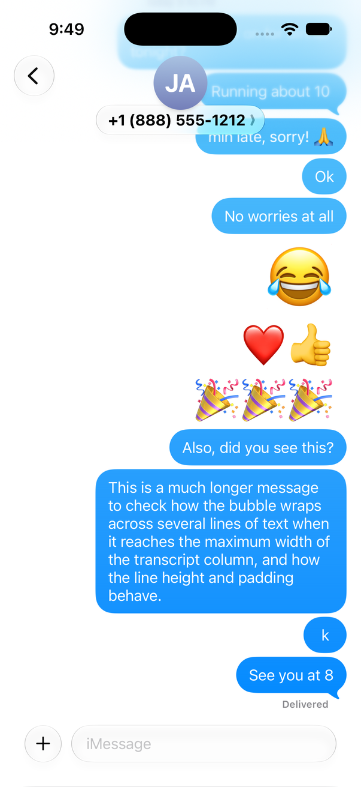 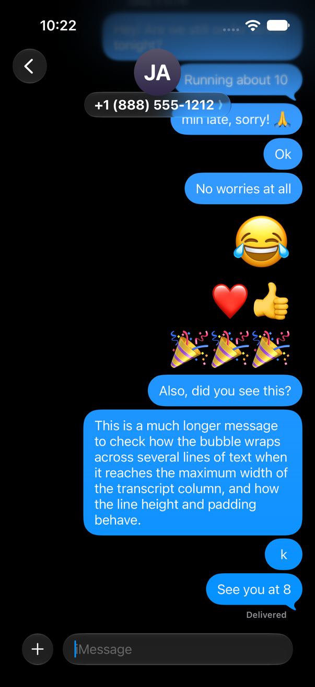
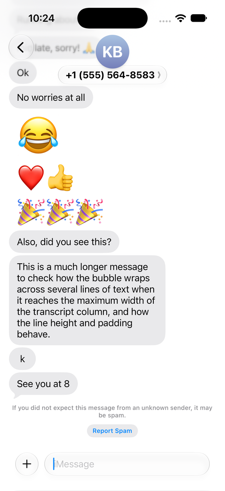 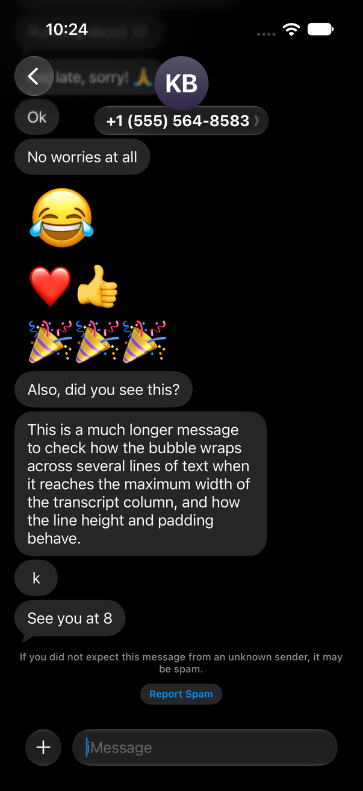

### Header [M]

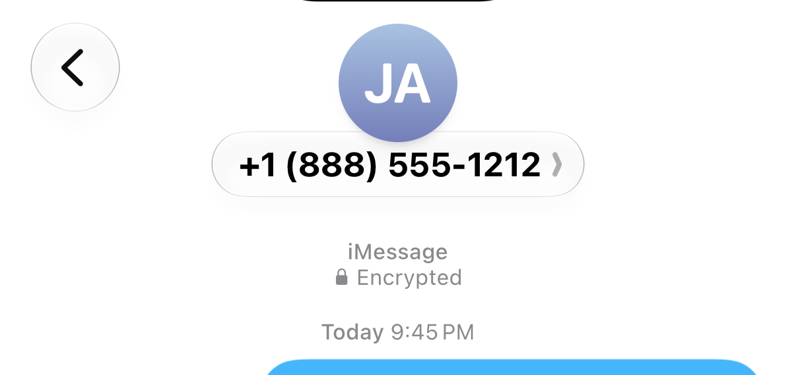

```
 62 ┌──┐            ┌────┐
    │ ‹│ back 44x44  │ JA │ avatar 60x60 at x171 (centered), y62
106 └──┘ x16        │    │
117      ┌─────────┴────┴──────────┐   name pill x107.3..294.7, y117, h32.3
         │ +1 (888) 555-1212   ›   │   17 semibold, chevron secondary
149      └─────────────────────────┘   pill overlaps avatar bottom by 5 pt
```

* Back button: glass circle 44 x 44 at (16, 62); chevron ink 10.7 x 18.3 at x 31-41.7.
* Avatar: 60 pt monogram circle; initials ≈ 28 pt bold white.
* Pill: glass capsule (radius 16), padding ≈ 13 pt horizontal.
* No bar background; transcript content scrolls under with the scroll-edge blur.

### Bubble geometry [M]

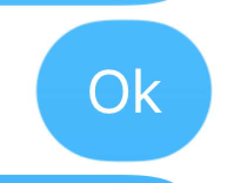
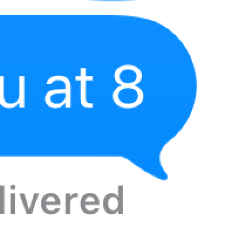 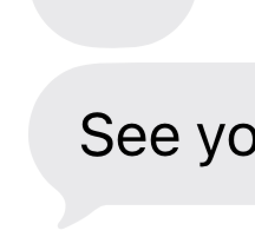

| Property | Value |
| --- | --- |
| Single-line height | **40** (40.3 incl. AA) |
| Line pitch | **20.0** per extra line (2 lines = 60.3, 7 lines = 160.3) |
| Vertical padding | 10 top / 10 bottom (text box 20.3 centered) |
| Horizontal padding | **14** from bubble edge to glyph box (ink starts 14.7, side bearing ~0.7) |
| Corner radius | **20** (circular arc fits: inset 13.7 @1pt, 8 @4, 2.7 @10, 0 @18-20); single-line bubbles are full capsules |
| Screen margin | sent right edge x=386 (16 pt); received left edge x=16 |
| Max width | **280** (long bubble 106.3-386 = 279.7, ≈ 69.6% of 402) |
| Min width | ~48 ("k" = 48, "Ok" = 49.7): capsule with 14 padding |
| Gap, same sender same group | **4** (tops pitch = height + 4) |
| Gap after a time-gap group break, same sender | **10** body-to-body |
| Gap around a timestamp separator | 10 above bubble (separator ink bottom -> bubble top) |
| Tail | only on the last bubble of a group; bubble body unchanged, tail hangs below |

**Tail shape (sent)** [M], in bubble-right-anchored coordinates (`R` = bubble right edge,
`B` = body bottom):

| y rel. to body bottom B | -7.7 | -6.7 | -4.7 | -3.7 | -2.7 | -1.7..+1.3 | +2.3 | +3.3 | +4.3 | +5.3 | +6.3 (tip) |
| --- | --- | --- | --- | --- | --- | --- | --- | --- | --- | --- | --- |
| tail outer (right) edge | R-4.7 | R-5.7 | R-7.7 | R-9.0 | R-9.7 | **R-10.3** | R-10.0 | R-9.7 | R-9.0 | R-8.3 | R-8.7 |
| tail inner (left) edge | (body) | | | | | R-20.3 at B+0.3 -> R-18.7 at B+1.3 | R-17.3 | R-16.0 | R-14.3 | R-12.7 | R-10.3 |

(`R` = bubble body right edge = 386, `B` = body bottom; sampled every 1 pt.)

In words: the bubble's bottom-right corner is pulled into a small hook. The tail is ≈ 10 pt
wide at its root (x R-20 to R-10), hangs **7.3 pt** below the body, and ends in a rounded tip
at (R-9, B+7). It curls **outward and down**; its outer edge is concave. Received tail is the
exact mirror (tip at x=L+9.7). The 6x crops above are the ground truth for the path.

### Emoji-only messages [M]

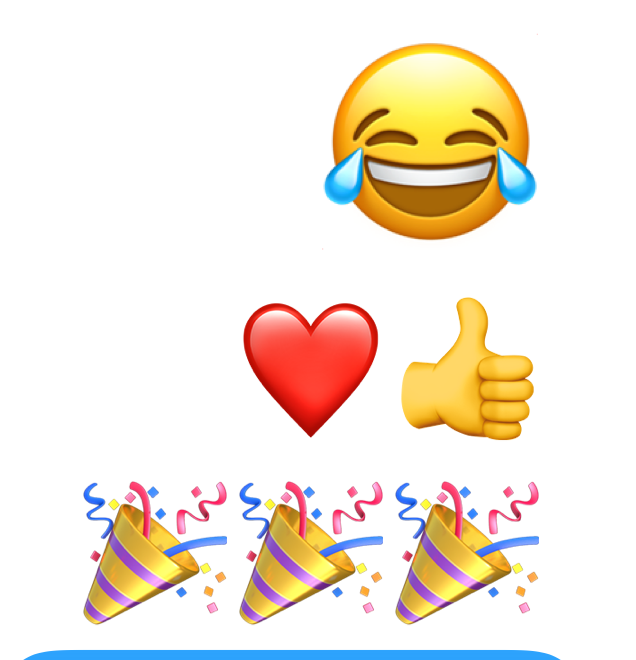

No bubble, no tail. One emoji renders at ink height **≈ 69 pt**; two or three emoji render at
**≈ 48 pt** each, with about 4 pt spacing. Right-aligned to x≈369 (sent), so the inset is about
17 pt from the edge, just inside the bubble column. Vertical gap to neighbours ≈ 12-16 pt.

### Separators and receipts [M]

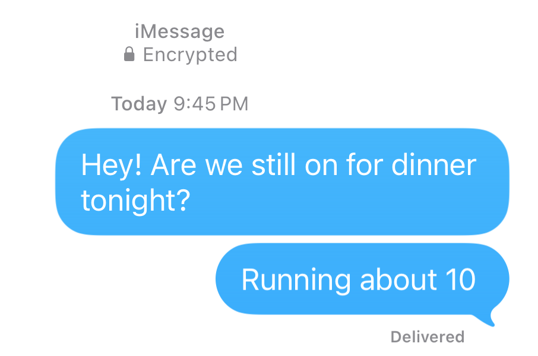

* Conversation header (first message only): "iMessage" / "🔒 Encrypted", 11 pt secondary,
  centered, y 173-196.
* Time separator "**Today** 9:45 PM" / "**Yesterday** 9:45 PM": 11 pt, centered, the day word
  semibold, the time regular, both `#8A8A8E`. It is inserted when ≥ ~1 h passes, and before the
  first message of a new day.
* "Delivered": 11 pt semibold secondary, right-aligned so that its right edge is 21 pt inside
  the bubble's right edge (x 365). Its ink top is ≈ 8 pt below the body bottom, just under the
  tail. It is shown only under the latest sent message.
* Unknown-sender footer (received thread): 13 pt secondary, centered, multi-line, followed by a
  "Report Spam" capsule (`#E9E9EB`/`#262629`, text `#0088FF` 15 semibold).

### Link previews [K]

The URL in "Also, did you see this? https://www.apple.com/iphone/" was split into its own
message. It rendered as an empty link balloon because the simulator had no network. Use
standard rich-link cards: 280 max width, image on top, and a title/domain footer in the
received-gray or sent-blue tint.

---

## 5. Composer

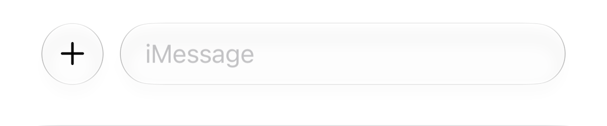
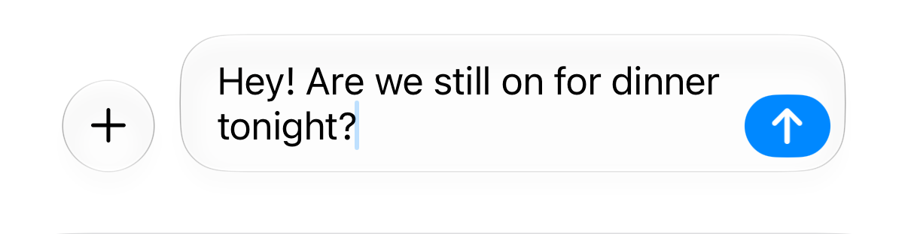
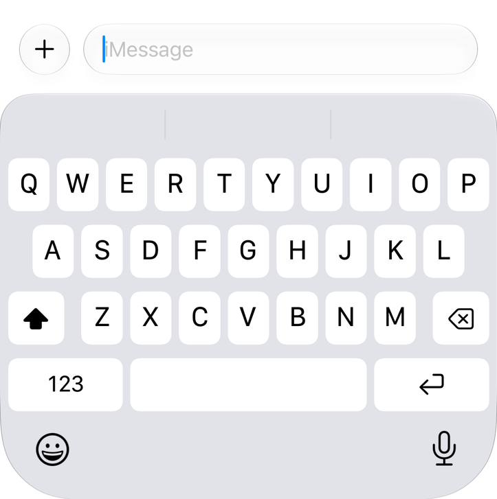
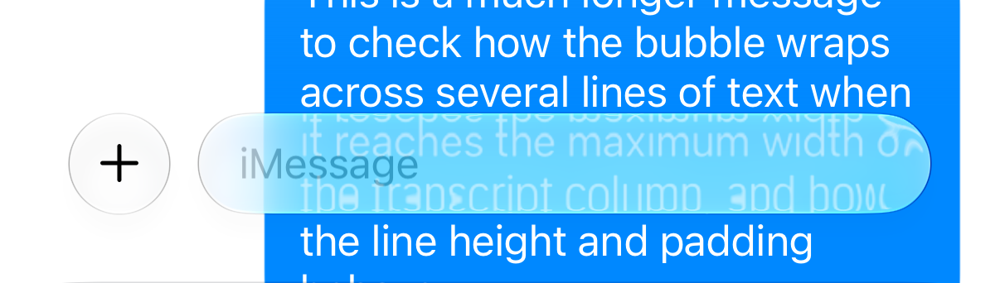

| State | "+" button | Field capsule | Send |
| --- | --- | --- | --- |
| Keyboard hidden | 40 x 40 glass circle at (28, 806) | x 80-374 (w 294), y 805.7, h 40.3, radius 20 | hidden |
| Keyboard shown | (16, 490) | x 68-386 (w 318), y 489.7, h 40.3 | |
| Text, 2 lines | stays bottom-aligned (806) | grows upward: y 785 -> 846.3 (h 61.3 = +20 per line) | capsule **38 x 28** `#0088FF`, white up-arrow, inset 6.3 from field right and bottom |

* Bottom gap is 28 pt with the keyboard hidden. With the keyboard shown, the field bottom sits
  16 pt above the predictions bar top (546).
* The gap between "+" and the field is 12. Margins are 28 when the keyboard is hidden and 16
  when it is shown.
* Placeholder "iMessage" is 17 regular `#C0C0C2`, ink starting at x=97 (17 inside the field).
* Empty field: no trailing glyph in the thread. The New Message sheet shows a waveform
  (audio-message) glyph. **Mic vs send swap:** the send capsule appears as soon as the text is
  non-empty [M]. Swap animation [K]: scale 0.6 -> 1 plus fade, about 200 ms.
* The field and "+" are Liquid Glass: they refract content scrolling behind them (see the
  "glass over content" crop). The edge band magnifies and distorts text by about 1.1x.
* Focus without a software keyboard (hardware keyboard attached) lifts the bar about 20 pt
  over 120 ms [V].
* Keyboard show/hide coupling [K]: the simulator had a hardware keyboard, so it was not
  measured. Use the system keyboard curve. Composer and transcript inset track the keyboard
  frame 1:1 (`keyboardLayoutGuide`, spring response ≈ 0.38, damping 1). Interactive dismiss
  follows the finger 1:1.

---

## 6. Animations

### Send [V]

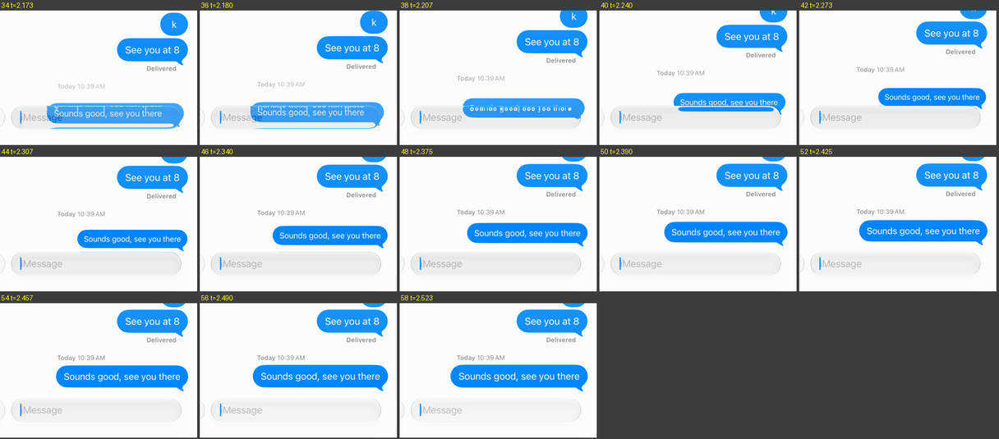

Sequence at t=0, when Return is pressed (send3 recording; thread already scrolled to bottom):

| t ms | Event |
| --- | --- |
| 0 | Transcript starts moving up. The field text is replaced by a blue bubble filling the field rect. |
| 0-110 | The blue bubble sits over the composer field. Its text stays put while the fill appears. |
| ~110 | The bubble squashes vertically (thin pill), then lifts and stretches to full height while moving up. Width grows from ≈ 190 to the final width, anchored at the right edge. |
| 110-400 | Bubble travels from the composer to its slot: **spring response 0.45, damping 0.84** (≈ 3% overshoot) |
| 0-320 | Existing transcript shifts up by (new bubble height + gaps + any new timestamp header). Here it moved 77.7 pt: **spring response 0.30, damping 1.0**. |
| 0-250 | A new "Today 10:39 AM" separator (if needed) fades in |
| ~1200 | On delivery: "Delivered" moves from the previous bubble to the new one. The new bubble shifts up 19 pt and the rows above shift down about 4 pt: **response 0.33, damping 0.94** (≈ 18 frames). |

When the thread is empty (send2), the bubble flew 515 pt with **response 0.50, damping 0.72**:
3.9% overshoot at 370 ms, settled by about 700 ms. Width went 247 (field) -> 200 (mid-flight)
-> 255 (final). Treat the 0.45/0.84 value as the normal in-thread curve.

Frame counts at 60 fps: bubble flight ≈ 19-24 frames; transcript shift ≈ 19 frames.

### Swipe left to reveal timestamps [V]

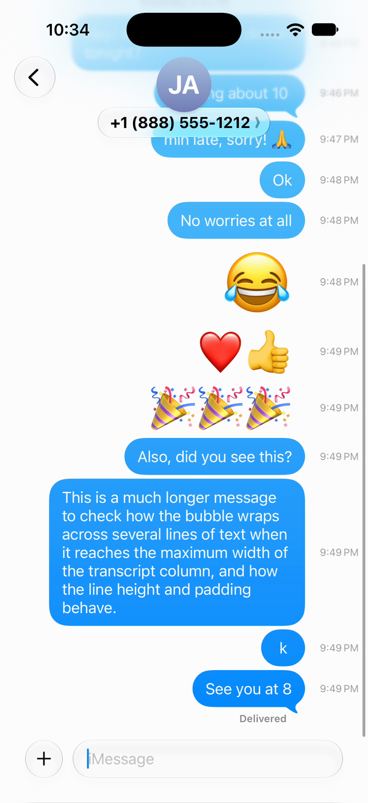

* A horizontal pan anywhere on the transcript moves **all bubbles (sent and received)** left.
* Translation ≈ 0.30 x finger travel. The finger moved 180 and bubbles moved 53.4. The motion
  saturates around 60-70 pt.
* Timestamps ("9:48 PM", 11 regular secondary) sit at x 350-391, right-aligned to
  402 - 11. They are vertically centered on each message and stay fixed; the bubbles slide off
  them.
* Release: spring back **response 0.43, damping 1.0**, 99% at ≈ 450 ms (27 frames).
* The "Delivered" label and the header row slide with the bubbles.

### Tapback (long-press a bubble) [M]/[V]

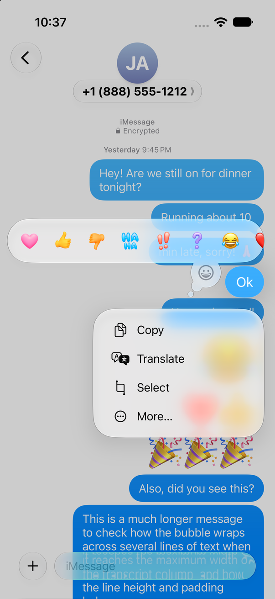

| Item | Value |
| --- | --- |
| Press feedback | the bubble scales up ~1.07-1.08 linearly while held (≈ 500 ms) |
| Trigger | menu appears ≈ 1.0 s after touch-down; the bubble returns to 1.0 in ≈ 100 ms |
| Backdrop | transcript dims to white x 0.80 (`#CCCCCC`) over ≈ 150 ms, no blur. The pressed bubble stays undimmed in place. |
| Reaction bar | glass capsule x 10.3 -> (scrolls past the right edge), y 319-383 (**h 64**). Items are 49 wide: Heart, Thumbs up, Thumbs down, Ha ha, !!, ?, then recent emoji. Positioned above the bubble. |
| Custom emoji button | 44 pt glass circle in a "thought bubble" tail pointing at the message, at (279, 375.6) |
| Action menu | glass panel w **250**, right-aligned to the bubble's right edge (x 136-386), items 42: Copy, Translate, Select, More… |

### Typing indicator [K]

Not reproducible (no remote sender). Spec from platform behavior: a received-gray bubble
≈ 60 x 40 with the received tail plus a smaller detached 10 pt "bubble dot" at the tail. It
holds 3 dots of 9 pt, spacing 4, color `#8E8E93` at 50%. The dots pulse in sequence (period
≈ 1.2 s, each dot 0.3 s phase offset, opacity 0.4 -> 1 and scale 1 -> 1.15). The bubble
enters with a scale from 0.6 at the tail anchor.

### Scroll to bottom [K]

New outgoing messages always scroll to the bottom (above). There is no visible "jump to
bottom" button in iOS 27 Messages. Scrolling up and sending snaps to the bottom with the
transcript spring (response ≈ 0.3).

---

## 7. Animation summary table

| Animation | Curve | 99% settle | Frames @60 | Source |
| --- | --- | --- | --- | --- |
| Push list -> thread | spring(response 0.28, damping 1.0) | 295 ms | 18 | push1 |
| Pop thread -> list | spring(0.27, 1.0) | 285 ms | 17 | pop1 |
| List parallax | -30% x (1 - p) | follows push/pop | | pop1 |
| List dim under thread | alpha 0.10 x (1 - p) | | | pop1 |
| Nav header crossfade | hold ~100 ms, blur+fade ~60 ms | 160 ms | ~10 | pop1 |
| Send: bubble flight | spring(0.45, 0.84) | ~310 ms | 19 | send3 |
| Send: transcript shift | spring(0.30, 1.0) | 316 ms | 19 | send3 |
| Send: first message | spring(0.50, 0.72) | ~700 ms | 42 | send2 |
| Delivered receipt move | spring(0.33, 0.94) | 300 ms | 18 | send3 |
| Timestamp swipe return | spring(0.43, 1.0) | 450 ms | 27 | ts |
| Context-menu expand | spring(~0.25, ~0.80) | ~370 ms | ~22 | ctx |
| Swipe action snap | critically damped, ~450 ms | | | swipeL |
| Large title -> inline title | crossfade 35-50 ms at offset ≈ 54 | | 3 | collapse |

SwiftUI mapping: `.spring(response: R, dampingFraction: D)`; for UIKit use
`UISpringTimingParameters(dampingRatio: D, frequencyResponse: R)`.

---

## 8. Validating an implementation: `tools/framediff.py`

```bash
~/nxios-ref/venv/bin/python -I ios-next/reference/tools/framediff.py \
    ~/nxios-ref/imessage/vid/send3.mp4  impl-send.mp4 \
    --crop 0,600,402,274 --track 260,725,130,50 --out /tmp/send-diff
```

* Videos are resampled to 60 fps. Sequences are aligned on motion onset. Per-frame bbox,
  centroid, progress and (with `--track`) the tracked element's x/y/scale/opacity are
  reported for both inputs.
* It also writes per-frame deltas, a SwiftUI spring fit for each input, and
  `contact_sheet.png` (ref | impl | diff per row).
* Accept parity when duration delta ≤ 2 frames, tracked position error ≤ 2 pt mean and ≤ 6 pt
  max, and fitted response within ±0.05 s and damping within ±0.08.

## Caveats

* Simulator recordings are variable-frame-rate. Under the host load at capture time (load
  average 400-900), frames were dropped and duplicated. All timings use per-frame PTS, so
  treat curve parameters as ±0.03 s response.
* Only two conversations existed (both pre-seeded): the compose sheet runs out of process and
  its recipient tokens failed to resolve under load. The pinned grid, unread dot, delete and pin
  animations, typing indicator, keyboard animation and link preview are **[K]**.
* The received thread is the simulator's loopback copy of the sent messages, which is why it
  shows an unknown-sender footer.
