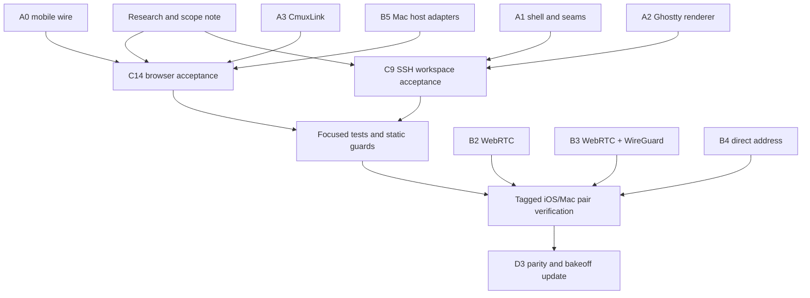

# cmux-next iOS execution snapshot

Updated 2026-10-07. This is the working handoff for the next implementation wave. The
authoritative lane contracts remain in [PLAN.md](PLAN.md); this file records what is
actually ready to run from the current `feat-cmux-next-ios` head.

## Product loop

Every slice follows the same loop:

1. **Research:** record the user journey, the platform pattern being followed, the
   state owner, and the failure states before changing code.
2. **Contract:** define the protocol or feature seam and its mock behavior. A feature
   cannot depend directly on a carrier.
3. **Implementation:** ship the smallest vertical behavior through the seam, with a
   deterministic test for its state transitions and idempotency/reconnect behavior.
4. **Verification:** run focused package tests, static guards, then the affected tagged
   iOS/Mac pair. Record device evidence or the exact external blocker.
5. **Handoff:** update the lane note and D3 parity row before starting the next dependent
   slice.

The realtime invariant applies at every step: event driven delivery, bounded buffers,
ordered revisions, gap-triggered snapshots, reconnect resume, and one UI commit per
display frame. Offline state is a read-only mirror plus a local draft; mutations do not
silently queue.

## Current evidence and selected work

The refreshed D3 matrix at implementation baseline `166e9c49fa` reports 85 of 98 parity rows done, with one
implementation gap (the remaining tmux workspace parity), four seam-only rows, four mocked
platform rows, and four intentional drops. B1 now isolates Stack sessions, binds HostDO placement,
rejects cross-host reads, enforces strict stream epochs, and rate-limits TURN and pending-snapshot
repair traffic. C9 has bounded tmux scrollback hydration for safe single-pane attachment, C16 has
an authenticated cached/fail-closed remote-config source, and E1 bounds SSH session output; carrier,
device, multi-pane/history, lifecycle, and other explicitly mocked or seam-only evidence remain open.
The existing A0/A1/A2/A3 and B1-B6 contracts are present, and the V1 WebRTC, V2
WebRTC-over-WireGuard, and V3 direct-address implementations remain separate behind `CmuxLink`.

The active wave is intentionally independent:

| Workstream | Depends on | First deliverable | Verification gate |
| --- | --- | --- | --- |
| Product/design research and scope reconciliation | current PLAN + D3 evidence | research note with user journeys, invariants, and ranked gaps | every selected gap has an acceptance row and owner |
| C14 browser parity | A0, A3, B5 seams | landed browser session, simulator stream, direct-host route, local port-forward, and credentialed generic SOCKS route | tagged WKWebView/SSH/direct-host and simulator verification |
| C9 SSH workspace parity | A1, A2, existing SSH host seam | landed deterministic tmux/screen/cmux-tui discovery, epoch-checked tmux control attach, and safe hydration for a single-pane window | tagged SSH verification; multi-pane/history/parser-state parity and target lifecycle remain |
| Integration and verification | completed slices | merged docs/code plus updated D3 rows | focused tests, static guards, tagged pair/device evidence |

## Completed in this wave

- `e2cb1ef9da` adds the research, J1–J8 journeys, current-head scope table, invariants,
  prioritized risks, and release acceptance. It corrects the original D3 count's historical
  status instead of treating it as a current completion claim.
- `864c3eddbf` routes saved direct-address hosts through the in-app browser tunnel and makes
  loopback URL policy consistent for `*.localhost` subframes. The focused address/navigation
  tests and static checks pass.
- `e3983cd23f` and `b83b98b583` preserve the exact validated cmux-tui socket discovered over
  SSH and attach with `attach --socket`, with malformed-path, runtime-directory, replacement,
  and stale-session regressions. Syntax and scoped convention checks pass.
- `8240bc92e2` bounds `CmuxLink` channels, pending sessions, incoming channels and media tracks;
  overflow refuses or closes the resource, and focused tests cover the local channel cap and stalled
  incoming resource queues. Full package execution remains a fleet/build-host gate.
- `8017210242` adds identity-keyed B1 limits for TURN credential mints and pending snapshot forwards;
  the backend's focused Vitest suite (26 tests) and TypeScript typecheck pass.
- `9f9c69ffc0` isolates Stack refresh sessions with server-scoped digests, persists the enrolled
  HostDO install binding, rejects cross-host read selectors, and requires epochs once a mirrored
  stream is epoch-scoped; 26 focused backend tests and TypeScript typecheck pass.
- `0a9575efc3` adds bounded, epoch-checked tmux control-mode discovery, snapshot hydration and
  live pane output; native tests and live SSH verification remain a build-host/device gate.
- `ae5373dbde` adds up to 256 normal-screen scrollback rows to the tmux attach replay and refuses
  truncated or ambiguous alternate-screen history; Swift parsing and scoped checks pass.
- `d0678348d5` wires a credentialed generic SOCKS route through `WebRoute`; syntax and static checks
  pass, while native package tests, WKWebView and live reconnect verification remain pending.
- `bd9dc02a3c` closes accepted SOCKS handshakes as part of route shutdown and rejects backend opens
  after stop; the focused lifecycle regression and Swift 6 library build pass.
- `11bcf23602` wires authenticated `/v1/mobile/config` into the shell with cached initial state,
  five-minute refresh, payload/status bounds, negative-revision clamping, and fail-closed offline
  behavior; Swift parsing and static guards pass, while the native target remains a hosted-build gate.
- `0b67aecc0e` bounds CmuxMobileSSH session output at 256 oldest-first events and closes a stalled
  channel on overflow; the package build and mobile concurrency guard pass. The local TestingMacros
  plugin prevents executing the new focused Swift Testing target.
- `a6ef9156c0` account-keys remote-config cache entries and only restores them after sign-in; SSH
  command collection caps each transcript at 4 MiB, closes on overflow, and rejects a stream that
  ends without its normal close marker. Swift parsing and package build pass.
- `f538410565` resets account-scoped flags to that account's cache (or empty defaults) before a
  switched account's remote-config refresh can publish, closing the in-memory account-switch gap.
- `61242e7aab`, `5e46833214`, and `f7a0ad406e` harden host control overflow, use Cloudflare's
  documented TURN request shape, and pin an unambiguous active tmux pane; `0cc3c8feed` refreshes
  stale tmux catalogs and drops modern windows without exactly one active pane.
- `02c9e7e256`, `3eed11780a`, and `e039144f38` close the fleet archive's type and whole-module Swift
  compile failures. `743332da42` preserves verified upload ids for bounded composer intake,
  `61b549e59a`/`3bd1e8e902` add the credential-free Cloud VM attach preflight, and `d68a2dd488`
  adds the privacy-bounded analytics wire contract.
- `fae1b61265` rejects unsupported HTTPS loopback tunnel URLs before they reach the HTTP-only proxy;
  `bf44f8838d` restores bounded tmux pending control input after hydration with octal decoding and
  split-sequence regressions; `166e9c49fa` surfaces a lost pairing registry path as an actionable
  onboarding offline state.

The dedicated build host remains unavailable for interactive package tests (`cmux-lawrence-2` does not
resolve), so native test execution, tagged pair installs, visual evidence, and live SSH/browser paths
remain explicitly unverified. A fleet archive now proves the exact current iOS device and simulator
targets compile: job `58bffde107091f30ece9f383`, tag `nxd3-166e-ios-v2`, exact head
`166e9c49fa7073c53a8c688ff9bdd9623153f7c7`, artifact digest
`5e168f236e1f22003109730037daf7bc1ed8b1337f0465ede765f5a717d67233`. Current static checks pass;
the post-build C8/C12/C16 slices add static and focused contract evidence; the backend slice has 35
focused Vitest tests and a clean TypeScript typecheck. The next gate is tagged Mac/iPhone pairing
and D3 runtime evidence; no simulator, real-phone, or live SSH/browser result is claimed.

## Dependency graph for this wave

The critical path for a usable terminal is still `A0/A3 -> B5 -> C1 -> D1`; the
selected work closes parity around that path without coupling the browser or SSH UI to
which carrier wins the D2 bakeoff. A carrier decision is made only after the same
workload is measured over V1, V2, and V3.

## Scope guardrails

- The agent-session GUI is future work and is not part of this wave.
- Host-owned state stays on the Mac daemon; Durable Objects coordinate and resume
  control-plane streams, but never become a terminal byte store.
- Terminal bytes, browser video, remote desktop, and file/media payloads stay on the
  stream plane. Workspace, feed, notifications, pairing, and signaling stay on the
  control plane.
- Direct Tailscale/WireGuard/LAN addresses are an explicit user-selected path and are
  authenticated with the pinned host identity. They do not become an implicit fallback
  for a failed cloud path.
- New UI must support Dynamic Type, VoiceOver, Reduce Motion and offline/reconnect
  states, and must cite the relevant Apple HIG guidance in its lane note.
