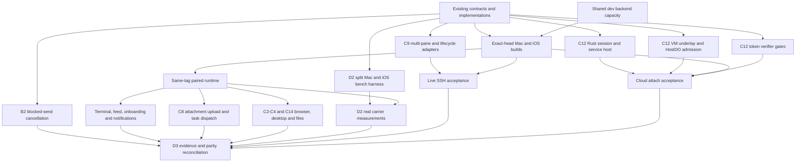

# cmux-next iOS execution snapshot

Updated 2026-10-08. This is the working handoff for the next implementation wave. The
authoritative lane contracts remain in [PLAN.md](PLAN.md); this file records what is
actually ready to run from the current `feat-cmux-next-ios` head.

## Product loop

Every slice follows the same loop:

1. **Research:** record the user journey, the platform pattern being followed, the
   state owner, and the failure states before changing code.
2. **Contract:** define the protocol or feature seam and its mock behavior. A feature
   cannot depend directly on a carrier.
3. **Implementation:** ship the smallest vertical behavior through the seam, with a
   deterministic test for its state transitions and idempotency/reconnect behavior.
4. **Verification:** run focused package tests, static guards, then the affected tagged
   iOS/Mac pair. Record device evidence or the exact external blocker.
5. **Handoff:** update the lane note and D3 parity row before starting the next dependent
   slice.

The realtime invariant applies at every step: event driven delivery, bounded buffers,
ordered revisions, gap-triggered snapshots, reconnect resume, and one UI commit per
display frame. Offline state is a read-only mirror plus a local draft; mutations do not
silently queue.

## Current evidence and selected work

The refreshed D3 matrix at the current implementation baseline
`8189a7fad29` reports 86 of 98 parity rows done, with one
implementation gap (the remaining tmux workspace parity), three seam-only rows, four mocked
platform rows, and four intentional drops. B1 now isolates Stack sessions, binds HostDO placement,
rejects cross-host reads, enforces strict stream epochs, and rate-limits TURN and pending-snapshot
repair traffic. C9 has bounded tmux scrollback hydration for safe single-pane attachment and a
partial pane-composition seam that preserves renderer/parser identity by pane id, C16 has
an authenticated cached/fail-closed remote-config source, and E1 bounds SSH session output; carrier,
device, full multi-pane/history/parser-state, lifecycle, and other explicitly mocked or seam-only
evidence remain open.
The existing A0/A1/A2/A3 and B1-B6 contracts are present, and the V1 WebRTC, V2
WireGuard-over-WebRTC, and V3 direct-address implementations remain separate behind `CmuxLink`.

The remaining work separates independent implementation from shared runtime dependencies:

| Workstream | Depends on | First deliverable | Verification gate |
| --- | --- | --- | --- |
| Hosted verification and D3 | current committed iOS/Mac tree; shared dev backend capacity | exact-head archives, native package/UI tests, same-tag pair | terminal, feed, onboarding, media and composer runtime evidence |
| D2 carrier measurement | B2/B3/B4; implemented F7 scheduling and F8 render credit | F2 split Mac/iOS benchmark harness; finish F3 blocked-send cancellation | real latency/throughput/roam results with manifests; power results require an authorized device run |
| C8 task attachments | landed C4 picker/uploader and C8 shell integration | native tests and PhotosUI/camera/document upload, cancellation and dispatch verification | tagged pair; no further picker seam is missing |
| C12 VM host | A0/A3 vectors, C12 connect-info and one-shot token contract | Rust link session and services, VM underlay, HostDO admission and token verifier | end-to-end VM terminal/files attach before enabling `cloudWorkspaces` |
| C9 SSH workspace parity | landed discovery, single-pane hydration, layout metadata, partial pane composition and lifecycle wire contract | complete multi-pane renderer/parser-state parity; owner-backed lifecycle adapter | hosted tests and live SSH verification |
| C14 browser and other landed feature paths | existing feature seams and Mac adapters | WKWebView/SSH/direct-host, simulator and media verification | tagged pair, permissions and reconnect evidence |

## Completed in this wave

- `e2cb1ef9da` adds the research, J1–J8 journeys, current-head scope table, invariants,
  prioritized risks, and release acceptance. It corrects the original D3 count's historical
  status instead of treating it as a current completion claim.
- `864c3eddbf` routes saved direct-address hosts through the in-app browser tunnel and makes
  loopback URL policy consistent for `*.localhost` subframes. The focused address/navigation
  tests and static checks pass.
- `e3983cd23f` and `b83b98b583` preserve the exact validated cmux-tui socket discovered over
  SSH and attach with `attach --socket`, with malformed-path, runtime-directory, replacement,
  and stale-session regressions. Syntax and scoped convention checks pass.
- `8240bc92e2` bounds `CmuxLink` channels, pending sessions, incoming channels and media tracks;
  overflow refuses or closes the resource, and focused tests cover the local channel cap and stalled
  incoming resource queues. Full package execution remains a fleet/build-host gate.
- `8017210242` adds identity-keyed B1 limits for TURN credential mints and pending snapshot forwards;
  the backend's focused Vitest suite (26 tests) and TypeScript typecheck pass.
- `9f9c69ffc0` isolates Stack refresh sessions with server-scoped digests, persists the enrolled
  HostDO install binding, rejects cross-host read selectors, and requires epochs once a mirrored
  stream is epoch-scoped; 26 focused backend tests and TypeScript typecheck pass.
- `0a9575efc3` adds bounded, epoch-checked tmux control-mode discovery, snapshot hydration and
  live pane output; native tests and live SSH verification remain a build-host/device gate.
- `ae5373dbde` adds up to 256 normal-screen scrollback rows to the tmux attach replay and refuses
  truncated or ambiguous alternate-screen history; Swift parsing and scoped checks pass.
- `d0678348d5` wires a credentialed generic SOCKS route through `WebRoute`; syntax and static checks
  pass, while native package tests, WKWebView and live reconnect verification remain pending.
- `bd9dc02a3c` closes accepted SOCKS handshakes as part of route shutdown and rejects backend opens
  after stop; the focused lifecycle regression and Swift 6 library build pass.
- `11bcf23602` wires authenticated `/v1/mobile/config` into the shell with cached initial state,
  five-minute refresh, payload/status bounds, negative-revision clamping, and fail-closed offline
  behavior; Swift parsing and static guards pass, while the native target remains a hosted-build gate.
- `0b67aecc0e` bounds CmuxMobileSSH session output at 256 oldest-first events and closes a stalled
  channel on overflow; the package build and mobile concurrency guard pass. The local TestingMacros
  plugin prevents executing the new focused Swift Testing target.
- `a6ef9156c0` account-keys remote-config cache entries and only restores them after sign-in; SSH
  command collection caps each transcript at 4 MiB, closes on overflow, and rejects a stream that
  ends without its normal close marker. Swift parsing and package build pass.
- `f538410565` resets account-scoped flags to that account's cache (or empty defaults) before a
  switched account's remote-config refresh can publish, closing the in-memory account-switch gap.
- `61242e7aab`, `5e46833214`, and `f7a0ad406e` harden host control overflow, use Cloudflare's
  documented TURN request shape, and pin an unambiguous active tmux pane; `0cc3c8feed` refreshes
  stale tmux catalogs and drops modern windows without exactly one active pane.
- `02c9e7e256`, `3eed11780a`, and `e039144f38` close the fleet archive's type and whole-module Swift
  compile failures. `743332da42` preserves verified upload ids for bounded composer intake,
  `61b549e59a`/`3bd1e8e902` add the credential-free Cloud VM attach preflight, and `d68a2dd488`
  adds the privacy-bounded analytics wire contract.
- `fae1b61265` rejects unsupported HTTPS loopback tunnel URLs before they reach the HTTP-only proxy;
  `bf44f8838d` restores bounded tmux pending control input after hydration with octal decoding and
  split-sequence regressions; `166e9c49fa` surfaces a lost pairing registry path as an actionable
  onboarding offline state.
- `33c8dc43f7` adds bounded tmux split-layout metadata to SSH discovery, validating checksums, pane
  geometry, depth and count before exposing read-only layout information. Full renderer composition
  and SSH lifecycle mutations remain open.
- `143b81f92d` and `661bbb47e9` add the C9 pane-composition seam: pane ids remain stable renderer
  and parser identities, grid input maps to pane-local coordinates, and reconciliation emits
  deterministic add/remove/update operations. This is a landed partial seam; full SSH multi-pane,
  history, parser-state restoration and lifecycle parity remain incomplete.
- `efe7c3c349` through `b060e3e9b4` add a transport-agnostic, bounded analytics uploader with offline
  fail-closed behavior, body/event splitting, transient retry backoff, cancellation-safe flushes,
  payload bounds and focused tests. It remains opt-in; `NoopAnalytics` is still the app default.
- `a22b7f7327` adds cancellable steady-state WebRTC RTT sampling through the bounded path event inbox;
  `027ed54032` adds the immutable tmux pane projection seam; and `17cc748f0f` makes the D2 result
  manifest and provenance reproducible from either the manifest or its directory.
- `323ef09dd3` bounds C8 picker admission and upload state with atomic batches, stable transfer ids,
  cancellation-safe late-progress suppression, retries, malformed owner-id rejection and focused
  tests. `ab67558826` then wires the real C4 picker/uploader into the shell; the remaining limitation
  is hosted runtime verification rather than a disabled attachment path.
- `88c8e31c73` defines the C9 create/rename/kill tmux lifecycle protocol with server epochs, host-issued
  ids, bounded names and idempotency keys, canonical wire parameters and durable owner receipts. It
  does not execute SSH commands; the host adapter and live lifecycle verification remain open.
- `5e1af976a5` sizes the default reliable terminal render credit from the latest RTT (2.5 MB/s target,
  2 MiB cap, 256 KiB baseline), wakes blocked render senders when the path changes, and preserves
  explicit channel budgets. `1cd8a1e0e6` connects that mode to the real terminal path: its 64 KiB
  input declaration is promoted to a directional render budget on the Mac bridge, with an integration
  test. Pure tests and the CmuxLink package build pass; device/WAN evidence remains open.
- `312264890a` distinguishes failed attachments from active uploads, and `1be496c976` adds explicit
  upload teardown plus a weak-model regression so an unfinished stream cannot retain a dismissed
  composer. `2dd297a2fb` preserves string-entry paths in D2 manifests and tests that string and object
  entries group identically without mixing experiments.
- `d69ae0edca` closes D2 F7 at the application layer: direct TCP keeps Noise frame segments contiguous,
  schedules queued interactive frames ahead of bulk, bounds active plus queued bulk to one maximum
  frame, and wakes/cancels blocked admissions. The implementation is covered by pure queue tests;
  WAN/device tail-latency confirmation remains a D2 evidence gate.
- `49b298df07` serializes Cloud VM attach preparation and one-shot link-token minting across actor
  suspension, validates the exact requested service and invalidates stale reconnect completions. The
  Rust VM session host, HostDO VM admission and live underlay remain phase-2 dependencies.
- `ab67558826` wires C8 task attachments through C4's shared PhotosUI/camera/document staging and
  transfer coordinator, including verified owner upload references, bounded progress and cancellation
  cleanup. Static guards pass; native package tests remain blocked by the known host/toolchain issue.
- `ea5b529e25` fixes the Xcode whole-module device archive error in `DirectWriter` by typing both
  throwing `Void` continuations. `c582018fc0` scopes C8 upload completions to their admitting target
  generation, removes canceled placeholders on composer teardown/target change, and resumes active
  direct writes with cancellation after closing the blocked socket. `a7bff36e41` ratchets the mobile
  concurrency and crash-safety baselines after those fixes.

The dedicated build host remains unavailable for interactive package tests (`cmux-lawrence-2` does not
resolve), so native test execution, tagged pair installs, visual evidence, and live SSH/browser paths
remain explicitly unverified. The first exact archive at `1cfec927019d0735b1838bb5acbf1e2f91104b8b`
reached the device archive and failed only on the now-fixed `DirectWriter` continuation inference; the
next SSH-focused archive at `5c12908b6fb7459f85477f8007ebf122a6561a8` completed both device and simulator
targets. Job `f900b76613afdfd5d143380b` (`nxios-5c1-ssh-v1`) finished on `cmuxs-Mac-mini.local` with
artifact digest `sha256:2616159e4636285cdade07d8f19ecadb3518230f6d4d4d9447cd4c927c2fc756`. Its device archive
took 175.64 seconds and its simulator build took 42.16 seconds. This is compile/archive evidence only;
it does not claim package tests, installation, or runtime behavior.
The older exact fleet archives also prove the iOS device and simulator targets compile:
the latest job `22d44de4793805270a52cbff`, tag `nxd3-dd344-ios-v4`, exact head
`dd344fa661ac766511d5da0f02f70dfa7e10a42a`, artifact digest
`b4225a08b805c05b7c8896fd79382a5f0070379e1f79eea416ed659fa0a91e00` (the prior `f23162542f` archive
was superseded by the final timing-safety commits). Exact-head follow-up job `a439f2f1083073248164673e`
for `cff9e2e9cff22df187c664b542c8047deba34d8b` completed on `cmuxs-Mac-mini.local` with iOS artifact
digest `sha256:ad26dc3b97ae13418b2038028cabf9783710c57456c48d1ec6abf6eaf22fd7a7`; this is archive and
simulator compile evidence only, with no install or runtime claim. Current static checks pass; the post-build
C8/C12/C16 slices add static and focused contract evidence; the backend slice has 37 focused Vitest
tests and a clean TypeScript typecheck. The next gate is tagged Mac/iOS pairing and D3 runtime
evidence; no simulator, real-phone, or live SSH/browser result is claimed.

Focused hosted checks at this exact head also passed: DirectWriter cancellation job
`08cb4b4404254ee8982135f1`, WebRTC room-waiter cancellation job
`b8eea654f3041653d09df898` (3 tests), and CmuxLinkBench job
`1f1ccda7d15a2458512e588e` (4 tests). These jobs provide deterministic application/test evidence;
they do not substitute for a tagged pair, device install, WAN run, or live SSH/browser verification.

### D2 carrier audit

The local bakeoff records a DEV-only loopback decision. F2's first split slice now has a real direct
`cmux-link-bench serve`/`client` path and the shared `BenchSplitClient` library: it exchanges a
pinned descriptor, runs the shared connect/echo/flood/bulk workloads through `LinkSession`, and
writes the regular report plus a checked manifest. The iOS DEV Link bench screen and B5 signaling
adapters for V1/V2 remain open, so no device JSON has been captured. The V3 direct roam measurement
is synthetic because the rig forces a direct TCP reconnect to report `.turn`, a path that the direct
carrier cannot actually provide; it must be omitted or replaced with an alternate direct endpoint
before it is compared with V1/V2 roaming. F8 is implemented in the session layer. F3 blocked-send
cancellation is implemented at the application and deterministic-test level: a real
`WebRTCPeer.send` blocked by a full lane removes only that send's waiter, admits no frame, and leaves
the peer open (`495f05b762f`). WAN/device evidence remains open. F7's application-side head-of-line
mitigation is implemented, but WAN/device evidence is still required before its tail-latency benefit is
claimed.

The post-F1/E1 results are nested in `plans/cmux-next/ios-next/bakeoff/results/e1/`. The checked-in
`manifest.json` enumerates the ten exact result files, labels the run groups, and records source
commit `2aebd498ca`; `summarize.py` accepts the manifest or its directory and rejects missing or
escaping paths. The table is reproducible, but the single full-session V1 run and the absence of
device/WAN results remain release limitations.

## Dependency graph for the remaining work

The A0-A3 foundations, B1-B6 carriers/host/pairing, and feature seams already exist. This graph
starts from those implementations; [PLAN.md](PLAN.md) retains the full construction order.
Independent implementation tracks do not wait for the shared backend or GUI verification slots.

The immediate runtime critical path is shared backend capacity -> exact-head tagged pair ->
pairing/terminal attach -> D3 evidence. The carrier decision also needs the F2 split harness and
measurements of the same workload on V1, V2 and V3. Cloud attach has a separate implementation
critical path through the Rust session host, VM underlay/admission and token verifier; phone token
minting alone cannot close it. SSH parity and the benchmark harness can progress independently.

## Scope guardrails

- The agent-session GUI is future work and is not part of this wave.
- Host-owned state stays on the Mac daemon; Durable Objects coordinate and resume
  control-plane streams, but never become a terminal byte store.
- Terminal bytes, browser video, remote desktop, and file/media payloads stay on the
  stream plane. Workspace, feed, notifications, pairing, and signaling stay on the
  control plane.
- Direct Tailscale/WireGuard/LAN addresses are an explicit user-selected path and are
  authenticated with the pinned host identity. They do not become an implicit fallback
  for a failed cloud path.
- New UI must support Dynamic Type, VoiceOver, Reduce Motion and offline/reconnect
  states, and must cite the relevant Apple HIG guidance in its lane note.
