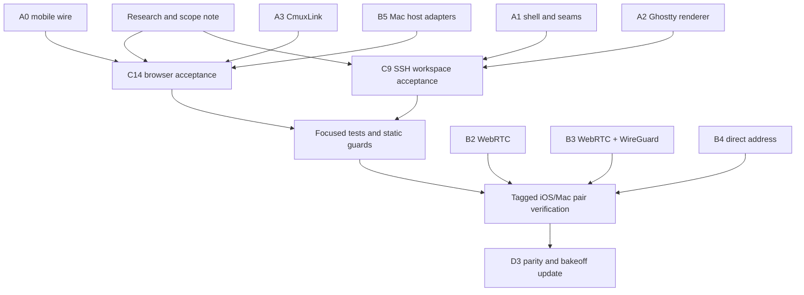

# cmux-next iOS execution snapshot

Updated 2026-10-07. This is the working handoff for the next implementation wave. The
authoritative lane contracts remain in [PLAN.md](PLAN.md); this file records what is
actually ready to run from the current `feat-cmux-next-ios` head.

## Product loop

Every slice follows the same loop:

1. **Research:** record the user journey, the platform pattern being followed, the
   state owner, and the failure states before changing code.
2. **Contract:** define the protocol or feature seam and its mock behavior. A feature
   cannot depend directly on a carrier.
3. **Implementation:** ship the smallest vertical behavior through the seam, with a
   deterministic test for its state transitions and idempotency/reconnect behavior.
4. **Verification:** run focused package tests, static guards, then the affected tagged
   iOS/Mac pair. Record device evidence or the exact external blocker.
5. **Handoff:** update the lane note and D3 parity row before starting the next dependent
   slice.

The realtime invariant applies at every step: event driven delivery, bounded buffers,
ordered revisions, gap-triggered snapshots, reconnect resume, and one UI commit per
display frame. Offline state is a read-only mirror plus a local draft; mutations do not
silently queue.

## Current evidence and selected work

The D3 matrix at the current head reports 71 of 98 parity rows done, with the remaining
work concentrated in the real Mac host adapters, the in-app browser/port-forward path,
SSH multiplexer workspaces, carrier/device evidence, and a few explicitly mocked
platform operations. The existing A0/A1/A2/A3 and B1-B6 contracts are present, and the
V1 WebRTC, V2 WebRTC-over-WireGuard, and V3 direct-address implementations remain
separate behind `CmuxLink`.

The active wave is intentionally independent:

| Workstream | Depends on | First deliverable | Verification gate |
| --- | --- | --- | --- |
| Product/design research and scope reconciliation | current PLAN + D3 evidence | research note with user journeys, invariants, and ranked gaps | every selected gap has an acceptance row and owner |
| C14 browser parity | A0, A3, B5 seams | browser session/port-forward behavior over a mock link, then real adapter | bounded stream, reconnect, input ordering, and no transport import in UI |
| C9 SSH workspace parity | A1, A2, existing SSH host seam | deterministic tmux/screen/cmux-tui discovery and attach model | discovery fixtures, changed-key and reconnect errors, attach idempotency |
| Integration and verification | completed slices | merged docs/code plus updated D3 rows | focused tests, static guards, tagged pair/device evidence |

## Dependency graph for this wave

The critical path for a usable terminal is still `A0/A3 -> B5 -> C1 -> D1`; the
selected work closes parity around that path without coupling the browser or SSH UI to
which carrier wins the D2 bakeoff. A carrier decision is made only after the same
workload is measured over V1, V2, and V3.

## Scope guardrails

- The agent-session GUI is future work and is not part of this wave.
- Host-owned state stays on the Mac daemon; Durable Objects coordinate and resume
  control-plane streams, but never become a terminal byte store.
- Terminal bytes, browser video, remote desktop, and file/media payloads stay on the
  stream plane. Workspace, feed, notifications, pairing, and signaling stay on the
  control plane.
- Direct Tailscale/WireGuard/LAN addresses are an explicit user-selected path and are
  authenticated with the pinned host identity. They do not become an implicit fallback
  for a failed cloud path.
- New UI must support Dynamic Type, VoiceOver, Reduce Motion and offline/reconnect
  states, and must cite the relevant Apple HIG guidance in its lane note.
