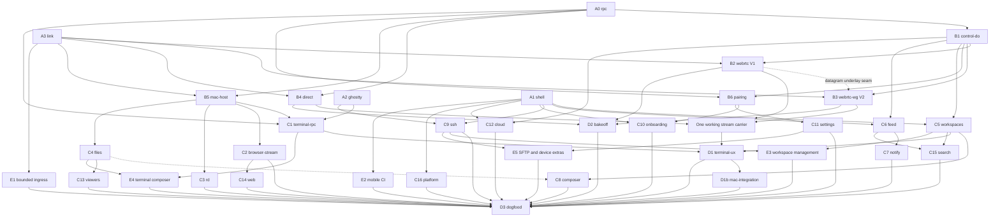

# cmux-next iOS: lanes and dependency graph

Status: active, 2026-10-06. Base branch `feat-cmux-next`. Binding: `plans/cmux-next/AGENT-BRIEF.md`,
`OWNERSHIP-PRINCIPLES.md`, `architecture.md`, `ios-rewrite.md` (app shell, auth, Home, budgets),
`ghostty-next.md`, `transport.md` (WireGuard overlay, `HostDO` relay, `cmux-wg`). This file adds the
network split decided on 2026-10-06 and assigns every iOS capability to a lane.

## 1. Network split

Two planes. Feature modules never import a transport; they talk to `CmuxLink` (lane A3).

| Plane | Carries | Carrier | Owner of truth |
| --- | --- | --- | --- |
| Control | workspace/pane/surface snapshots and deltas, presence, feed items and replies, notifications, device and host registry, pairing, task dispatch receipts, WebRTC signaling | Durable Objects over hibernating WebSockets (`backend/apps/api`) | the DO for cloud state, the Mac daemon for machine state (DO mirrors it) |
| Stream | terminal render updates and input, browser video and input, VNC/remote desktop, file and media transfer, voice | WebRTC data channels and media tracks; Cloudflare Realtime (TURN, SFU) for relay | the Mac session host |

Stream carriers are built three ways, by separate lanes, behind the same `CmuxLink` seam:

- V1 `webrtc`: WebRTC P2P with Cloudflare TURN fallback; signaling over the control plane.
- V2 `webrtc-wg`: end-to-end WireGuard (`CmuxLinkWG`) whose datagrams ride one unreliable WebRTC
  data channel, so ICE/TURN find the path and HostDO, TURN and DTLS see only ciphertext. Running
  WebRTC ICE on top of the overlay was rejected: libwebrtc binds OS sockets and cannot use overlay
  addresses on iOS without a Network Extension (`b3-webrtc-wg.md`).
- V3 `direct`: no rendezvous; the phone dials a user-entered or discovered address (Tailscale
  100.x / MagicDNS, any WireGuard or LAN address) when it is reachable, pinned to the Mac's device key.

Path order at runtime: direct (V3) > WebRTC P2P > TURN relay > DO relay (control-sized only). Lane D2
measures V1 vs V2 and picks the default; the loser stays behind a DEV switch until removed.

Realtime contract for every lane: no polling, no timers for sync; every stream has a revision and a
gap triggers a resync from snapshot; reconnect resumes with `(stream, revision)`; UI coalesces to one
update per frame.

## 2. Lanes

Each lane is one agent, one branch `feat-cmux-next-ios-<id>` off `feat-cmux-next-ios`, one design note
`plans/cmux-next/ios-next/<id>.md` (written first), then code, tests, PR into `feat-cmux-next`.

### Wave 0: contracts and foundations (no dependencies)

- **A0 `rpc`**: `cmux.mobile/1` wire. Envelope (id, stream, revision, idempotency key, capability
  negotiation, errors), plane tag per message family, schemas in `schemas/mobile-rpc/` with fixtures,
  Swift codec `Packages/Shared/CmuxMobileWire`, TS codec in `backend/packages/protocol`. Families:
  host, workspace, terminal, browser, rd, files, feed, notify, task, ssh, pairing, signal.
- **A1 `shell`**: app shell on `ios/CmuxiOS`: root navigation (Feed, Workspaces, Compose, Hosts,
  Settings), design tokens, dependency container with mock sources for every feature seam, feature
  flags, Sentry, l10n scaffolding, DEV menu. Keeps the existing auth and Home.
- **A2 `ghostty`**: Ghostty renderer on iOS from ghostty-next: Metal surface, manual I/O mode,
  snapshot restore, Ghostty key encoder, selection, scrollback budget, 120 Hz, fixture-driven
  benchmark. Input source agnostic (feeds A3 streams or SSH).
- **A3 `link`**: `CmuxLink` seam in Swift (iOS and Mac) and Rust (session host side): connection
  state machine, reliable-ordered and unreliable channels, media track handle, path badge,
  reconnect/resume, back-pressure, loopback and lossy-simulation mocks, conformance tests every
  carrier must pass.

### Wave 1: carriers and host (needs A0, A3)

- **B1 `control-do`**: control plane on DOs: per-host and per-device presence, workspace mirror,
  notification fan-out, signaling relay for WebRTC (SDP/ICE), WebSocket hibernation, auth by install
  token. Extends `HostDO`, `UserDO`, `FeedDO`, `PairingDO`; no new owner where one exists. Needs A0.
- **B2 `webrtc`** (V1): Cloudflare Realtime TURN credentials minted by the backend, WebRTC data
  channels and tracks on iOS and Mac implementing `CmuxLink`, ICE restart on roam. Needs A3, B1.
- **B3 `webrtc-wg`** (V2): userspace WireGuard over an unreliable WebRTC data channel, iOS without a
  Network Extension; Keychain-held WireGuard keys are certified by the install identity. Needs A3,
  B1 and B2's datagram-underlay seam (mockable while B2 is in development).
- **B4 `direct`** (V3): direct-address carrier: add a Tailscale/WireGuard/LAN address, reachability
  detection (VPN up, interface present), Noise/TLS pinned to the host key, Bonjour on LAN. Needs A0, A3.
- **B5 `mac-host`**: the Mac side: cmux-next exposes the mobile RPC services over `CmuxLink`,
  registers with B1, authorizes paired devices, maps services onto the cmux-tui daemon. Needs A0, A3.
- **B6 `pairing`**: same-account discovery, QR pairing, device keys and trust store, revoke, multi-Mac
  list. Needs A0, B1.

### Wave 2: features over the seams (each starts on mocks, switches to real carriers when ready)

- **C1 `terminal-rpc`**: terminal rendering state protocol: live bytes plus GHOSTSNP snapshots,
  attach/resize/sizing (smallest-viewer rules), input, flood catch-up, local echo prediction,
  latency telemetry. Needs A0, A2, A3, B5.
- **C2 `browser-stream`**: browser surface streaming: video track from the Mac browser host,
  touch/keyboard/scroll input, navigation and tab control, adaptive bitrate. Needs A0, A3, B5.
- **C3 `rd`**: VNC/remote desktop over `cmux.rd/1` (`cmux-rd-*` crates) on `CmuxLink`. Needs A3, B5.
- **C4 `files`**: file and media transfer: chunked resumable upload/download, photos and camera
  picker, drag into terminal/composer, progress. Needs A0, A3, B5.
- **C5 `workspaces`**: realtime workspace/pane/surface list and switcher, previews, status
  indicators, multi-Mac. Needs A0, A1, B1.
- **C6 `feed`**: feed of inline respondable agent events (permission, question, plan approval,
  done), reply inline, push actions, read state, via `FeedDO`. Needs A0, A1, B1.
- **C7 `notify`**: APNs categories and actions, Notification Service extension, Live Activities for
  running agents, badge = unread. Needs B1, C6.
- **C8 `composer`**: task composer: pick host, workspace, agent, model and effort, prompt with
  attachments and voice dictation, templates, dispatch and receipt. Needs A0, A1, C5; attachments
  via C4 when ready.
- **C9 `ssh`**: SSH hosts: add host, key generation (Secure Enclave or Keychain), known_hosts,
  jump hosts, SSH sessions rendered by A2, hosts sync across devices via B1. Needs A1, A2.
- **C10 `onboarding`**: onboarding in the style of Duolingo and Goodnotes: animated intro, value
  pages, sign-in, permission priming (notifications, local network, camera), Mac install and pairing
  walkthrough, first success moment. Needs A1, B6 (pairing step mocked until B6 lands).
- **C11 `settings`**: settings and devices: account, devices and revoke, terminal theme and font,
  notification preferences, transport diagnostics (path badge, RTT), about. Needs A1, B6.

### Wave 2b: parity gaps found by A1 (`a1-shell.md` section 1.20)

- **C12 `cloud`**: Cloud tab: Cloud VM list and lifecycle, Cloud onboarding, attach to a VM's
  terminals over `CmuxLink` (replaces the CloudVPN packet-tunnel extension). Needs A1, B1.
- **C13 `viewers`**: changes/diff viewer, artifact and file viewer (text, Markdown, images, PDF),
  todo and Markdown surfaces. Needs A1, C4.
- **C14 `web`**: in-app browser over Mac and SSH tunnels (loopback port forwarding on `CmuxLink`),
  simulator streaming on the C2 video path. Needs B5, C2.
- **C15 `search`**: search across feed, workspaces, hosts and terminals. Needs C5, C6.
- **C16 `platform`**: Sentry and diagnostics export, analytics, toasts, `ShellRoute` URL router and
  deferred deep links, remote flags served by B1, What's New, Mac version gate, App Review demo
  mode, Keep Mac Awake, StoreKit billing, deferred sign-in for SSH-only use. Needs A1 (remote
  flags and version gate also need B1, B5).

### Wave E: gaps found by D3 (`d3-dogfood.md` sections 1 and 4)

- **E1 `backpressure`**: bounded network ingress: replace unbounded `AsyncStream` buffers in
  CmuxLinkWebRTC, CmuxLinkDirect, CmuxControlPlane, CmuxMobileLink, CmuxLinkWG and the browser
  session with credit-driven or bounded delivery, with tests.
- **E2 `ci`**: CI coverage for the new tree: point l10n, concurrency and package lints at
  `ios/CmuxiOS` and the new Shared packages, run their `swift test` in CI, and add an iOS UI test
  workflow for the `Next*UITests` classes (the old `test-e2e.yml` was removed).
- **E3 `workspace-mgmt`**: workspace groups (collapse, rename, drag reorder), customize sheet, and
  SSH workspaces (tmux, screen, cmux-tui sessions) in the Workspaces list.
- **E4 `terminal-compose`**: terminal composer with image paste, drafts per terminal, todo surface.
- **E5 `device-extras`**: SFTP for SSH hosts, haptics toggle, erase all data, Keep Mac Awake
  onboarding card, deferred sign-in for SSH-only use.

### Wave 3: integration and choice

- **D1 `terminal-ux`**: end-to-end terminal on a real carrier: workspace to terminal navigation, key
  bar, gestures, selection and copy, links, hardware keyboard. Needs C1, C5, one of B2/B3/B4.
- **D1b `mac-integration`**: everything lanes left for the cmux-next Mac app: the
  `MobileLinkHostAccount` seam (host id, install, token minter, signers), TURN credentials on the
  host socket, B6 `wg` cert publish, `team=` signaling for other accounts, one control-plane socket
  per Mac shared by C5/C8/D1, and the app adapters C2 (`BrowserPageHost`), C4
  (`MobileFileRootsProvider`), C8 (`MobileTaskRunner` over acpmux). Needs D1.
- **D2 `bakeoff`**: V1 vs V2 vs V3: latency, throughput, roam and reconnect, battery, cold connect.
  Writes the decision and the path policy. Needs B2, B3, B4.
- **D3 `dogfood`**: tagged Mac+iOS pair, UI tests per feature, performance runs on device,
  accessibility audit, parity checklist against the shipping app. Needs everything above.

Out of scope now: agent session GUI (future), iPad multi-window, Home messaging (owned by
`ios-rewrite.md` lanes 14 to 16).

## 3. Graph

The carrier node is an OR dependency: D1 can integrate as soon as any one carrier works; D2
compares all three. Feature agents can work against mocks before their real integration dependencies
are ready. E1 and E2 run alongside the feature tracks, rather than waiting for feature completion.

Critical paths: A0/A3 -> B5 -> C1 -> D1 -> D1b -> D3 for the first usable terminal, and
completion of B2/B3/B4 -> D2 -> D3 for the carrier decision. The current implementation and
remaining-work graph are in [EXECUTION-2026-10-07.md](EXECUTION-2026-10-07.md); this graph is the
overall dependency model, not a claim that every node still needs implementation.

## 4. Rules for every lane

- Read the brief files above plus this plan before writing code. State and protocol work follows
  `OWNERSHIP-PRINCIPLES.md` (one owner per entity, clients are mirror + intent log).
- Swift 6 strict concurrency, UIKit on hot paths, no `DispatchQueue.asyncAfter`, no polling, one
  type per file, localized strings (en, ja).
- Feature lanes code against protocols and mocks from A0/A1/A3 and never wait idle on a dependency;
  if the dependency is unmerged, base on its branch and say so in the PR.
- Tests: Swift Testing in the package; TS with vitest in `backend/apps/api`; conformance tests from
  A3 for every carrier. No `xcodebuild test` on the local Mac; use the fleet or CI.
- UI lanes hand off a tagged iOS build (`ios/scripts/reload-cloud.sh --tag <tag>`), tags `nx<lane>`.
- Disk is tight (~30 GiB) and there is no fleet manifest on this Mac: build one package at a
  time, delete your own `.build`/DerivedData scratch after verifying, never others'.
- Record the lane in `plans/cmux-next/coordination/ios-next.md` (stream open, landed).
