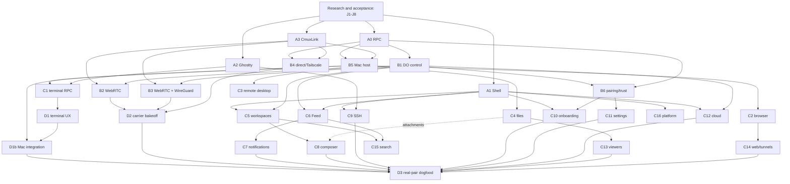

# cmux-next iOS: product and design research, scope, and verification

**Date:** 2026-10-07
**Evidence baseline:** `feat-cmux-next-ios` at `f538410565` (the initial D3 baseline at
`40df21e546`/`afbc8c69b3b` remains cited where historical results matter)
**Purpose:** turn the existing lane plans and the refreshed D3 pass into an executable product scope. This note is a research and sequencing artifact; it does not change product code.

The product target is a phone that gets a user from an actionable agent event or a workspace to a useful result quickly, while preserving the Mac as the owner of sessions and state. The first release should feel like one realtime system with several paths underneath it, rather than a collection of disconnected remote-control screens.

## Decision summary

1. **Primary loop:** open cmux, see what needs attention, answer inline or compose a task, then watch the resulting terminal/workspace update. Feed and Workspaces are the two recovery points when a user returns after a notification.
2. **Connection model:** keep the two planes in [PLAN.md](PLAN.md): Durable Objects and hibernating WebSockets carry small, durable control state; `CmuxLink` carriers carry terminal, browser, remote desktop, and bulk traffic. Feature modules only depend on `CmuxLink`/feature seams, never on a carrier.
3. **Path policy:** ship direct reachability when it answers, otherwise WebRTC P2P/TURN for V1. Keep WebRTC-over-WireGuard (V2) and direct-address V3 behind the same conformance suite and a development switch until D2 has device data. Do not infer a default from loopback measurements.
4. **Scope order:** contracts and shell first (A0–A3), then host/control/pairing and carriers (B1–B6), then terminal and core mobile journeys (C1, C5–C11), then media/bulk and parity surfaces (C2–C4, C12–C16), then real Mac integration and the D2/D3 evidence gate. The E lanes are hardening and parity closure, not a substitute for the real-pair gate.
5. **Release bar:** code that compiles or passes a package test is *implemented*, not *verified*. A lane is ready only when its seam tests, static checks, tagged iOS build, and the applicable real Mac/iPhone journey have evidence.

## Research and evidence

### Repository evidence

* `plans/cmux-next/ios-next/PLAN.md` defines the two planes, the carrier alternatives, lane ownership, and the dependency graph. Its critical paths are A0/A3 → B1 → a carrier → D2 → D3 and A0/A3 → B5 → C1 → D1 → D3.
* `plans/cmux-next/ios-rewrite.md` defines the app shell and the retained sign-in/Home model. Home is owned by the rewrite lanes; this plan owns the mobile terminal and feature surfaces around that shell. The rewrite supplies useful budgets: cached Home frame under 400 ms, live data under 1.2 s, 120 Hz scrolling without hitches, bounded transcript memory, and no idle polling.
* `plans/cmux-next/ios-next/d3-dogfood.md` is the parity and device checklist. Its original count (98 rows: 71 done, 3 mocked, 5 seam only, 15 missing, 4 dropped) was computed on the D3 branch at `afbc8c69b3b`, before the later C3, C14, D1b, E3, E4, and E5 merges. The refresh at `f538410565` now reports 85 done, 4 mocked, 4 seam only, 1 missing, and 4 dropped; the original count remains historical context.
* The current branch contains the later lane merges and the Mac app wiring (`Packages/macOS/CmuxNext/Sources/CmuxNextApp/MobileLinkService.swift`, `MobileLinkHostRunner.swift`). It still has no tagged iPhone/Mac run evidence. The lane notes and refreshed D3 matrix are the current implementation evidence; live verification remains a separate gate.
* `backend/apps/api/src/mobile-session.ts` establishes the control-session handshake and frame bound (`cmux.mobile/1`, version negotiation, capability intersection, 128 KiB control frame limit). `Packages/Shared/CmuxMobileWire` and `schemas/mobile-rpc/` provide the shared catalog, schemas, and fixtures.
* The source tree has the intended seams and mocks: `CmuxiOSFeatureKit`, `CmuxControlPlane`, `CmuxMobileLink`, `CmuxTerminalLink`, the Ghostty render core, and carrier packages. This lets product work proceed while a real Mac or TURN environment is unavailable, but it also makes a device gate essential.

### External product and design research

These public references were used to check the proposed information architecture and interaction principles (accessed 2026-10-07). The private comparison set supplied for this project was used as hypothesis input; public source names are intentionally omitted from this repository.

* [Apple Human Interface Guidelines: Tab bars](https://developer.apple.com/design/human-interface-guidelines/tab-bars) — keep top-level destinations stable and scannable; put secondary destinations behind a deliberate More/settings path. This supports Feed, Workspaces, Compose, Hosts, and Settings as the shell destinations, with feature flags controlling availability while the tree is incomplete.
* [Apple HIG: Onboarding](https://developer.apple.com/design/human-interface-guidelines/onboarding) — teach value in context, let users defer optional setup, and make the first useful action clear. C10 should therefore end on a successful paired or SSH-only action, not on a permission checklist.
* [Apple HIG: Notifications](https://developer.apple.com/design/human-interface-guidelines/notifications) — notification actions should be short, contextual, and safe to repeat. Feed intent keys and “answered elsewhere”/“not sent” states are required for an inline action to be trustworthy.
* [Apple HIG: Accessibility](https://developer.apple.com/design/human-interface-guidelines/accessibility), [Navigation and search](https://developer.apple.com/design/human-interface-guidelines/navigation-and-search), and [Playing haptics](https://developer.apple.com/design/human-interface-guidelines/playing-haptics) — every control needs a discoverable label/action, search must not trap the user, and haptics should reinforce state changes while respecting a setting. These map directly to the D3 accessibility checklist and C11/E5 settings.
* [Apple HIG: Privacy](https://developer.apple.com/design/human-interface-guidelines/privacy) — explain why a permission is useful immediately before requesting it and keep optional access optional. This informs C10 permission priming and the SSH-without-account path.
* Public mobile SSH client surfaces — a useful reference for host inventory, quick connect, key/known-host trust, and file-oriented SSH workflows. cmux should preserve the fast host path while showing ownership and realtime state clearly.
* Public agent-work surfaces motivate the same interaction hypothesis: a stream of work with an obvious pending action, a compact composer, and a visible running/completed state. These are hypotheses to validate in C6/C8 dogfood, not dependencies or visual copying; the cmux-specific differentiator is that the output is a live Mac workspace and terminal.

## User journeys and product outcomes

The journeys below are the minimum coherent product. Each one has a first success and an explicit failure/recovery state; a spinner without a reason is not a success criterion.

| Journey | User-visible flow | Required lanes | First-success acceptance |
| --- | --- | --- | --- |
| **J1: first run and pair** | Welcome value → sign in or “Use SSH without an account” → notification/local-network/camera choice → discover a Mac or scan QR → connection state → open a workspace. | A1, C10, B6, B1, B4/B2, C5 | A fresh install reaches a named Mac or a saved SSH host, explains every denied permission, and can replay onboarding without losing the account. |
| **J2: return to an agent event** | Push or Feed tab → filter Needs Input → read context → Allow/Deny, choose an option, reply, or approve a plan → resolution appears in place. | A0, B1, C6, C7, C16 | A repeated action key produces one owner result; foreground, background, and “answered elsewhere” states are distinct and recover on reconnect. |
| **J3: compose to a terminal** | Floating Compose → choose Mac/workspace/agent/model/effort → prompt, dictation, and attachment → dispatch receipt → open workspace → terminal stream. | A0, A1, B5, C4, C5, C8, C1, A2, D1/D1b | The prompt appears immediately as a pending intent, the Mac either returns a receipt or a typed refusal, and terminal output/input remain ordered through a reconnect. Spawn remains explicitly refused while the host gate is off. |
| **J4: terminal as a daily driver** | Workspaces grouped by Mac → preview/status → attach → type, resize, select/copy, links, history affordance → switch surfaces. | C5, C1, A2, D1, one carrier | On a tagged pair, first frame meets the attach budget, keys echo once, resize uses the shared grid, and a Wi-Fi/cellular change returns to content without duplicate input. |
| **J5: SSH or direct address** | Hosts → Add SSH or direct/Tailscale address → key/known-host trust → optional jump host/port forward → terminal/SFTP/browser. | C9, B4, A2, C4, C14 | A first-use trust decision is explicit and pinned; changed keys stop the session; reconnect, PTY resize, SFTP resume, and a direct VPN address have clear outcomes. |
| **J6: browser, remote desktop, and files** | Workspace surface → browser/video or RD surface; Files/artifact viewer → transfer progress → cancel/resume/retry. | C2, C3, C4, C13, C14, B5, D1b | A media stream does not block terminal input; a 200 MB transfer resumes after a drop; VNC consent and clipboard policy are visible. |
| **J7: offline, sleep, and revoke** | Mac sleeps or network changes → path/reconnect banner → cached read-only state → resume or explain refusal; revoke a device in Settings. | A3, B1, B6, C5, C11, C16 | No polling or busy loop; cached state is marked cached, writes explain why they are disabled, reconnect resends the same idempotency keys, and revocation prevents new/existing traffic within the policy budget. |
| **J8: settings and trust maintenance** | Devices/Macs → path badge/RTT → rename/revoke; terminal appearance, notifications, privacy, diagnostics, erase data. | C11, C16, B6, C7, E5 | Settings affect the next relevant surface, diagnostics are exportable without secrets, and erase data reports each store's result. |

## Scope and dependency order

The following table is the working scope. “Landed” means the current branch contains the lane's code and its documented package/static evidence. “Unverified” means the lane still needs the tagged pair, real permissions, or a production-shaped backend; it must not be presented as shipped parity.

| Stage | Lanes and ownership | Depends on | Current evidence at `f538410565` | Exit gate before downstream work |
| --- | --- | --- | --- | --- |
| **R0 research/design** | This note; lane notes; HIG/competitor hypotheses; acceptance IDs J1–J8 | Existing plans and shipping-app parity inventory | PLAN, ios-rewrite, D3, and current source inspected | Product owner signs off the journeys, non-goals, and measurements; each lane note names an acceptance test. |
| **Wave 0 contracts** | A0 RPC, A1 shell/seams, A2 Ghostty renderer, A3 `CmuxLink` | R0 | All four are in the branch; Swift/TS schemas, mocks, render/conformance tests, and simulator compile are documented. Device rendering and input are unverified. | Catalog/schema fixtures round-trip; carrier conformance passes; shell can launch every feature with mocks; renderer benchmark is repeatable. |
| **Wave 1 control/carriers/host** | B1 Durable Object control; B2 WebRTC/TURN; B3 WebRTC-over-WireGuard; B4 direct/Tailscale/LAN; B5 Mac host; B6 pairing/trust | A0, A3; B2/B3/B6 also need B1; B5 needs A0/A3 | Lane code and package tests are present. B1 now rate-limits TURN and pending-snapshot repair traffic; principal/HostDO placement follow-ups remain. B2 TURN deployment and continuous RTT are unverified; B3 interop/security review is pending; B4 Bonjour/VPN is unverified; B5/D1b app wiring is present but no real pair. | Same-account and QR pairing; pinned identity and revocation; control snapshot/gap recovery; direct, P2P, TURN and (DEV) WG path badges; no carrier drops reliable frames under fault tests. |
| **Terminal critical path** | C1 terminal RPC, C5 workspaces, D1 terminal UX, D1b Mac integration | A2/A3, B5/B6; one B2/B3/B4 carrier | C1/C5/D1/D1b code and tests are in branch. Mac `MobileLinkService`/`MobileLinkHostRunner` now exists; device and app-target build are unverified. `terminal.history` is intentionally unavailable on cmux-tui. | J3/J4 on a tagged Mac+iPhone pair: attach/READY, ordered input, resize, selection, backpressure, roam/reconnect, and latency report meet the budgets. |
| **Core mobile actions** | C6 Feed, C7 notifications/Live Activities, C8 task composer, C9 SSH, C10 onboarding, C11 settings | A0/A1; C6/C7 need B1; C8/C5; C9/A2; C10/B6 (mock first); C11/B6 | Implementations, mocks, and package tests are present. C7 terminal reply, C8 attachments/live spawn, C9 host sync/import UI, C10 real permissions/QR, and C11 device verification remain open. | J1/J2/J3/J5/J8 pass with accessibility, localized strings, and explicit refusal/offline states. |
| **Media and parity surfaces** | C2 browser stream, C3 remote desktop, C4 files/media, C13 viewers, C14 web/tunnels/simulator | B5 + C1 link seam; C13 needs C4; C14 needs C2/C9/D1b | C2/C3/C4/C13/C14 code and tests are in the current ancestry (D3's old matrix marked some missing before these merges). Live ScreenCaptureKit/VideoToolbox/VNC/WKWebView/SSH-forward paths and Mac adapters are unverified. | J6 passes with a real host: media/input isolation, transfer resume/cancel, viewer safety, tunnel policy, and no unbounded ingress. |
| **Cloud** | C12 Cloud machines and onboarding; phase-2 VM terminal/files host | A1, B1, C5; VM host work is a separate backend dependency | CloudDO list/lifecycle and iOS UI are implemented and tested. VM terminal/workspace/file attach is a seam; `cloudWorkspaces` is off until the Rust host exists; metering is not wired. | Cloud create/pause/start/delete and failure recovery are live; then enable VM workspaces only after the phase-2 host passes the same C1/C4 gates. |
| **Platform/search** | C15 universal search; C16 routing, diagnostics, flags, What's New, billing/Keep Awake seams | A1; C15 needs C5/C6; C16 remote behavior needs B1/B5 | Code/tests are present; terminal scrollback search is deliberately unavailable; authenticated remote config is cached and fail-closed; Mac capabilities, StoreKit, and Keep Mac Awake remain seams or stubs. | Search routes to every enabled destination without trapping focus; diagnostics and deep links are safe; remote flags fail closed and are observable. |
| **Hardening/parity** | E1 bounded ingress/backpressure, E2 CI, E3 workspace management, E4 terminal compose/drafts/todo, E5 SFTP/haptics/erase/guest | Relevant C/B lanes | Current ancestry includes these branches and their tests/docs. A3 bounds channel/session/resource ingress; B1 isolates sessions and rate-limits TURN/pending repair traffic; C9 tmux hydration, C14 credentialed SOCKS routing, and CmuxMobileSSH output bounds are landed with explicit limits. D3 reports 85 done, 4 mocked, 4 seam only, 1 missing, and 4 dropped; native package/UI and device evidence remain pending. | Static mobile scans, package/UI CI, and the parity matrix are green; real journey regressions are linked to evidence. |
| **Choice and release evidence** | D2 carrier bakeoff; D3 tagged dogfood/accessibility/performance; release gate | D1/D1b + all feature lanes; D2 needs B2/B3/B4 | D2 loopback results and D3 runbook exist. No authoritative device power/latency/roam data or screenshots are recorded yet. | Pick V1/V2/V3 from device data; run nxd3 UI tests and real journeys; publish artifacts, pass bars, and known limitations before a release claim. |

### Dependency graph

## Invariants for every implementation

1. **Ownership and intent:** the Mac daemon, a Cloudflare Durable Object, or an SSH host owns each fact. iOS keeps bounded mirrors and an ordered intent log. Optimistic UI is replaced by the owner echo carrying the same idempotency key; no heuristic “Nth snapshot” reconciliation.
2. **Revision repair:** every stream has an epoch/revision. A gap or epoch change drops the affected mirror and requests one snapshot; reconnect resumes from a cursor. The UI coalesces changes to one update per frame.
3. **Two planes:** control packets stay small, ordered, authenticated, and resumable over DO WebSockets. High-volume or latency-sensitive traffic uses a `CmuxLink` stream/channel with explicit priority and backpressure. A feature never reaches into WebRTC, WireGuard, NWConnection, or DO APIs directly.
4. **Bounded ingress:** reliable sends suspend or fail with a typed backpressure error; no unbounded `AsyncStream`, receive queue, frame assembler, or file buffer. Overflow policy is explicit (resync, drop telemetry, or refuse) and tested with a stalled reader.
5. **Realtime without polling:** state is event-driven. Reconnect/backoff and keepalives are reviewed wakeups; no timer or periodic poll is used to make state converge.
6. **Identity and authorization:** the install key remains device-bound; link certificates bind purpose, host, and expiry; host keys are pinned; app authorization is separate from network reachability; revocation closes existing sessions and blocks new ones.
7. **Path transparency:** direct, P2P, TURN, and WG-over-WebRTC implement the same `CmuxLink` conformance contract. Path changes preserve a session or report a typed reconnect; the UI shows the path and meaningful RTT.
8. **Input correctness:** terminal bytes are parsed/rendered once, input has a sequence and exactly-once behavior, resize is tied to visible foreground viewers, and a snapshot repairs drift. The software keyboard must not silently alter the shared grid policy.
9. **Permission and failure clarity:** every permission is requested just before its value is clear. Offline, sleeping Mac, unsupported operation, expired trust, and refused policy have distinct copy and recovery actions.
10. **Accessibility/localization:** rows and bubbles expose complete labels plus custom actions; Dynamic Type, VoiceOver, Reduce Motion/Transparency, contrast, and hardware keyboard paths are part of acceptance. All user strings use catalogs (en/ja and the repository's required languages).
11. **Privacy and diagnostics:** logs and telemetry scrub tokens, prompts, file contents, host addresses where required, and credentials. Export is user initiated and bounded. Metal/video surfaces stay masked before replay is enabled.
12. **Performance budgets:** use the rewrite and transport budgets as gates: cached Home <400 ms, live data <1.2 s, terminal first frame ≤1 RTT+20 ms, echo within path target, 120 Hz gesture/scroll without hitches, bulk does not raise interactive p99 by >10 ms, idle CPU 0% when no work exists, and bounded memory for terminal/history/transfers.

## Highest-risk gaps and the next safe work

| Priority | Gap and evidence | Why it can invalidate the product | Next action and owner |
| --- | --- | --- | --- |
| P0 | No recorded tagged iPhone/Mac run; D3 says no fleet/backend/credentials and all visual paths are unverified. | Compile/test green can hide auth, TCC, signing, ICE, Metal, and input failures. | Acquire the prescribed isolated build/device slot; run D3 `nxd3` preflight and record screenshots, logs, latency, and failures. D3 owner. |
| P0 | B1's session identity, HostDO placement, read-admission, epoch and rate-limit follow-ups are implemented; B2 TURN secret/deploy and B5 host-socket reads still need a live environment. | A stale or cross-session control socket can expose state or strand the first connection. | Deploy TURN secrets in dev; run same-account and QR pairing, including stale-epoch and revoked-device cases. B2/B5/B6. |
| P0 | The V2 Swift WireGuard engine has boringtun interop and security-review follow-ups; V1/V2 media behavior differs (V2 carries no native media tracks). | A transport choice can be secure but too costly, or accidentally expose ciphertext/identity boundaries. | Run Rust interop and a focused security review before enabling WG for user traffic; keep V2 DEV-only until D2 measurements. B3/D2. |
| P1 | Large-frame and bounded-ingress fixes are documented after the old D3 baseline; D2 has a future-dated F9 note relative to this evidence date. | The plan can claim backpressure while current branch behavior or status is unknown. | Re-run mobile concurrency/crash/l10n scans and the stalled-reader conformance cases at this commit; correct the F9 date and update the parity matrix. E1/E2/D3. |
| P1 | Terminal history is `proto.unsupported`; C8 dispatch and C12 VM host are gated; C2/C3/C4/C13/C14 Mac adapters and live media are unverified. | “Full parity” would overpromise key workflows. | Keep unavailable states explicit; add a capability matrix to the UI; land daemon history/VM host/adapters as separate acceptance-gated work. C1/C8/C12/D1b and feature owners. |
| P1 | C10/C11/C15 and all visual lanes lack device VoiceOver/Dynamic Type/hardware-keyboard evidence. | The app may be functionally correct but unusable or inaccessible on iPhone. | Run each `Next*UITests` class plus AX5/VoiceOver and hardware-keyboard passes on a tagged simulator/device; fix issues before visual polish. D3/C10/C11/C15. |
| P2 | StoreKit, Keep Mac Awake, telemetry uploader, usage metering, and replay masks remain seams/stubs; remote flags now have an authenticated cached/fail-closed source. | Shipping defaults could enable incomplete behavior or leak sensitive surfaces. | Keep incomplete platform controls dev-only, add receipts and mask inventory, then assign release lanes once the core pair is stable. C12/C16. |
| P2 | Competitor patterns are hypotheses, not validated against cmux users. | Copying a feed/composer pattern can hide the terminal's context or overload the tab bar. | Prototype two Feed densities and two Composer flows behind a DEV switch; test J2/J3 completion time and error recovery, then choose from evidence. A1/C6/C8/D3. |

## Acceptance criteria and verification loop

Use this loop for every remaining lane and for any change to a landed lane.

1. **Research gate:** write the user problem, journey ID, owner, dependency, non-goal, and measurable acceptance in the lane note. Link any HIG/competitor hypothesis; do not add a tab or network path only because a competitor has one.
2. **Contract gate:** add catalog entries, JSON schema, Swift/TS/Rust codec fixtures, capability/error codes, revision and idempotency rules, and an owner/mirror table before UI or transport code. Unknown capabilities must fail closed.
3. **Mock gate:** implement the feature against its seam and deterministic mock first. Exercise loading, empty, offline, refusal, reconnect, duplicate key, gap, stale epoch, and accessibility labels. Keep the mock visibly marked in DEV builds.
4. **Unit/conformance gate:** run the focused Swift Testing/vitest suites and the carrier `LinkConformanceSuite`; include a stalled-reader/backpressure test and a security negative test. Delete scratch build output after each package as required by the repository instructions.
5. **Static/CI gate:** run the mobile l10n, concurrency, crash-safety, package-convention, and workspace-group checks. The iOS CI workflow must compile the same roots and run `Next*UITests` through the documented simulator workflow.
6. **Tagged-pair gate:** build a same-tag Mac+iOS pair, install it on the isolated simulator/phone, and run only the journey checklist that the lane owns. Capture runtime logs, `xcresult`, screenshots/video where visual, and the corresponding latency/memory/power numbers. No synthetic screenshot counts as evidence.
7. **Adversarial gate:** test network roam, sleeping/revoked host, malformed frames, oversized inputs, duplicate/reordered events, permission denial, background execution, and a stalled consumer. Verify user-facing recovery copy and that no secret enters diagnostics.
8. **Evidence update:** update the lane note, D3 matrix status, and coordination line with commit SHA, test command/result, tagged build, device identifiers kept out of logs, and unresolved limitations. “Implemented” and “device verified” remain separate labels.
9. **Choice gate:** D2 selects a default carrier only from device data for latency, throughput, roam, battery, and cold connect. The losing carrier remains behind a DEV switch until removal has an explicit decision. D3 is the release recommendation, not a substitute for D2.

### Minimum release acceptance

* J1–J8 complete on a fresh install and a returning signed-in install, with a clear offline/sleeping state.
* A0 wire compatibility and all enabled carriers pass fixtures/conformance; protocol mismatch and revocation are typed and observable.
* C1 terminal input/output survives at least one network change with no duplicate input, and first frame/echo/backpressure meet the budgets.
* Feed action, notification action, task receipt, SSH trust, direct address, browser/RD/file transfer, and viewers each have a real or explicitly unavailable capability state; no silent mock data in a release build.
* Static checks and CI are green; package tests cover every changed lane; UI tests run on an isolated simulator; VoiceOver/Dynamic Type/Reduce Motion/hardware keyboard passes are recorded.
* D2 carrier decision and D3 artifacts (build SHA, test results, screenshots/video, latency/power/memory reports, known limitations) are attached to the release review. Until these exist, report the branch as “implementation complete, device verification pending.”

## Reconciliation with PLAN and D3

* **Dependency graph:** this note follows PLAN's A0–A3 → B → C → D graph and adds a research gate before A0. It does not reorder C lanes that can develop against mocks.
* **Home vs mobile shell:** `ios-rewrite.md` owns Home/Messages and retained auth. The mobile plan owns Feed, Workspaces, Compose, Hosts, Settings, and terminal/media surfaces around that shell. Do not duplicate Home ownership in C6 or move terminal state into the iOS app.
* **D3 parity counts:** 71/3/5/15/4 is a historical baseline from `afbc8c69b3b`. C3, C14, D1b, E3, E4, and E5 landed after that baseline. The refresh at `f538410565` reports 85 done, 4 mocked, 4 seam only, 1 missing, and 4 dropped across 98 rows; it keeps separate implementation, device-verified, and release-ready evidence.
* **D1b blocker:** D3's first pass says no `MobileLinkHostAccount`; current source now contains `InstallHostAccount`, `MobileLinkHostRunner`, `MobileLinkService`, and the C2/C4/C8/C13/C14 adapters. The remaining blocker is tagged build/deploy/pair verification (including host-role TURN credentials), not an absent protocol type.
* **Backpressure:** current history contains the E1 bounded ingress changes and F1 static guard results. The refreshed D3 note records the current static checks and leaves device/network evidence pending; do not carry the old unbounded baseline forward as a current result.
* **Date inconsistency:** `d2-bakeoff.md` mentions F9 as done on 2026-10-08 even though this evidence baseline is 2026-10-07. Treat that line as a typo or future work until the commit and test output are verified, then correct it with the D3 refresh.
* **Out-of-scope for this product cut:** agent session GUI, iPad multi-window, system-wide VPN/Network Extension, voice/audio media, and terminal history search until the host protocol exists. SSH, direct Tailscale/WireGuard addresses, Feed, onboarding, task composer, browser/RD/files, and cloud lifecycle remain in scope; unavailable capabilities must be explicit.

## Source index

* [iOS lane plan and graph](PLAN.md)
* [iOS rewrite and Home/auth ownership](../ios-rewrite.md)
* [D3 parity matrix and device runbook](d3-dogfood.md)
* [A0 mobile wire](a0-rpc.md), [A3 link seam](a3-link.md), [B1 control plane](b1-control-do.md), [D2 bakeoff](d2-bakeoff.md)
* [cmux-next architecture](../architecture.md), [transport proposal](../transport.md), [D3 CI workflow](../../../.github/workflows/cmux-next-ios.yml)
