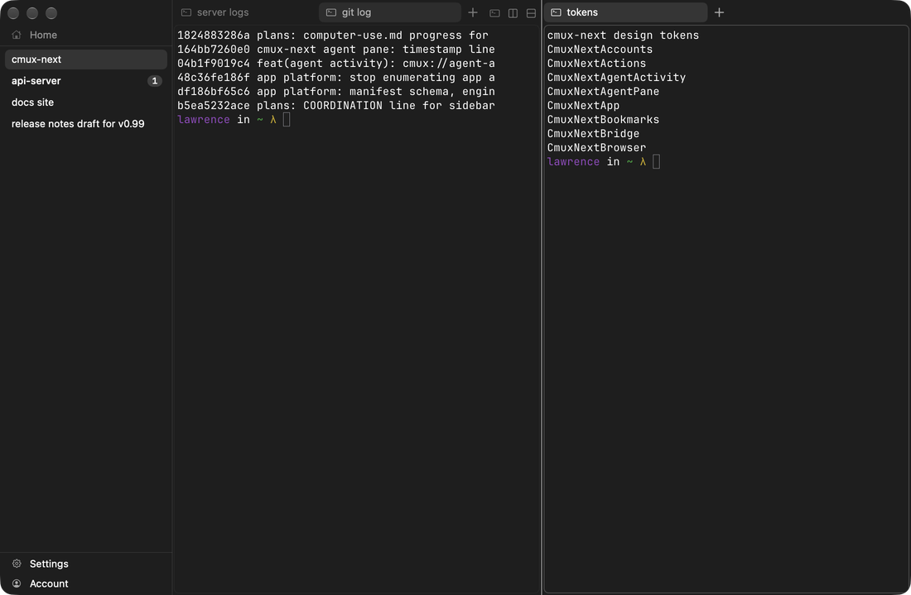

# Spec proposal: visuals

Design tokens, every component state, and screenshots for cmux-next, so the GPUI and browser ports can match the macOS app pixel for pixel and a person can see what each state looks like. Prepared for lawrence-coordinator to commit into manaflow-ai/cmux-next-spec (suggested spec paths in brackets).

| page | contents | spec path |
|---|---|---|
| [design-tokens.md](design-tokens.md) | color model and formulas, resolved colors for 5 themes, type scale, metrics, materials, motion, visual settings | spec/design-tokens.md |
| [design-tokens.json](design-tokens.json) | machine-readable tokens with source path:line for every value; ports import it | spec/design-tokens.json |
| [components/sidebar.md](components/sidebar.md) | workspace rows, badge, status indicator, sections and looks, hover card | spec/visuals/sidebar.md |
| [components/tabs.md](components/tabs.md) | strip, tab, close, +, trailing buttons, unfocused pane styles, hover card, drag | spec/visuals/tabs.md |
| [components/panes.md](components/panes.md) | pane states, focus ring contrast, focus indicator, borders none, dividers, drop overlay | spec/visuals/panes.md |
| [components/palette.md](components/palette.md) | command palette, hover card panel, materials | spec/visuals/palette.md |
| [components/browser.md](components/browser.md) | toolbar, omnibar, buttons | spec/visuals/browser.md |
| [components/agent-pane.md](components/agent-pane.md) | CSS bridge, composer, thread, states | spec/visuals/agent-pane.md |
| [pixel-parity.md](pixel-parity.md) | rules for ports and the screenshot-diff harness plan | spec/pixel-parity.md |
| [images/](images/) | 84 PNGs, 2x crops (window overviews 1x), alt text on every use | spec/images/ |
| [tools/](tools/) | derive_theme_tokens.py (oracle), continuous_corner_check.swift (corner path vs CALayer), capture.sh / lib.sh / shot.py / winlist.swift (reproduce the images) | references/visuals-tools/ |

Provenance: images from tagged build `specvis-v1` of feat-cmux-next `1824883286a` (fleet job 6ae58467e770db91c783bc05), run with scratch configs (empty Ghostty config, so the default Apple System Colors theme; scratch cmux.json), window never brought to front. Source refs are `path:line (Type.member)` at feat-cmux-next `d445a445556`; the symbol is the anchor when lines drift. Resolved colors are computed by the Python port (8-bit channels round half away from zero, as Swift does) and matched screenshot pixels to within one 8-bit level.

Stale images: the code changed after the image build. The sidebar now paints a tonal step (`sidebarStep`, Apple dark `#272727`) and pressed buttons use `pressedFill`. Every sidebar image and every window image need a new capture with `tools/capture.sh`; until then those regions are report-only (see pixel-parity.md, CI gating). Next step (parked 2026-10-03): fleet job 26d894c36453cfdc642ca67a built tag specvis2-v1 of 6200ee73090; download it (`cmux-ci artifact`), launch it clean-env with `CMUX_NEXT_NO_ACTIVATE=1` and scratch configs, rebuild the scene (workspaces cmux-next, api-server with 1 unread, docs site, release notes draft for v0.99, browser demo), run `tools/capture.sh dark` and `light`, replace `images/sidebar/*` and `images/window/*`, then make those regions gate again.

## UNVERIFIED states (no screenshot; tokens from code, diagrams where useful)

- Window focused (key): the test window stayed unfocused to avoid taking focus from the user. Code shows no chrome change between key and non-key except the system traffic lights and the terminal cursor.
- Pressed: tab close, new-tab, trailing buttons, sidebar items and icon buttons, browser buttons (a synthetic mouse-down enters AppKit's tracking loop before the capture).
- Trailing button hover: `images/tabs/*-trailing-button-hover.png` caught the + button, not a trailing button.
- Hover cards (sidebar and tab): not opened by `debug.mouse action:hover`.
- Status indicator (busy, waiting, error, success, progress): build predates the shared indicator; no socket verb sets agent state.
- Tab drag, sidebar drag lift, drop overlay zones.
- Palette row hover; palette in light appearance (Liquid Glass captured off screen rendered gray; the dark capture also lacks a real backdrop).
- Browser loading progress, find bar, load error page, extension toolbar.
- Agent pane hover, menus, tool-call and permission cards.
- Terminal content colors are Ghostty's and are out of scope here.

## Known gaps between the target and the code

None in the documented components. A few surfaces outside them still call `Glass.makePanel` without the Reduce Transparency fallback (notifications panel, tab drag ghost, update sheet, appearance studio, tab strip overflow panel, onboarding); `materials.rawGlassPanels` in the JSON lists them.

## Open questions for Lawrence (via the coordinator)

Decided (coordinator, 2026-10-02):

- `focus.inactiveTabStyle` is a cmux.json key, default `fade`, in Settings > Appearance > Unfocused Pane Tabs. The section look has its key too, `sidebar.sectionLook` (default quiet).
- CI gating: a state with a reference image gates port CI; a state without one is report-only until its image exists, then it gates.
- Rounding, corners, fractional font sizes and pane padding: see pixel-parity.md, rules 1 (rounding), 3 (corners, pane padding) and 5 (fonts).

Open:

1. Non-macOS fonts: accept the platform system UI font at the same size (proposed), or bundle Inter/SF-like fonts for identical metrics?
