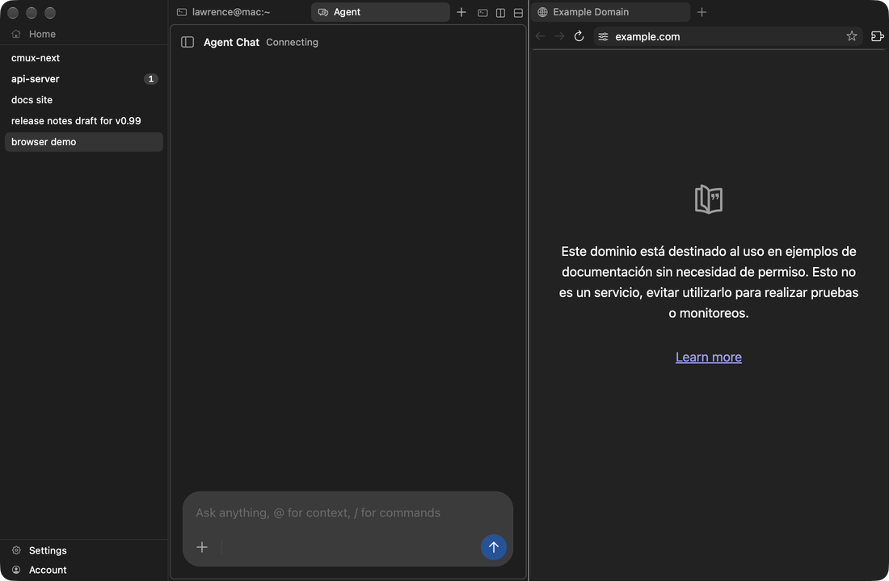
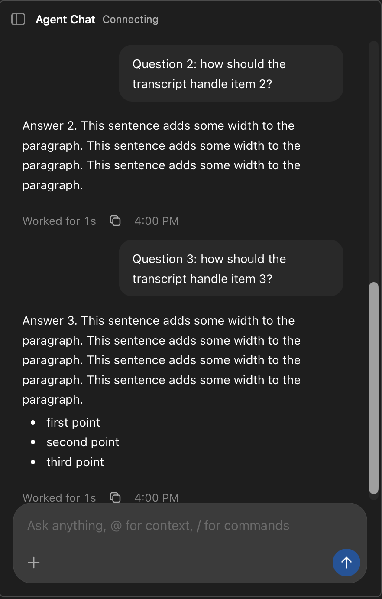
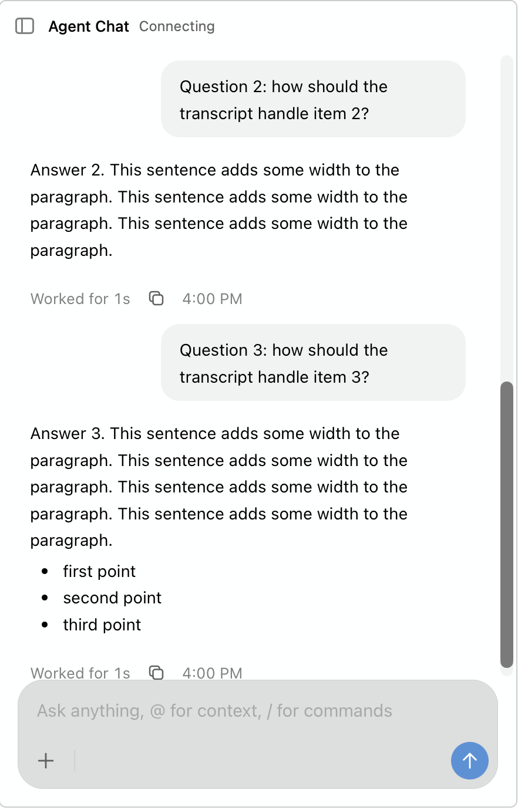
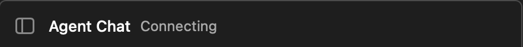
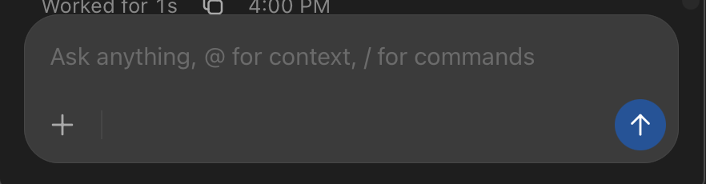
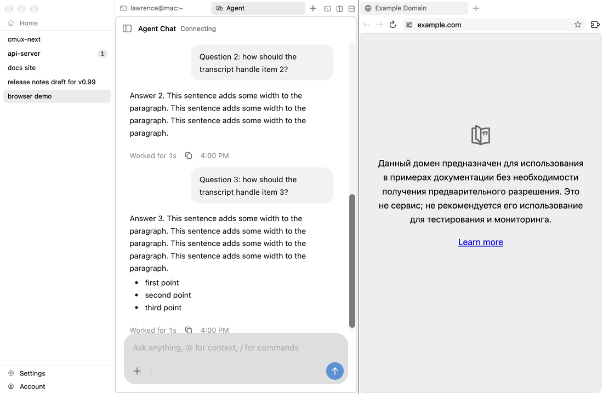

# Agent pane

A web UI (React, `webviews/src/agent-session/acpmux/`) in a native tab, themed by the native bridge `AgentPaneTheme.swift`, which passes the theme tokens as CSS variables. JSON key `components["agentPane"]`.

 

## Bridge (`Packages/macOS/CmuxNext/Sources/CmuxNextAgentPane/AgentPaneTheme.swift:28-63 (AgentPaneTheme.values)`)

| CSS variable | token |
|---|---|
| --agent-page-bg, --agent-surface | contentBackground (transparent when the window is translucent) |
| --agent-surface-elevated | elevatedBackground |
| --agent-input-bg | hoverFill |
| --agent-border / --agent-border-strong | separator / paneBorder (transparent under borders none) |
| --agent-text / --agent-muted / --agent-soft | textPrimary / textSecondary / textTertiary |
| --agent-accent / --agent-accent-soft / --agent-accent-text | textPrimary / selectionFill / opaque contentBackground |
| --agent-danger / --agent-warning | danger / attention |
| --agent-highlight / --agent-highlight-text | highlight (ANSI blue) / highlightText |
| --agent-shadow | shadow |
| --agent-ansi-N | ANSI N made 4.5:1 on elevatedBackground |

## Geometry and type

Shell font 13px system. Header 44px (padding 0 8px), title 13px medium, status 12px textSecondary. Conversation 14px / 22.75px system-ui, column 720px, gutter 26.5px. User bubble (`.cv-user__bubble`) max-width 70%, padding 10.5px 16px 9.5px, radius 16px, fill text 5%. Inline code 13px ui-monospace (`.cv-code`); shell output 12px / 18px ui-monospace (`.cv-shell__body`). Composer box radius 22px with a 0.5px inset edge (text 18% over page), fill text 13% over page; field 15px / 22px, padding 15px 16px 8px; bar 48px; picker buttons 32px tall, radius 16px; Send 32px circle. Menus radius 12px, padding 6px, items 28px radius 8px, shadow 0 10px 30px. Session sidebar 292px; rail 48px with 34px buttons radius 9px. Sources: `acpmux/styles.css`, `acpmux/composerControls.css`, `acpmux/conversation/conversation.css:10-33 (:root), 58-62 (.cv-user__bubble), 131-133 (.cv-code), 605-612 (.cv-shell__body)`.

## States

| element | state | value |
|---|---|---|
| Send | ready | fill highlight, glyph highlightText |
| Send | idle (empty draft) | mix(highlight 72%, base) |
| picker / plan button | hover or open | composerHover = text 14% over page |
| plan toggle | pressed | highlight 16%, text highlight |
| switch | on | track highlight, knob highlightText |
| session row | hover / selected | text 5% / text 9% |
| icon button | hover | text 6%, color text |
| rail button | hover / current / disabled | text 6% / text 9% / opacity 0.4 |
| focus-visible | composer picker, plan, Send | 1.5px solid text, offset 2px |
| focus-visible | rail buttons, sidebar toggle and actions | 2px, text 40%, offset -2px (toggle 0) |
| focus-visible | session rows | 2px accent (= text), offset -2px |
| focus-visible | diff tools, file headers | 1.5px muted, offset 1px |
| menu item | active | text 14% over base |
| unrestricted mode | | warning color (attention, else danger) |
| turn footer | | "Worked for Ns", copy, time in textTertiary, tabular numbers |

UNVERIFIED screenshots: hover and menu states (the page needs pointer events inside WebKit; `debug.agent_pane` only seeds rows and measures), tool-call cards, permission card.

Highlight (the theme's ANSI 4) is the one hue in chrome, and only these composer controls use it: Send, the pressed plan toggle and a switch's on state.

## Borders none

Under `appearance.borders = none` the agent pane draws no edge. The bridge sends `borders`, and `applyAgentTheme` sets `data-borders="none"` on the root (`webviews/src/agent-session/shared/theme.ts`). The stylesheets then clear `--agent-border`, `--agent-border-strong`, the composer, menu, slash-menu and tray edge (`--acpmux-composer-edge`), the pill edge (`--acpmux-pill-edge`), the code block ring (`--cv-codeblock-ring`) and the tool card ring (`--cv-card-ring`); checkboxes become a fill. Fills keep the surfaces apart.

## Motion

The bridge passes the hover, focus, fade-in and fade-out durations from the Motion policy (speed and Reduce Motion applied) as `--agent-motion-hover`, `--agent-motion-focus`, `--agent-motion-in` and `--agent-motion-out`.
