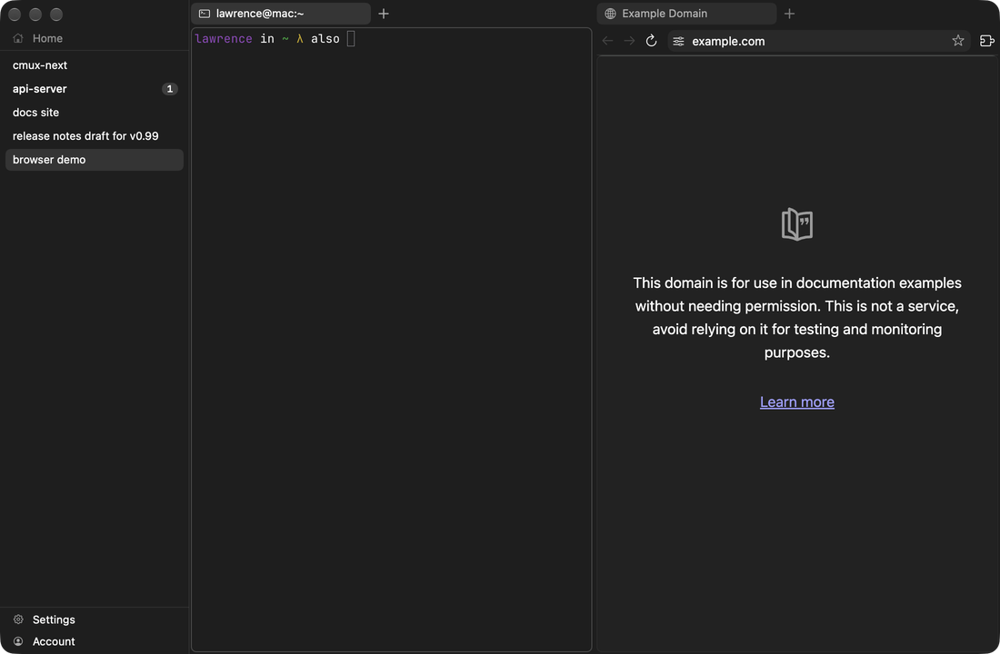
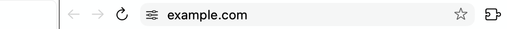
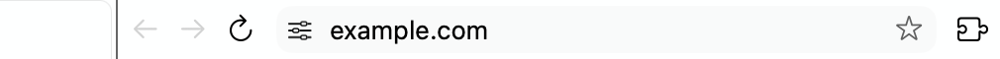
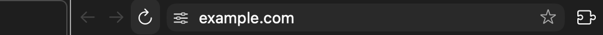
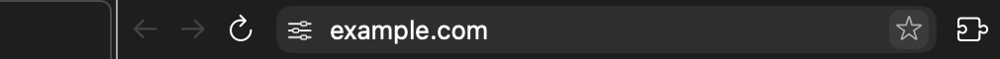
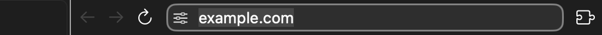
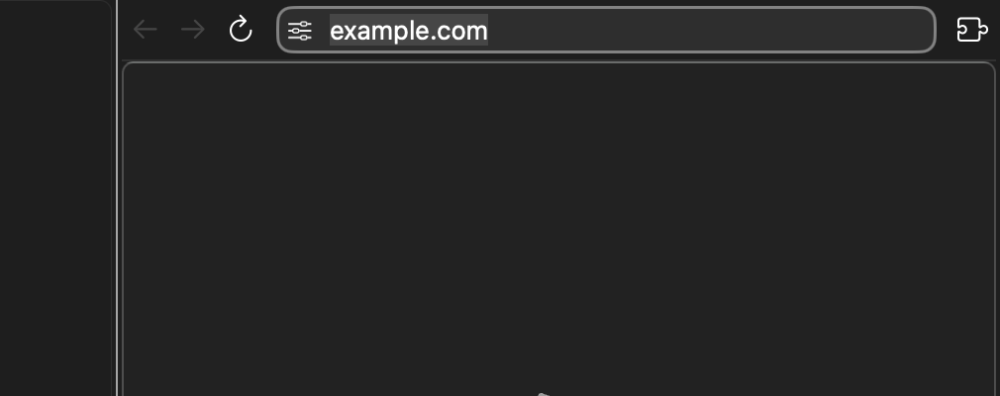
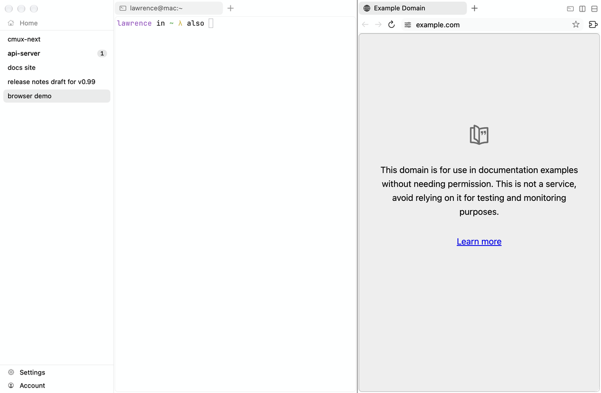

# Browser chrome

A browser pane has a toolbar under its tab strip: back, forward, reload, the omnibar (page-info chip, URL, bookmark star), and the extensions button. Geometry is fixed points on a 3 pt base padding (bar 24 or 28 pt, radii 6, 8 and 12 pt), not density tokens; colors come from the terminal theme. Sources: `Packages/macOS/CmuxNext/Sources/CmuxNextBrowser/UI/` at `dd5e6216935`; images from `1824883286a`. JSON key `components["browser.toolbar"]`.

## Geometry (`OmnibarStyle.swift:15-70 (OmnibarStyle)`)

Bar height 24 compact / 28 comfortable; toolbar height bar + 6 (padding 3). Buttons bar-height square, radius 8, symbol 13/15, no spacing. Omnibar radius 8, chip bar-4 radius 6 at 2, text at 5, trailing padding 8, icons 12/13, font system 13/14. Editing ring 1.5. Suggestion card radius 12, outset 3 top and 6 sides, rows bar height, inset 4, gap 2, radius 8. Progress line 2 pt.

## States

| element | state | token | source |
|---|---|---|---|
| toolbar | | windowBackground | OmnibarStyle.swift:79 (`OmnibarStyle.toolbarBackground`) |
| omnibar | idle | chromeBackground fill | OmnibarStyle.swift:80 (`barFill`), OmnibarViews.swift:50 (`OmnibarPillView.refresh`) |
| omnibar | hover | elevatedBackground | OmnibarStyle.swift:81 (`barHoverFill`) |
| omnibar | editing | elevatedBackground, 1.5 pt focusRing ring (0 under appearance.borders none), text selection textSelection | OmnibarViews.swift:46-56 (`OmnibarPillView.refresh`) |
| omnibar | popup open | elevatedBackground card, selected row selectionFill | OmniboxSuggestionPanel.swift:167 (`SuggestionCardView.refresh`) |
| URL text | idle | host textPrimary, rest textSecondary | AddressField.swift:105-112 (`AddressField`) |
| button | default | clear, tint textPrimary | ChromeButtons.swift:124-134 (`ChromeIconButton.updateFill`) |
| button | hover | hoverFill | ChromeButtons.swift:129 |
| button | pressed | selectionFill | ChromeButtons.swift:127 |
| button | disabled | clear, whole button opacity 0.35 | ChromeButtons.swift:68 (`ChromeIconButton.isEnabled`) |
| chip / star | hover | hoverFill | OmnibarStyle.swift:87 (`chipHoverFill`) |
| loading | | progress line alpha(focusRing, 0.8) | ProgressLineView.swift:61 (`ProgressLineView.updateColor`) |
| find bar, prompt bar, notices | | glass, radius panelCornerRadius, padding 8, height tabStripHeight. Material: the overlay fallbacks (opaque under Reduce Transparency) through `Glass.makeOverlayPanel` | BrowserMetrics.swift:28-35 (`BrowserMetrics`); FindBarView.swift, PromptBarView.swift, BrowserNoticeView.swift (`glass`) |

UNVERIFIED: pressed buttons (tracking loop, as in tabs), loading progress, find bar, load error page, extension toolbar. Tokens above are from code.

