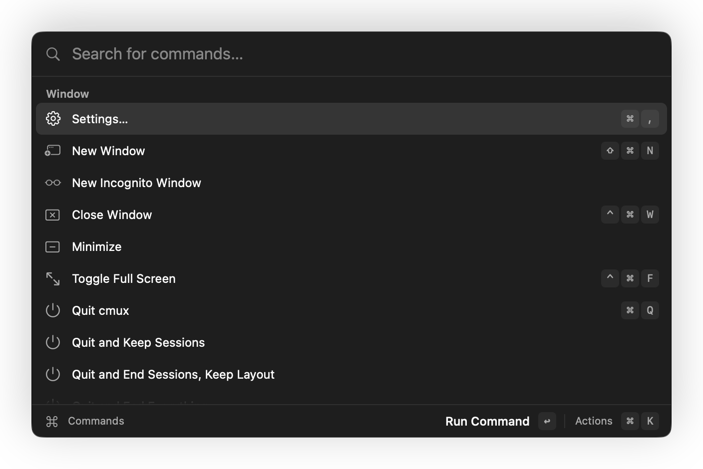
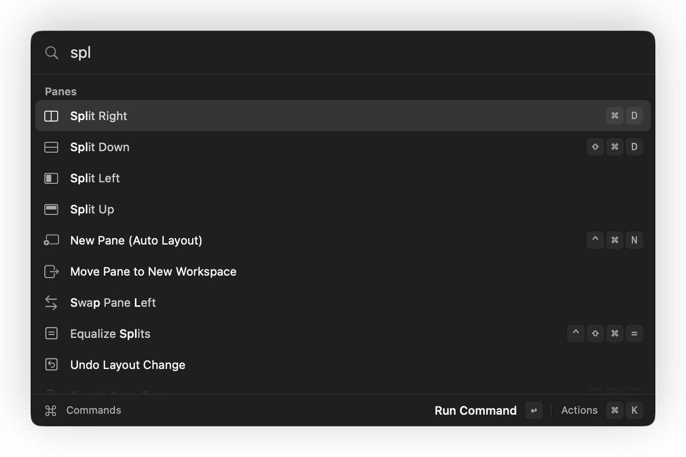
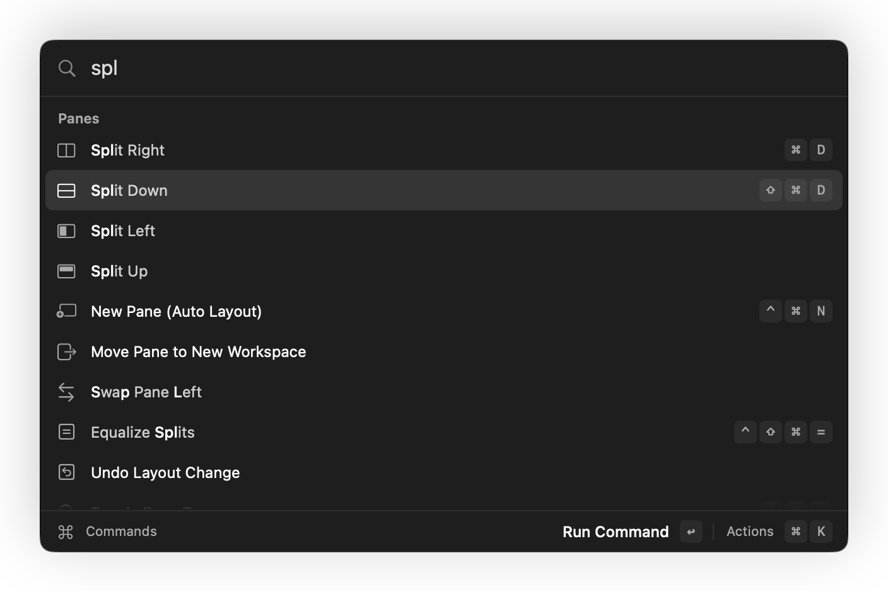

# Command palette and overlays

Cmd-Shift-P opens a floating glass panel over the window. Sources: `Packages/macOS/CmuxNext/Sources/CmuxNextPalette/` at `dd5e6216935`; images from `1824883286a`. JSON key `components["palette.panel"]`.

## Layout

Width paletteWidth (640/720). Search field height 44/52, search font 16/18 regular with a magnifier glyph; separator rules above and below the list; 10 visible rows of 32/40; list inset 4; footer row 32/40 with "Commands", "Run Command ↩", "Actions ⌘K". Panel radius panelCornerRadius (10/12, continuous); row radius itemCornerRadius (circular arcs: rows are `NSBezierPath(roundedRect:)`); horizontal padding 12. Keycaps: at least iconSize+4 square, padding 4 each side of the text, radius itemCornerRadius-2 (circular arcs), 2 apart, fill hoverFill, text shortcut (SF Mono) textSecondary. Section headers: header style, textSecondary, height sidebarHeaderHeight. Source `PaletteLayout.swift:9-37 (PaletteLayout)`.

## States

| element | state | token | source |
|---|---|---|---|
| panel | open | Liquid Glass .regular, tint glassTint; shadow alpha(shadow, 0.22), blur 24, y 8 | PaletteContentView.swift:17 (`PaletteContentView.glass`), :244-251 (`applyColors`) |
| row | default | no fill, icon textSecondary, title textPrimary, subtitle caption textSecondary, accessory caption textTertiary | PaletteRowCell.swift:80-138 (`PaletteRowCell`) |
| row | hover | hoverFill, inset 4 from the list edges | PaletteRowCell.swift:65 (`PaletteTableRowView.drawBackground`) |
| row | selected (keyboard) | selectionFill, icon textPrimary | PaletteRowCell.swift:65, :123 |
| row | filtering | unmatched title chars alpha(textPrimary, 0.78), matched bodyEmphasized textPrimary | PaletteRowCell.swift:182-187 |
| field | caret / selection | textPrimary / selectionFill | PaletteContentView.swift:259-260 (`applyEditorColors`) |
| empty | | title bodyEmphasized textSecondary, hint caption textTertiary | PaletteContentView.swift:25-26 (`emptyTitle`, `emptyHint`) |
| actions menu (⌘K) | | glass panel, width palette/2-16, rows rowHeight-4, selected selectionFill | PaletteActionsMenuView.swift (`PaletteActionsMenuView`) |

Motion: opens from scale 0.97 (spring appear) with a 0.12 s fade; closes to 0.98 with a 0.08 s fade.

Materials (target): macOS 26+ Liquid Glass; vibrancy (.popover) with the glassTint layer and a 1/scale separator border where Liquid Glass is missing; Reduce Transparency opaque mix(window, textPrimary, 0.14) with an opaque separator border (`CmuxNextDesign/OverlaySurface.swift (OverlayMaterial, OverlaySurfaceView)`). Today the panel, its actions menu and its shortcut recorder call `Glass.makePanel` directly, so Reduce Transparency shows system Liquid Glass instead of the opaque fallback. A code fix is in progress in a separate lane.

UNVERIFIED: palette row hover screenshot (`debug.mouse` targets the main window, not the panel); light palette screenshot (the panel was captured while not on screen, so Liquid Glass sampled no backdrop and rendered gray; the dark capture is also missing real backdrop sampling). Capture both with the window on a visible test screen.

## Hover cards

Shared panel (`CmuxNextDesign/HoverCards/HoverCardPanel.swift (HoverCardPanel)`): glass (same material target and status as the palette), radius panelCornerRadius, tint glassTint, placed space2 below or beside the anchor with a space2 screen margin. State machine: delay per source (workspace 0.6 s; tab 0.3-0.8 s by width), re-show window 0.7 s (moving between targets inside it shows at once), pin lifetime 10 s. Slide spring panel (0.18/0.85), fade in 0.12 s, out 0.08 s, thumbnail crossfade 0.1 s. See the diagrams in [sidebar.md](sidebar.md) and [tabs.md](tabs.md).
