# Panes, focus and borders

Panes sit in columns separated by columnGap (6/8). Each pane has padding (2/4; ports add it too, above the strip and around the content, so the tab pill sits 3/3 pt at compact density), a corner radius (paneCornerRadius, circular arcs, not continuous, so the browser page mask matches), a one-device-pixel border, and an overlay that draws the focus ring, the inactive dim and the attention ring. Sources: `Packages/macOS/CmuxNext/Sources/CmuxNextLayout/` at `d445a445556`; images from `1824883286a`. JSON keys `components["panes.*"]`.


## Pane states

| state | drawing | source |
|---|---|---|
| default | paneBorder hairline (1/scale), radius paneCornerRadius; hidden while a ring or attention ring draws | Views/PaneOverlayView.swift:193 (`PaneOverlayView.update`), :229 (`applyColors`) |
| focused | focus ring (below) when >1 pane and the indicator marks the border | Views/ScreenContentView.swift:255-260 (`ScreenContentView.updateChrome`) |
| unfocused | tabs subtler (tabs page); optional dim: opaque contentBackground at 0.14, only when dimming is on or (borders none and indicator border) | ScreenContentView.swift:263-264; PaneOverlayView.swift:194, :230 |
| attention | ring in attention (or the notification color), width 2; blink style (default): 2 blinks over 0.6 s (0.3 s each, the `flash` loop), then persists. Pulse style: opacity 1 → 0.3 on the 1.8 s pulse period for `duration` (3 s). Reduce Motion: one fade in | PaneOverlayView.swift:200-219 (`applyAttention`); CmuxNextDesign/Motion/Motion+Attention.swift:14-50 (`Motion.attentionAnimation`); CmuxNextDesign/AttentionSettings.swift (`AttentionSettings`) |
| drop target | drop overlay (below) | |
| unfocused window | no change | |

Transitions fade over `fade.focus` (0.1 s).

## Focus ring

Width focusRing.width (1). Radius focusRing.cornerRadius, else paneCornerRadius. Color focusRing.color, else foreground at the contrast alpha. Style ring (default), glow (border at ring alpha × 0.6 plus shadow radius max(2, width×3)), or none (`CmuxNextDesign/FocusRingSettings.swift (FocusRingSettings)`, `PaneOverlayView.swift:119-147 (layoutLayers), 223-226 (applyColors)`). Shown on one pane only when focusRing.showWhenSinglePane.

| focusRing.contrast | alpha | Apple dark | Apple light |
|---|---|---|---|
| subtle (default) | 0.20 | `#FFFFFF33` | `#00000033` |
| standard | 0.55 | `#FFFFFF8C` | `#0000008C` |
| strong | 0.85 | `#FFFFFFD9` | `#000000D9` |

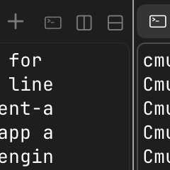 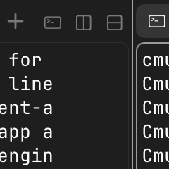 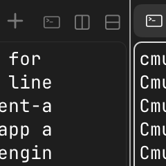

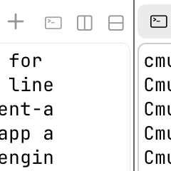 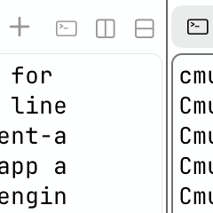 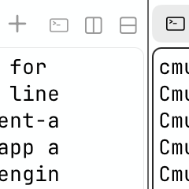

## Focus indicator (appearance.focusIndicator)

| value | ring on focused pane | unfocused pane tabs subtler |
|---|---|---|
| both (default) | yes | yes |
| border | yes | no |
| tabs | no | yes |
| none | no | no |

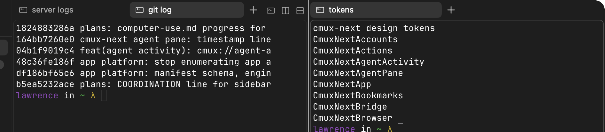
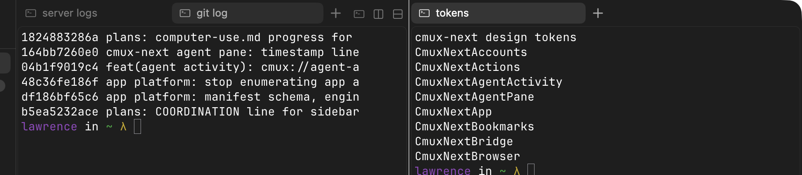

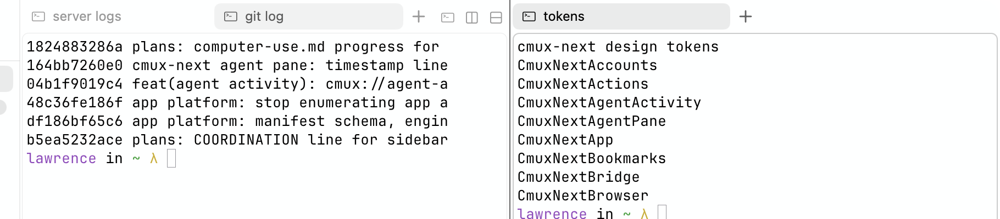

## Borders none (appearance.borders)

Every border, hairline and separator becomes clear; the focus ring and attention width are off. With indicator `border`, the unfocused panes dim (0.14) instead (`CmuxNextLayout/Model/LayoutStyle.swift:99-104 (LayoutStyle.applyingDesignMetrics)`). The browser omnibar loses its editing ring. Target for the agent pane: no edge at all. Today the bridge sets `--agent-border` and `--agent-border-strong` to transparent, but the composer, menu and code block edges still draw; a code fix is in progress in a separate lane (see [agent-pane.md](agent-pane.md#borders-none)).

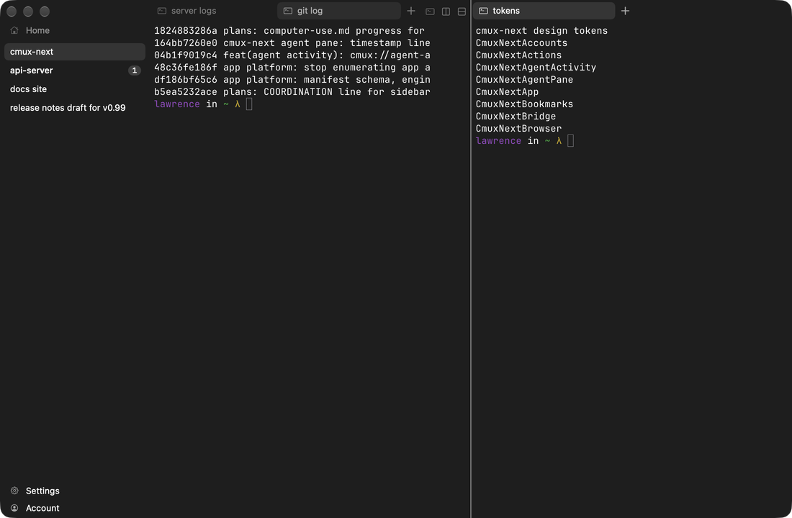 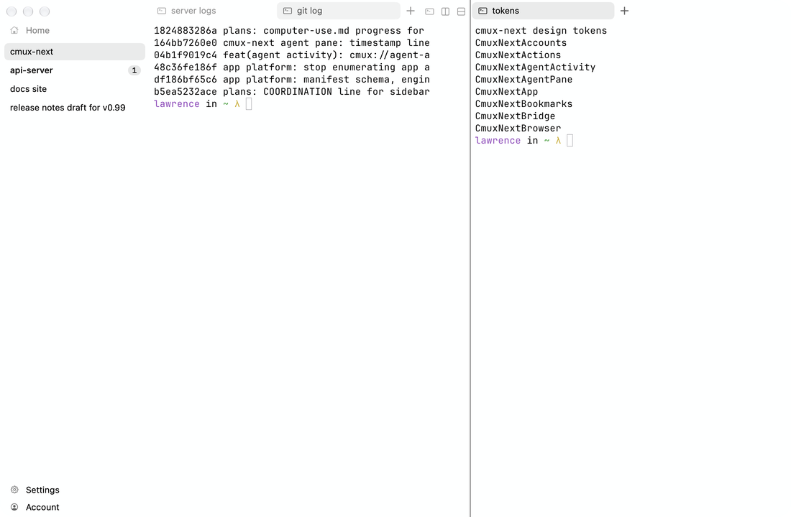

## Dividers and drop overlay

Divider: 1 pt visible, 7 pt hit width; hover fades in 0.08 s. Drop overlay defaults: style glassFill, spring track (0.12/0.9), grows from 3% smaller, inset space2 where a pane has no chrome, pane radius, label on targets ≥ 90 wide, color textPrimary; edge zones 28% of the pane clamped to 28-180 pt; new column zone 36 pt (`Views/DropOverlay/DropOverlayTunables.swift (DropOverlayTunables, LayoutTunables)`). The overlay uses the `OverlaySurface` materials, so Reduce Transparency gives the opaque fallback. Drop overlay screenshots UNVERIFIED (needs a live drag; `debug.drop_highlight` exists and is the next step). Diagram:

```
 ┌────────── pane ──────────┐
 │ ┌──┐               ┌──┐  │  edge zone = clamp(28% of side, 28, 180)
 │ │L │   center:     │R │  │  overlay: glass fill, textPrimary line,
 │ │  │   move here   │  │  │  radius = pane radius, label if ≥ 90 pt
 │ └──┘               └──┘  │
 └──────────────────────────┘
```

## Light appearance and borders none crop

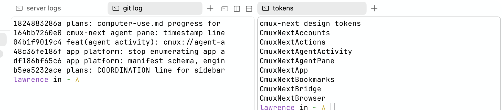
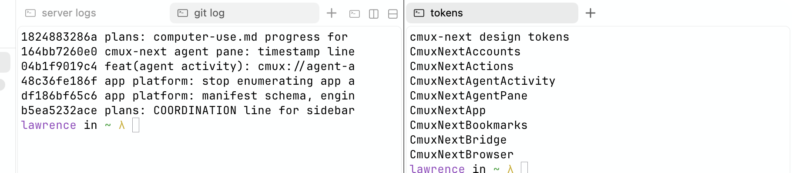

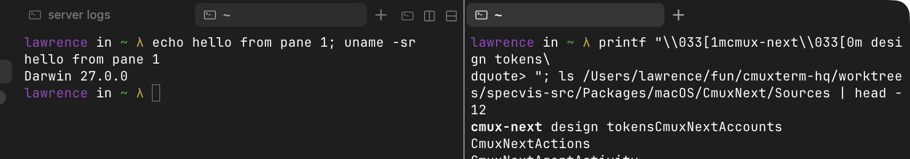
