# Sidebar

Window-height list of workspaces with sticky sections (Home at the top; Settings and Account at the bottom). Same surface as the window (`sidebarBackground` = `windowBackground`), no panel, no borders on rows. Width 208 compact / 240 comfortable. Sources: `Packages/macOS/CmuxNext/Sources/CmuxNextSidebar/Views/` at `1824883286a` unless noted. Tokens: [design-tokens.md](../design-tokens.md); JSON keys `components["sidebar.*"]`.

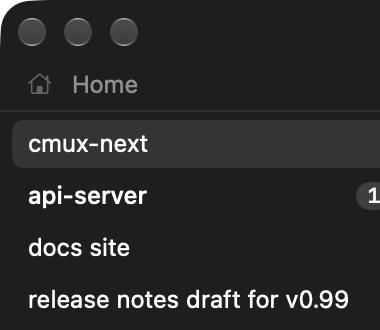 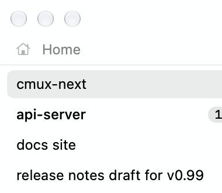

## Workspace row

Row height `sidebarRowHeight` (24/32); `sidebarRowHeightWithSubtitle` (36/46) only when the row has live status. Rows are 2 pt apart (space1). Text starts at space3 (6) from the row edge, +space5 (12) when grouped; with an icon, the icon box is smallIconSize+space2 and the text starts space3 after it. Corner radius itemCornerRadius (6/7). A clipped title fades over space6 (16) at its trailing edge. Title body (12/13), bodyEmphasized when unread; subtitle caption (10.5/11).

| state | background | title | subtitle | other | source |
|---|---|---|---|---|---|
| default | none | textPrimary | textSecondary | | WorkspaceRowView.swift:125-136 |
| hover | hoverFill | textPrimary | textSecondary | close button (x) replaces the badge; title narrows, then marquees after 0.6 s | :108-120, :133, :161-168 |
| selected (active) | selectionFill on one shared pill that glides between rows (spring selection 0.15/0.9) | textPrimary | textSecondary | | ChromeDecorations.swift:48-58 |
| selected + hover | selectionFill pill | textPrimary | | close button shown | |
| multi-selected (not active) | secondarySelectionFill | | | | WorkspaceRowView.swift:131 |
| drop target | selectionFill; insertion gap is a hoverFill pill | | | | :129; ChromeDecorations.swift:49 |
| dragging | card elevatedBackground, radius itemCornerRadius; shadow color shadow, opacity 0.28, radius 12, y 6 (rest: 0, 4, 2); stacked cards inset 4 per depth with alpha 0.85 and a 0.5 pt separator border; count badge textPrimary fill, textOnPrimary text | | | lift fade 0.12 s, drop spring settle | DragLiftView.swift:20-107 |
| unread | | bodyEmphasized | | badge | WorkspaceRowView.swift:59 |
| pressed | no distinct state: selection changes on mouse down | | | | |
| keyboard focus | no ring; arrow keys move the pill | | | | |
| unfocused window | no change (only the system traffic lights dim) | | | | |
| light vs dark | same tokens; values from the theme | | | | |

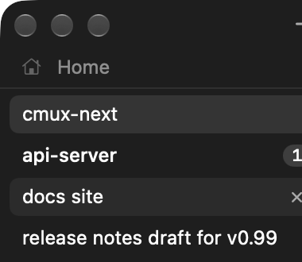 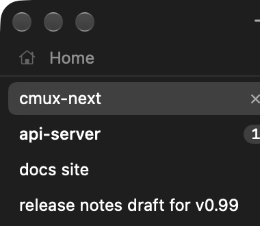 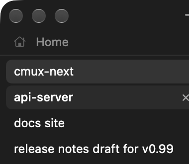

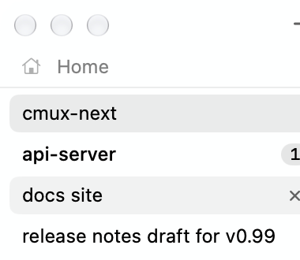 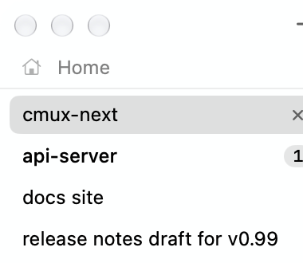

Close button: iconSize+space2 (18/20) square, space3 from the trailing edge, glyph smallIconSize-space1 regular.

## Unread badge

Count pill: height iconSize (14/16), width max(height+4, text+8), radius height/2, fill badgeFill, text textPrimary in shortcut (SF Mono 10.5 medium). Dot: 6 pt, alpha(textPrimary, 0.85). Hidden while the row is hovered. Source `UnreadBadgeView.swift:40-58`.

## Status indicator

At `9e5083e7554` rows and tabs share one indicator (`CmuxNextDesign/StatusIndicator/`): slot smallIconSize-space1 (10/12).

| state | glyph | color | motion |
|---|---|---|---|
| idle | hidden | | |
| busy | arc covering 0.72 of the circle, stroke 1.5 | textSecondary (or appearance.statusIndicator.color) | spin, 0.9 s/turn |
| busy with progress | ring over a track at 0.22 opacity | textSecondary | none |
| waiting (needs input) | dot, 0.5 of the slot | attention | pulse 1.8 s, low 0.35 |
| error | dot | danger | none |
| success | check | success | none |
| paused | dot or ring | attention | none |
| Reduce Motion | same glyphs | | no spin, no pulse |

Styles: arc (default), native (NSProgressIndicator, 8 steps), dot, none. UNVERIFIED screenshot: the build used for images predates this indicator and a busy agent could not be driven from the socket. Diagram:

```
 busy        waiting      error       success     progress
  ◜ ⟳        ● (pulse)    ●           ✓           ◔ over ○ (track 0.22)
 textSecondary attention  danger      success     textSecondary
```

## Section headers and sticky sections

Header height sidebarHeaderHeight (22/26), text header style (11/12 semibold) in textTertiary, chevron textTertiary (smallIconSize-space2, bold). Items: row height sidebarRowHeight, title textPrimary, icon textSecondary (textPrimary when active).

| item state | fill | source |
|---|---|---|
| default | none (tray tiles: hoverFill) | SidebarItemRowView.swift:74 |
| hover | hoverFill | :75 |
| active | selectionFill | :75 |
| missing target | whole item opacity 0.5 | :67 |

Section look (`sidebar.sections.look`, Debug tunable, default quiet; `CmuxNextSidebar/Sections/SidebarSectionTunables.swift`):

| look | headers | separation | built-in items |
|---|---|---|---|
| quiet | yes | hairline band lines (separator) | rows |
| card | yes | each section on a card, hoverFill, radius itemCornerRadius+2 | rows |
| tray | yes | none | tiles in a grid (min width rowHeight*1.5, height rowHeight+4, gap 4, rest fill hoverFill) |
| lines | no | 1 pt line between sections | rows |
| linesIcons | no | lines | icon-only buttons (width rowHeight+4) |

Under borders none the lines become hoverFill at 0.6 of its alpha.

 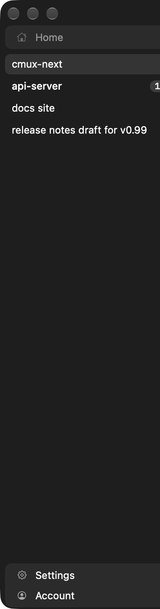 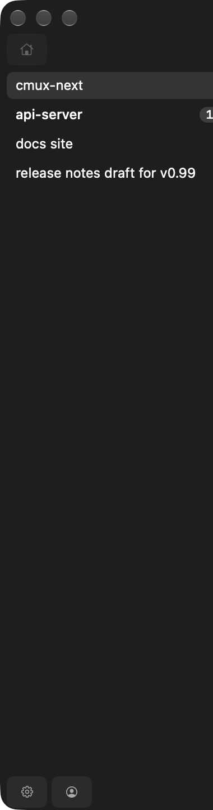 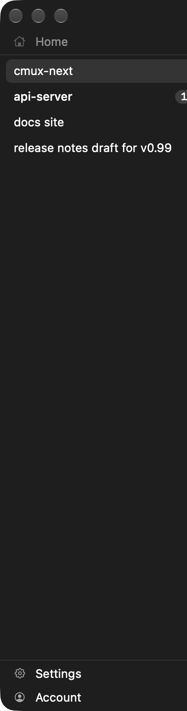 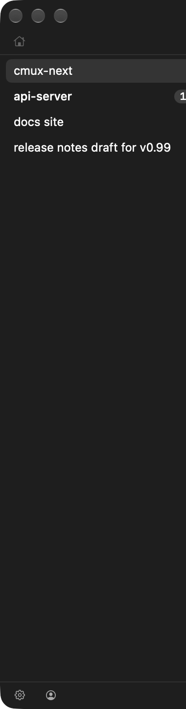

 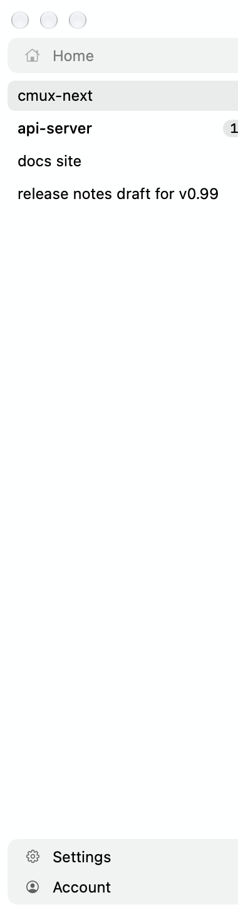 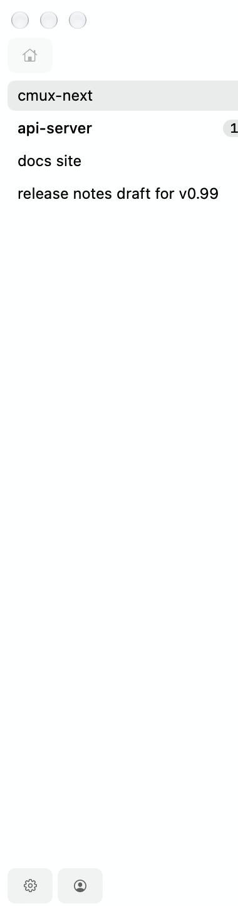 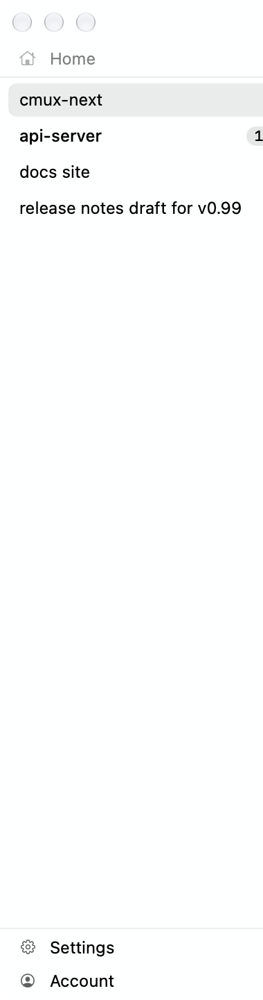 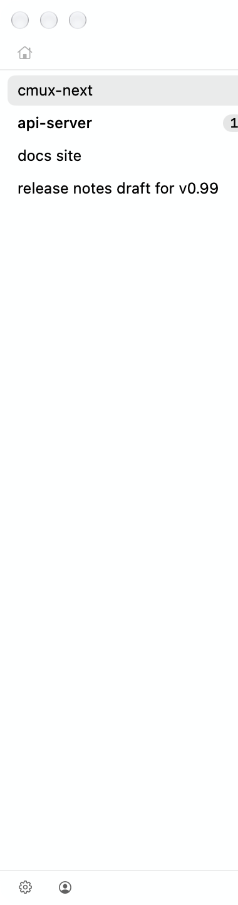

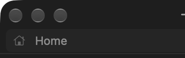 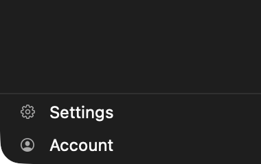

## Icon buttons and hover card

Sidebar icon buttons: sidebarHeaderHeight square, radius itemCornerRadius, SF Symbol smallIconSize semibold, tint textSecondary, hover fill hoverFill; no distinct pressed state (`SidebarIconButton.swift:17-60`).

Workspace hover card: glass panel (overlay material), radius panelCornerRadius, shown 0.6 s after the pointer rests on a row, offset space2 from the row (`WorkspaceHoverCard.swift:16`, `CmuxNextDesign/HoverCards/HoverCardPanel.swift`). UNVERIFIED screenshot: hover cards follow the real pointer through the hover coordinator; `debug.mouse action:hover` did not open one. Diagram:

```
 sidebar row  ┃ ┌──────────────────────────┐  glass, glassTint, radius 10/12
 [cmux-next ] ┃ │ cmux-next     bodyEmph.  │  padding space5
              ┃ │ ~/fun/cmux    caption    │  textSecondary
              ┃ │ CPU 2%  RAM 180 MB       │
              ┃ └──────────────────────────┘  4 pt from the row
```

## Driving states for screenshots

`debug.mouse {"action":"hover","x":X,"y":Y}` (top-left window points) delivers hover to tracking-area owners. `cmux notify --workspace N` sets unread. `debug.tunables {"action":"set","key":"sidebar.sections.look","value":"card"}` switches looks. `debug.sidebar_rename` starts inline rename. See [tools/capture.sh](../tools/capture.sh).

## Light appearance, more states

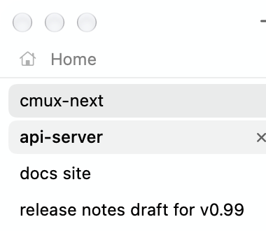 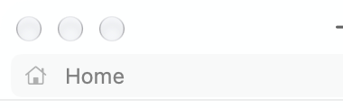 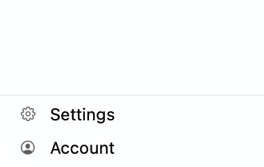
