# Tabs

Every pane has its own tab strip. Pills start on the pane's content line; the strip is the window surface unless `appearance.tabBarBackground = darker`. Sources: `Packages/macOS/CmuxNext/Sources/CmuxNextTabs/` at `dd5e6216935`; images from `1824883286a`. JSON keys `components["tabs.*"]`.

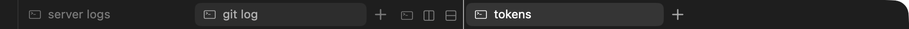

## Strip

Height tabStripHeight (28/36). Pill top = snapDown((stripHeight - tabHeight - panePadding) / 2) (`CmuxNextDesign/PaneChromeMetrics.swift:49-62 (PaneChromeMetrics.pillTop)`). Trailing buttons (new terminal, split right, split down) are tabHeight-4 square, 2 apart, 4 after the tabs, and reveal while the pointer is in the strip. A scrolled strip fades its edge over 24 pt. Separators between unselected neighbours: separator color, height tabHeight/2, centered in the gap.

| tabBarBackground | strip fill | source |
|---|---|---|
| window (default) | none: windowBackground shows | CmuxNextApp/PaneContentView.swift:56 (`PaneContentView.stripTint`) |
| darker | stripBackground (mix(bg, black, 0.22/0.05)) | :56, :185 |

The strip fill is a `ChromeBackdropView`: in a see-through window with Reduce Transparency off, a behind-window `.headerView` blur shows under the tint at 0.82 × its alpha; otherwise the tint is solid (`CmuxNextDesign/ChromeBackdropView.swift:17,74-81`). A pane whose terminal theme differs from the window also paints the strip.

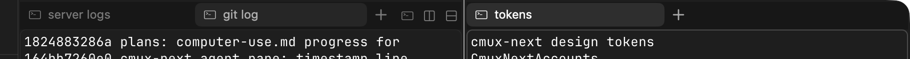 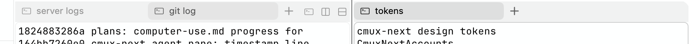

## Tab

Height tabHeight (24/30), max width 200/240, min (icon-only, pinned) 32/40, compact style width round(max*3/4). The pill starts at x = 0 in its slot and is 2 × tabBackgroundInset (2 pt) narrower, so the whole gap to the next tab is on the trailing side (`TabStripMetrics.swift:98-100 (TabStripMetrics.pillFrame)`). Radius itemCornerRadius (6/7), continuous corners. Icon iconSize (14/16) at 8 from the leading edge, title body (12/13) 6 after the icon, close button 16 square at 4 from the trailing edge, 4 after the title. Title fade 20. Status dot 6. A hovered unselected tab shows its close button only when its contents are at least 68 wide.

| state | fill | title and icon | close | source |
|---|---|---|---|---|
| default (unselected) | none | textSecondary; dormant textTertiary, icon opacity 0.55 | hidden | TabCell.swift:202-208 (`TabCell.applyColors`), :306 (`layoutLayers`) |
| hover | hoverFill | textSecondary | shown | :202 |
| selected | selectionFill | textPrimary | shown on hover | :202, :208 |
| pressed | no distinct fill (selects on mouse down) | | | |
| dragging (lifted) | solid mix(windowBackground, textPrimary, 0.08); shadow opacity 0.22, radius 6, y 2 | | | :186-189 (`updateLift`), :204-207 |
| status needsInput / success / failure / unread | dot attention / success / danger / textPrimary | | | :221-227 (`badgeColor`) |
| busy | the shared status indicator (`StatusIndicatorLayer`) replaces the icon, in the icon frame inset space1; arc by default, stroke 1.5, textSecondary; follows `appearance.statusIndicator` (style, size, thickness, color); progress draws a ring over a 0.22 track; paused uses attention | | | TabCell+StatusIndicator.swift:10-35 (`TabCell.spinnerPlan`, `updateSpinner`); TabCell+LazyLayers.swift:10-21 (`makeSpinner`) |
| unfocused pane | tokens through the inactive style below | | | |
| unfocused window | no change | | | |
| disabled | n/a | | | |

Colors fade over 0.08 s (easeOut). Open grows from width 0 and alpha 0 (spring appear), close uses spring disappear, reflow spring move.

 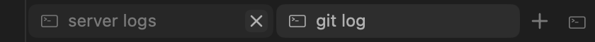

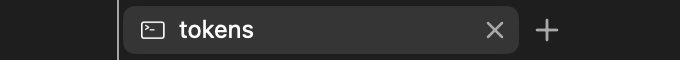 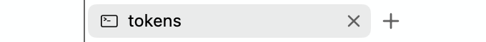

## Close button

16 pt, radius itemCornerRadius-2, x glyph 7 pt with 1.3 stroke and round caps (`TabCell+LazyLayers.swift:38-65 (TabCell.makeCloseLayers, applyCloseColors)`, `TabCell.swift:331 (layoutLayers)`).

| state | glyph | fill |
|---|---|---|
| default | textSecondary | none |
| hover | textPrimary | hoverFill |
| pressed | textPrimary | selectionFill |

## New tab (+) and trailing buttons

+ button: tabHeight wide, radius itemCornerRadius, glyph stroke 1.4 (`NewTabButtonView.swift (NewTabButtonView)`). Trailing buttons: same fills (`TabStripButtonGroupView.swift:161-162 (TabStripButtonGroupView.applyColors)`).

| state | glyph | fill | note |
|---|---|---|---|
| default | textSecondary | none | |
| hover | textPrimary | hoverFill | 0.08 s fade |
| pressed | textPrimary | selectionFill | not animated |

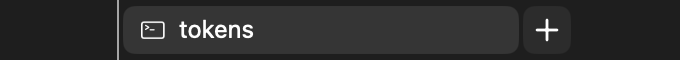  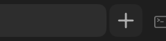

Pressed screenshots are UNVERIFIED: a synthetic mouse-down enters AppKit's tracking loop before the capture. The pressed tokens above come from code.

## Unfocused pane tabs (focus.inactiveTabStyle)

Applies when `appearance.focusIndicator` is `tabs` or `both`, the screen has more than one pane, and the pane is not focused (`CmuxNextDesign/ChromeEmphasis.swift:30-77 (ChromeEmphasis.forPane, ThemeTokens.emphasized)`). Strength 0.35 (Debug tunable). Contrast floors: primary 3.5, secondary 2.5, tertiary 2.0.

| style | textPrimary | textSecondary | selectionFill | hoverFill |
|---|---|---|---|---|
| fade (default) | mixed toward the page by 0.35, floor 3.5 | mixed, floor 2.5 | alpha × 0.65 | alpha × 0.65 |
| tonal | ← textSecondary | ← textTertiary | hoverFill alpha × 0.825 | unchanged |
| quiet | ← textSecondary | textTertiary faded by 0.175 | transparent | unchanged |

Resolved for Apple System dark: fade primary `#B0B0B0`, selection `#FFFFFF11`; tonal selection `#FFFFFF0D`; quiet selection none. All themes: `components["tabs.inactivePaneEmphasis"].resolved` in the JSON. Screenshot check (dark): selected tab in the unfocused pane is `#2D2D2D` (fade), `#292929` (tonal), `#1E1E1E` (quiet).

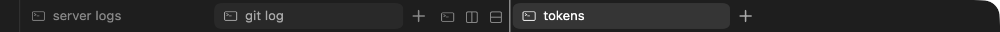
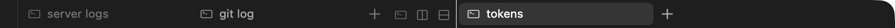

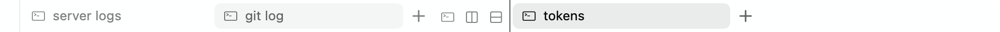
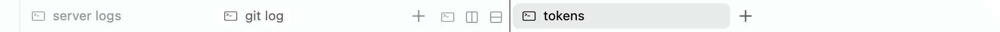

## Tab hover card

Glass panel, padding 12, thumbnail tabMaxWidth × round(tabMaxWidth·10/16) radius itemCornerRadius on hoverFill, title bodyEmphasized textPrimary, subtitle caption textSecondary. Delay 0.3 s over the narrowest tabs to 0.8 s over full-width tabs; re-show window 0.7 s; slide spring panel; appear 0.12 s; hide 0.08 s (`TabHoverCardView.swift (TabHoverCardView)`, `TabTunables.swift:49-54 (TabTunables.hoverCardMinimumDelay, hoverCardMaximumDelay)`). Material: the overlay fallbacks in [design-tokens.md](../design-tokens.md#4-materials), through `Glass.makeOverlayPanel`. UNVERIFIED screenshot (same reason as the sidebar hover card).

## Drag

Drag starts after 4 pt; tear-off 24 pt outside the strip; group join hysteresis 0.3; autoscroll 14 pt/s per pt inside the edge fade (`TabTunables.swift:37-48 (TabTunables.tearOffDistance, dragStartDistance, groupJoinHysteresis, autoscrollGain)`). Drop insertion and pane drop zones: see [panes.md](panes.md). Drag screenshots UNVERIFIED (`debug.tab_drag` reports state only).

## Tab groups

A group shows as a chip before its tabs, an underline under them and a faint wash behind them. The colors are the group colors ([design-tokens.md](../design-tokens.md#group-colors-user-content-exception)), a user-content exception to the theme-only rule.

| part | geometry | color |
|---|---|---|
| chip | height max(space6, tabHeight - 2 × space2), inset space1 in its slot, padding space3, radius itemCornerRadius - space1; unnamed expanded group: dot space5 - space1 (10); name max width round(tabMaxWidth / 2); count space2 after the name | group fill; hover blends 8% textPrimary, pressed 16%; name textPrimary, count textSecondary; shadow color shadow, radius space3, y space1 |
| underline | height space1 (2), round ends | group swatch |
| wash | behind member tabs, continuous corners | swatch at alpha 0.09 |

Sources: `TabStripMetrics.swift:137-143 (TabStripMetrics.init)`, `Groups/TabGroupChipCell.swift:126-171 (TabGroupChipCell.layout, applyColors)`, `Groups/TabGroupBandCell.swift:40-52 (TabGroupBandCell)`. UNVERIFIED screenshot.

## Light appearance, more states

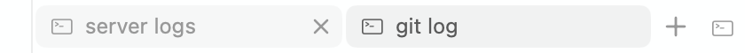 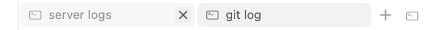 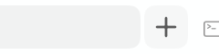

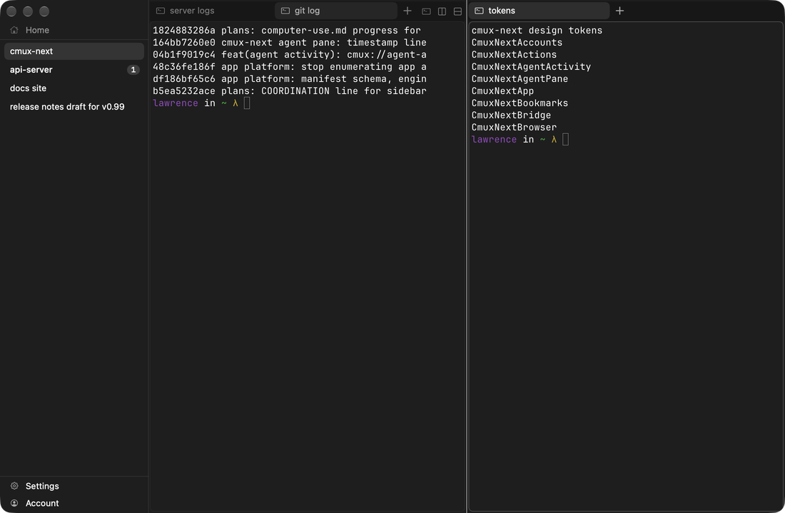 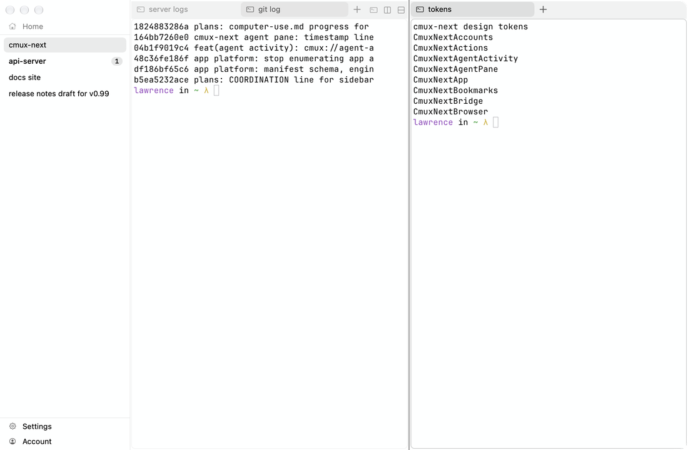
