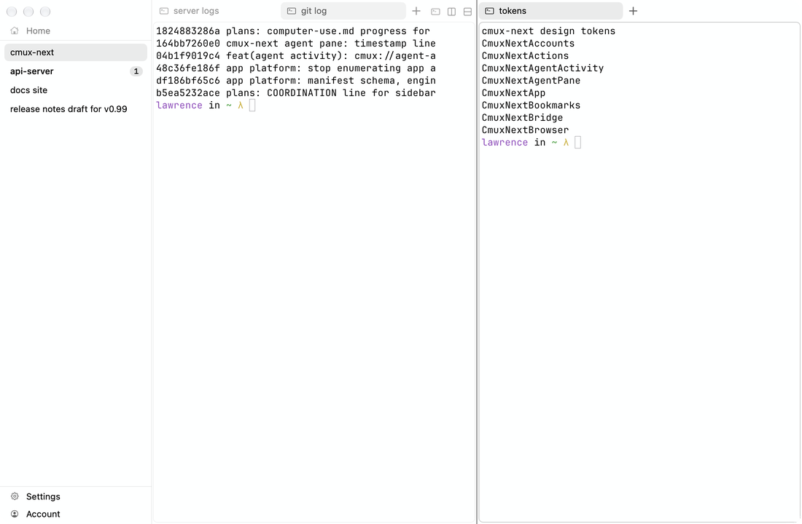
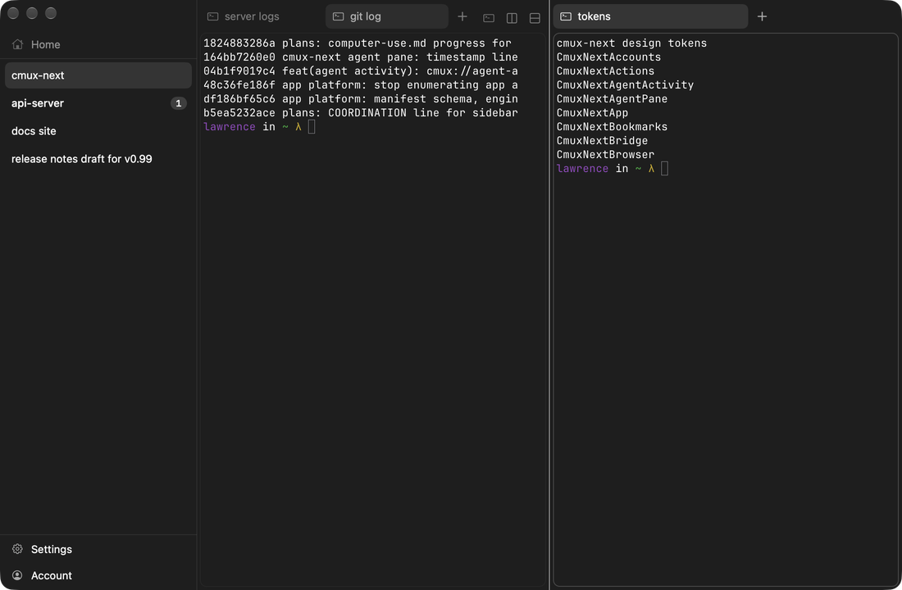
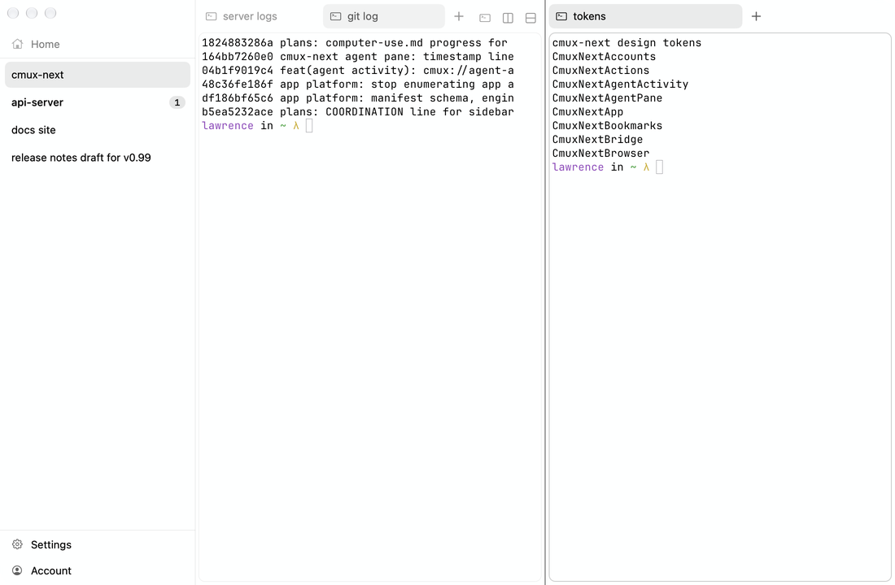

# Design tokens

Every visual value of the cmux-next macOS app, with its source. Machine-readable twin: [design-tokens.json](design-tokens.json) (GPUI and Chrome ports import it). Source refs are `path:line` at feat-cmux-next `1824883286a` (the screenshot build); status indicator refs are at `9e5083e7554`.

## 1. Color model

Chrome has no fixed palette. Every color derives from the terminal theme (Ghostty config: `background`, `foreground`, `palette`, `selection-*`, `background-opacity`, `background-blur`) in `ThemeTokens.derive` (`Packages/Shared/CmuxTheme/Sources/CmuxTheme/ThemeTokens.swift:102-160`). Surfaces next to the terminal are the terminal background, so there is no seam. Fills are the foreground at low alpha. Text is the foreground, muted toward the background only as far as WCAG contrast allows (4.5:1 for primary and secondary, 3:1 for tertiary and status marks). There is no accent hue; blue appears only when the theme itself is blue, and the only control that uses the ANSI blue is the agent composer Send button (`highlight`).

The default theme is `light:Apple System Colors Light,dark:Apple System Colors` (`Packages/macOS/CmuxNext/Sources/CmuxNextTerminal/GhosttyRuntime+DefaultTheme.swift:11-16`), following the macOS appearance. Before the config is read the app uses Ghostty's built-in default (`#282C34` on `#FFFFFF`).

Ports must implement `derive` exactly, not copy the table below: the table is only the result for five reference themes. [tools/derive_theme_tokens.py](tools/derive_theme_tokens.py) is a line-for-line port; use it as the oracle in unit tests.

### Formulas

| token | formula (dark / light) | source |
|---|---|---|
| windowBackground, sidebarBackground, contentBackground | bg with alpha = background-opacity | ThemeTokens.swift:119,131-133 |
| chromeBackground | mix(bg, fg, 0.05 / 0.035) | :134 |
| elevatedBackground | mix(bg, fg, 0.07 / 0.02) | :135 |
| stripBackground | mix(bg, black, 0.22 / 0.05), alpha = opacity | :136 |
| textPrimary | fg pushed toward white or black in 0.02 steps until 4.5:1 over pressedFill-on-bg | :112, :164-174 |
| textSecondary | textPrimary mixed toward bg, up to 0.38, keeping 4.5:1 | :113, :178-186 |
| textTertiary | textPrimary mixed toward bg, up to 0.55, keeping 3:1 | :114 |
| hoverFill | fg @ 0.06 / 0.05 | :107 |
| selectionFill | fg @ 0.10 / 0.08 | :108 |
| secondarySelectionFill | fg @ 0.07 / 0.055 | :142 |
| pressedFill | fg @ 0.14 / 0.11 | :109 |
| badgeFill | fg @ 0.14 / 0.10 | :144 |
| separator | fg @ 0.08 / 0.07; clear under borders none | :145; Palette.swift:56 |
| paneBorder | fg @ 0.07 / 0.09; clear under borders none | :146; Palette.swift:58 |
| focusRing | fg @ 0.40 (pane ring replaces alpha, see focusRing.contrast) | :147 |
| glassTint | bg @ 0.40 / 0.30 | :148 |
| shadow | mix(bg, black, 0.85), opaque; layers set opacity | :149 |
| textSelection | selection-background, else mix(bg, fg, 0.22) | :150 |
| attention / danger / success | ANSI 3 / 1 / 2 pushed to 3:1 on bg | :151-153 |
| highlight | ANSI 4 pushed to 3:1 | :120, :154 |
| highlightText | bg or textPrimary, whichever contrasts more, if 4.5:1; else black or white | :121-128 |

`mix(a, b, t)` is per-channel sRGB linear interpolation that keeps a's alpha (`ThemeRGB.swift:104`). Contrast is WCAG relative luminance (`ThemeRGB.swift:84-96`). "dark" means luminance(bg) < luminance(fg).

### Resolved values

Value, then the color composited on the window background (what a screenshot shows). Verified against screenshot pixels for Apple System dark and light: window `#1E1E1E`/`#FEFFFF`, selected row `#343434`/`#EAEBEB`, hovered row `#2B2B2B`/`#F1F2F2` (derive: `#2C2C2C`, 1 level rounding), darker strip `#171717`/`#F1F2F2`.

| token | appleSystemDark | appleSystemLight | ghosttyDefault | monokaiClassic | githubLight |
|---|---|---|---|---|---|
| windowBackground | `#1E1E1E` | `#FEFFFF` | `#282C34` | `#272822` | `#FFFFFF` |
| sidebarBackground | `#1E1E1E` | `#FEFFFF` | `#282C34` | `#272822` | `#FFFFFF` |
| contentBackground | `#1E1E1E` | `#FEFFFF` | `#282C34` | `#272822` | `#FFFFFF` |
| chromeBackground | `#292929` | `#F5F6F6` | `#33373E` | `#32332C` | `#F7F7F7` |
| elevatedBackground | `#2E2E2E` | `#F9FAFA` | `#373B42` | `#363730` | `#FBFBFB` |
| stripBackground | `#171717` | `#F1F2F2` | `#1F2229` | `#1E1F1B` | `#F2F2F2` |
| textPrimary | `#FFFFFF` | `#000000` | `#FFFFFF` | `#FDFFF1` | `#1F2328` |
| textSecondary | `#AAAAAA` | `#616161` | `#B8B9BC` | `#B2B4A9` | `#64676B` |
| textTertiary | `#888888` | `#7F8080` | `#93969A` | `#92938A` | `#828487` |
| hoverFill | `#FFFFFF0F` → `#2C2C2C` | `#0000000D` → `#F1F2F2` | `#FFFFFF0F` → `#353940` | `#FDFFF10F` → `#34352E` | `#1F23280D` → `#F4F4F4` |
| selectionFill | `#FFFFFF1A` → `#343434` | `#00000014` → `#EAEBEB` | `#FFFFFF1A` → `#3E4148` | `#FDFFF11A` → `#3C3E37` | `#1F232814` → `#EDEDEE` |
| secondarySelectionFill | `#FFFFFF12` → `#2E2E2E` | `#0000000E` → `#F0F1F1` | `#FFFFFF12` → `#373B42` | `#FDFFF112` → `#363730` | `#1F23280E` → `#F3F3F3` |
| pressedFill | `#FFFFFF24` → `#3E3E3E` | `#0000001C` → `#E2E3E3` | `#FFFFFF24` → `#464A50` | `#FDFFF124` → `#45463F` | `#1F23281C` → `#E6E7E7` |
| badgeFill | `#FFFFFF24` → `#3E3E3E` | `#0000001A` → `#E5E6E6` | `#FFFFFF24` → `#464A50` | `#FDFFF124` → `#45463F` | `#1F23281A` → `#E9E9EA` |
| separator | `#FFFFFF14` → `#303030` | `#00000012` → `#ECEDED` | `#FFFFFF14` → `#393D44` | `#FDFFF114` → `#383933` | `#1F232812` → `#EFF0F0` |
| paneBorder | `#FFFFFF12` → `#2E2E2E` | `#00000017` → `#E7E8E8` | `#FFFFFF12` → `#373B42` | `#FDFFF112` → `#363730` | `#1F232817` → `#EBEBEC` |
| focusRing | `#FFFFFF66` → `#787878` | `#00000066` → `#989999` | `#FFFFFF66` → `#7E8085` | `#FDFFF166` → `#7D7E75` | `#1F232866` → `#A5A7A9` |
| glassTint | `#1E1E1E66` → `#1E1E1E` | `#FEFFFF4C` → `#FEFFFF` | `#282C3466` → `#282C34` | `#27282266` → `#272822` | `#FFFFFF4C` → `#FFFFFF` |
| shadow | `#050505` | `#262626` | `#060708` | `#060605` | `#262626` |
| textSelection | `#3F638B` | `#ABD8FF` | `#575A61` | `#57584F` | `#CECFD0` |
| attention | `#CDAC08` | `#AC9007` | `#F0C674` | `#E6DB74` | `#4D2D00` |
| danger | `#CC372E` | `#CC372E` | `#CC6666` | `#F92672` | `#CF222E` |
| success | `#26A439` | `#26A439` | `#B5BD68` | `#A6E22E` | `#116329` |
| highlight | `#0869CB` | `#0869CB` | `#81A2BE` | `#FD971F` | `#0969DA` |
| highlightText | `#FFFFFF` | `#FEFFFF` | `#282C34` | `#272822` | `#FFFFFF` |

Pane focus ring colors (fg with the contrast alpha): subtle `fg@0.20`, standard `fg@0.55`, strong `fg@0.85`. Apple dark: `#FFFFFF33` / `#FFFFFF8C` / `#FFFFFFD9`; Apple light: `#00000033` / `#0000008C` / `#000000D9`.

### Theme scopes and translucency

A view resolves tokens inside its `ThemeScope` (app, room, workspace, terminal; `CmuxNextDesign/ThemeScope.swift`). A pane's chrome uses the theme of the terminal it shows, so two panes can have different strip colors. With `background-opacity < 1` the window is translucent, Ghostty's CGS blur applies, and panes do not paint their own background; `background-blur < 0` selects macOS glass (`CmuxNextDesign/WindowBackdrop.swift`). Theme switches crossfade over `fade.theme` (0.16 s).

## 2. Typography

System font (SF Pro) everywhere in native chrome; keycaps and count badges use SF Mono. No custom line height: AppKit's default line height for the font. Sizes scale with `appearance.metrics.chromeFontSize / (compact ? 12 : 13)`.

| style | compact | comfortable | weight | used by | source |
|---|---|---|---|---|---|
| body | 12 | 13 | regular | sidebar row title, tab title, palette row, browser body | Metrics.swift:166 |
| bodyEmphasized | 12 | 13 | medium | unread row title, matched palette chars, hover card title | :168 |
| caption | 10.5 | 11 | regular | row subtitle, palette subtitle and accessory, tab location chip | :170 |
| header | 11 | 12 | semibold | sidebar section headers, palette section headers | :172 |
| search | 16 | 18 | regular | palette search field | :174 |
| shortcut (mono) | 10.5 | 11 | medium | keycaps, count badges | :176 |
| title | 20 | 22 | semibold | onboarding, empty states | :178 |
| subtitle | 13 | 14 | regular | onboarding | :180 |
| omnibar | 13 | 14 | regular | browser address field | OmnibarStyle.swift:54 |

Agent pane (web): shell 13px system; conversation 14px / 22.75px system-ui; composer 15px / 22px; code 11.5-12px ui-monospace.

## 3. Metrics

Default density is **compact** (`DesignSettings.swift:25`). Spacing is a 2 pt grid: space1 2, space2 4, space3 6, space4 8, space5 12, space6 16 (`Tunables/ChromeTunables.swift:15-20`).

| metric | compact | comfortable | source |
|---|---|---|---|
| sidebarWidth (range 120-480; resize 160-360) | 208 | 240 | MetricTunables.swift:36 |
| titlebarHeight | 32 | 40 | :38 |
| trafficLightInset | 76 | 76 | ChromeTunables.swift:24 |
| sidebarRowHeight | 24 | 32 | :40 |
| sidebarRowHeightWithSubtitle | 36 | 46 | :42 |
| sidebarHeaderHeight | 22 | 26 | :45 |
| tabStripHeight | 28 | 36 | :54 |
| tabHeight | 24 | 30 | :56 |
| tabMaxWidth / tabMinWidth | 200 / 32 | 240 / 40 | :58-61 |
| paletteWidth / searchHeight / rowHeight | 640 / 44 / 32 | 720 / 52 / 40 | :65-70 |
| panelInset | 6 | 8 | :71 |
| columnGap | 6 | 8 | :76 |
| densityPaneCornerRadius | 6 | 8 | :78 |
| panelCornerRadius | 10 | 12 | :84 |
| itemCornerRadius | 6 | 7 | :86 |
| iconSize / smallIconSize | 14 / 12 | 16 / 14 | :88-90 |
| scrollEdgeFade | 18 | 22 | :91 |
| panePadding | 2 | 4 | Metrics.swift:91-95 |
| divider thickness / hit width | 1 / 7 | 1 / 7 | ChromeTunables.swift:32-33 |
| tab background inset / content inset | 1 / 8 | 1 / 8 | :28-31 |
| terminal text inset | 4 | 4 | PaneChromeMetrics.swift:46 |

All rounded rectangles use `cornerCurve = .continuous`. Hairlines are one device pixel (1/scale pt). Strip offsets snap to device pixels (`PaneChromeMetrics.swift:69-77`).

 

## 4. Materials

| surface | macOS 26+ | older macOS | Reduce Transparency | source |
|---|---|---|---|---|
| Palette, hover card, overlays | NSGlassEffectView .regular, tint glassTint, radius panelCornerRadius | NSVisualEffectView .popover, withinWindow, glassTint layer, 1/scale separator border | opaque: mix(window, textPrimary, 0.14), 1/scale opaque separator border | OverlaySurface.swift:17-178; Glass.swift:16-33 |
| Tab strip (darker or foreign theme) | ChromeBackdropView .headerView with strip tint | same | same | PaneContentView.swift:15,56,185 |
| Window | Ghostty rules: opaque, translucent + CGS blur, or macOS glass | | | WindowBackdrop.swift |

Glass tint strength is a Debug tunable (default 1).

## 5. Motion

Speed `fast` (default) scales times by 1, `normal` by 1.5, `off` disables (`Motion/MotionTokens.swift:4-19`). Fades use `easeOut` (`cubic-bezier(0,0,0.58,1)`, `Motion/Motion.swift:38`). Springs use response/dampingFraction (SwiftUI semantics; `omega = 2π/response`, stiffness `omega²`, damping `2ζω`, `Motion/SpringParameters.swift`).

| spring | response | damping | use |
|---|---|---|---|
| move | 0.20 | 0.90 | tab reflow, row moves, pane frames |
| appear | 0.18 | 0.90 | palette scale-in, tab grow-in, row insert |
| disappear | 0.15 | 0.90 | tab close, collapse, row removal |
| settle | 0.22 | 0.85 | drop after drag |
| scroll | 0.22 | 0.90 | strip reveal, column reveal, fling snap |
| screen | 0.22 | 0.90 | screen switch |
| track | 0.12 | 0.90 | drop overlay, drag ghost |
| selection | 0.15 | 0.90 | sidebar selection pill |
| panel | 0.18 | 0.85 | hover card slide |

| fade | s | use |
|---|---|---|
| hover | 0.08 | hover fills, revealed buttons |
| focus | 0.10 | focus ring, inactive dim |
| fadeIn / fadeOut | 0.12 / 0.08 | palette, find bar, notices, hover card |
| crossfade | 0.10 | thumbnail swap; Reduce Motion ceiling |
| lift | 0.12 | drag lift shadow |
| theme | 0.16 | theme switch |

Loops: spinner 0.9 s/turn, pulse 1.8 s (easeInEaseOut, low opacity 0.35), attention flash 0.6 s. Marquee: delay 0.6 s, 40 pt/s, minimum 0.4 s, hold 1.2 s, ignore under 2 pt. Palette open scale 0.97, close 0.98. Source: `Motion/MotionTunables.swift:10-80`.

Reduce Motion: no movement springs and no loops; fades capped at 0.1 s (`Motion/MotionPolicy.swift`).

## 6. Visual settings

| setting | values (default first) | effect |
|---|---|---|
| appearance.density | compact, comfortable | every metric |
| appearance.borders | default, none | none clears all borders, hairlines, separators, the focus ring and attention width. [Borders none](images/window/dark-borders-none.png) |
| appearance.focusIndicator | both, border, tabs, none | border = focus ring; tabs = inactive pane tabs subtler |
| appearance.tabBarBackground | window, darker | darker paints stripBackground |
| focusRing.contrast | subtle 0.20, standard 0.55, strong 0.85 | ring alpha |
| focusRing.{enabled,style,color,width,cornerRadius,showWhenSinglePane} | true, ring, nil, 1, nil, false | |
| focus.inactiveTabStyle (Debug tunable only) | fade, tonal, quiet; strength 0.35 | see tabs page |
| sidebar.sections.look (Debug tunable only) | quiet, card, tray, lines, linesIcons | see sidebar page |
| notifications.attention.* | blink, width 2, 2 blinks, 3 s, persist | pane attention ring |
| appearance.statusIndicator.* | arc, scale 1, thickness 1.5, color textSecondary | status glyphs |
| layout.panePadding / paneCornerRadius / paneBorder / paneBorderColor / paneBorderWidth | density values | pane chrome |
