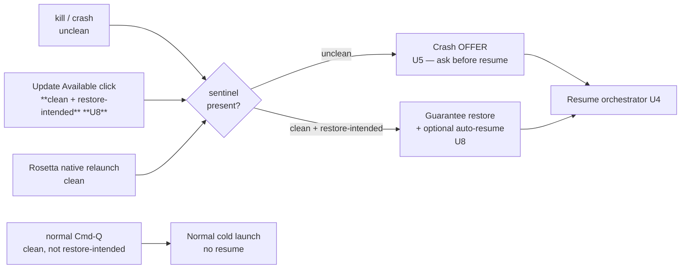

# feat: Crash recovery — "pick up where we left off" agent resume

**Target repo:** cmux (`manaflow-ai/cmux`)
**Grounded against:** official `main` @ `e4b590a` (fresh clone). File references favor path + symbol over line numbers so they survive local/official drift; verify symbols against the branch you implement on.
**Plan type:** feat · **Depth:** Deep · **Created:** 2026-06-24

---

## Summary

After cmux exits unexpectedly, it already rebuilds windows and workspaces on relaunch — including each workspace's auto-name (e.g. *"Clarify unclear connection"*), the agent's `sessionId`, and a stored resume command. What it does **not** do is help you re-enter the work: the agent process is not running, the names are cryptic, and the human no longer remembers which window was which.

This feature adds a Chrome-style **"you crashed — want to resume?"** flow plus a manual per-workspace **Resume** action. On resume, cmux re-runs the agent's own resume command (`claude --resume <id>` / Codex equivalent) so the agent reloads its real context, then delivers a short **breadcrumb prompt** anchored on the persisted workspace name (*"We were working on 'X' in this window last session — pick up where we left off."*). The agent remembers even when the human and cmux don't.

It builds entirely on existing plumbing (session snapshot, resume bindings, startup-input delivery, `sendText`). The new surface is narrow: unclean-shutdown detection, an offer modal, a manual action, a breadcrumb builder, and an opt-in setting. v1 supports **Claude Code and Codex**.

The same machinery covers a second, friendlier trigger: clicking **"Update Available"**. An update is an *intentional, clean* relaunch, but users fear it the same way they fear a crash ("I'll lose my windows"). So the update-relaunch path must guarantee a full window restore, must never be misclassified as a crash, and — because it's deliberate — can auto-resume agents and surface that promise in the UI ("Update & reload all windows").

---

## Problem Frame

From the originating discussion (X thread, 2026-06-24):

> *"The worst agentic engineering feeling in the world. What on earth was going on in these terminal windows before my computer crashed?!"*
>
> *"Claude knows what was going on in each of these windows, I just don't remember and neither does cmux. SO if I prompted with 'Hey we were working on the last30days big new release in this window from last time, can you pick up where we left off?' it would know. But I had so many things going beyond my context window I don't remember each one."*

The core insight: **the agent retains the context** (via its own session/transcript, reachable through `claude --resume <sessionId>`). The loss is on the human + cmux side — neither remembers which restored window maps to which effort. cmux already persists the one anchor that bridges this gap: the per-workspace auto-name. The feature turns that anchor into automated re-entry.

A follow-on point in the same thread extends this to deliberate restarts:

> *"I'm also terrified to click the 'Update Available' button since I never shut my machine off on purpose — I don't want to lose my windows."* → *"would be nice 'Update Available AND RELOAD ALL WINDOWS'."*

And external validation of the mechanism (André Felipe Breijão, same thread): *"What I usually do is use hooks to save every tool call and message into a SQLite database, along with metadata like the session, pane, timestamp… Then I have agents with the ability to manage those sessions. So when something crashes I ask the agent to restart the panes."* — which is essentially cmux's existing architecture already (agent hooks write session records; a local SQLite index catalogs them).

**Who is affected:** cmux power users running many concurrent agent workspaces, whose context exceeds what they can hold in their head — both when the app crashes (the thread cites VS Code / heavy-app instability as a common trigger) and when they avoid updating out of fear of losing windows.

**How state survives today (storage reality):** Two stores, two jobs. (1) A **JSON session snapshot** under `~/.local/state/cmux/` (XDG state dir; falls back to Application Support) holds window/workspace/layout state — the workspace name lives in `SessionWorkspaceSnapshot.customTitle`, which is *why the name survives a restart*. (2) A **local SQLite index** (`Sources/SessionIndexStore.swift`) catalogs agent sessions/transcripts across the machine, including reading Codex's own `~/.codex/state_5.sqlite` and Claude transcript files — this is the agent-session source-of-truth (being consolidated by #6631) that supplies the `sessionId`/transcript a resume needs. This feature *reads* both; it does not add a new store.

---

## Prior Art & Conflict Surface (open PRs)

No open PR implements this feature. But the resume/restore subsystem is **under very heavy active development** — ~60 open PRs touch resume/restore/title/session. This is both a foundation to build on and a merge-conflict hot zone. The plan consumes existing resume plumbing rather than reimplementing it, defaults the feature off, and keeps new code in additive files.

Directly adjacent / coordinate-with:

- **#6631** *Agent-session tracking: single source of truth (no title/mtime heuristics)* — establishes the SoT this feature reads for `sessionId` / resume binding. **Rebase on this; consume its API.**
- **#6487** *Add `terminal.claudeResumeMode` to auto-answer Claude Code's resume prompt* — closest neighbor; automates the Claude resume prompt. The breadcrumb-delivery mechanism (U4) should compose with, not fight, this.
- **#6741** *Pin Claude auto-resume binding to launch cwd* · **#6211** *Codex resume binding for unproven restored sessions* · **#6014** *Claude failed resume clobbering surface restore* · **#6012 / #5848** *poisoned/shell-wrapper resume commands* — all harden the exact resume-command path U4 invokes. Treat resume-command correctness as **owned by these PRs**; this feature must degrade gracefully when a binding is missing or unproven.
- **#6692** *Repair persisted session restore snapshots* — touches the snapshot this feature reads.
- **#6374** *Show workspace names in desktop notifications* — same spirit (workspace name as a recognizability signal); a precedent for surfacing `customTitle` in UX.

---

## Requirements

- **R1** — On relaunch, cmux can distinguish an unclean shutdown (crash/kill) from a clean quit.
- **R2** — After a suspected unclean shutdown, with the feature enabled, cmux presents a single launch-time offer listing the restorable workspaces by name and lets the user accept (resume all) or decline (restore-without-resume, today's behavior).
- **R3** — A manual per-workspace **Resume** action is available at any time (not only after a crash) on a restored workspace that has a resume binding.
- **R4** — "Resume" re-runs the workspace's stored agent resume command so the agent reloads its own context, for **Claude Code and Codex**.
- **R5** — After the resumed agent is ready, cmux delivers a breadcrumb prompt anchored on the workspace's persisted name, instructing the agent to pick up where it left off.
- **R6** — The breadcrumb is delivered through the existing startup-input path (it arrives as the agent's first input when the agent REPL is ready), not via a post-launch timing race.
- **R7** — The feature is opt-in via `cmux.json`, default off, with independent control of (a) the crash-gated offer and (b) breadcrumb injection.
- **R8** — When a workspace has no usable resume binding (no `sessionId`, unproven, or non-Claude/Codex agent), Resume degrades gracefully: skip that workspace, surface why, never clobber the restored surface.
- **R9** — Resume must never overwrite a user-set workspace title (`CustomTitleSource.user`) and must not interfere with existing restore correctness.
- **R10** — An update-triggered relaunch (clicking "Update Available") restores **all** windows/workspaces and is **never** classified as an unclean shutdown (no crash offer). The relaunch marks a clean, restore-intended exit so the next launch reliably restores.
- **R11** — The update affordance communicates that updating preserves windows (e.g. "Update & reload all windows"), and — because the relaunch is intentional — agents may auto-resume after an update without a separate prompt, governed by a setting.

---

## Key Technical Decisions

**KTD1 — Detect unclean shutdown with a startup sentinel + clean-quit marker.** On `applicationDidFinishLaunching`, write a sentinel file under the existing crash-storage root (`~/.local/state/cmux/...`, see `SessionPersistencePolicy+CrashStorage.swift`). On `applicationWillTerminate` (and other clean-exit paths in `AppDelegate`), remove it. If the sentinel exists at launch, the prior run did not exit cleanly. *Rationale:* cmux has crash-diagnostic storage and pruning today but no clean-vs-crash signal; a sentinel is the standard, low-risk approach and reuses the existing storage location. *Alternative rejected:* PID liveness / heartbeat watchdog — heavier, and unnecessary for a binary "did we exit cleanly" signal.

**KTD2 — Consume the existing resume binding; do not build a new resume path.** "Resume" reads the agent `sessionId` + resume command from the restored snapshot (`RestorableAgentSession.swift` — `SessionRestorableAgentSnapshot.resumeCommand` / `AgentResumeCommandBuilder` / `SurfaceResumeBindingSnapshot`) and the SoT from #6631. *Rationale:* resume-command correctness is actively owned by #6741/#6211/#6014/#6012/#5848; reimplementing it would collide and rot. This feature is an *orchestration layer* over that path.

**KTD3 — Deliver the breadcrumb via the existing startup-input mechanism, not a `sendText` race.** Set the breadcrumb as the resumed surface's startup input (`SurfaceResumeBindingSnapshot.inlineStartupInput` / `resumeStartupInput()`), so it is delivered when the agent REPL is ready. *Rationale:* re-running the resume command spawns the agent asynchronously; a naive post-launch `sendText` could land in a bare shell before the agent attaches. The startup-input path already solves "first input to a freshly launched agent." `TerminalPanel.sendText` remains the fallback for the manual-action-on-already-live-agent case. (See R6.)

**KTD4 — Breadcrumb is a pure, agent-aware string builder.** A standalone function takes `(workspaceName, agentKind)` and returns the prompt. Pure → trivially unit-testable, no UI/process coupling. Claude and Codex may get slightly different phrasing but share a template.

**KTD5 — Opt-in, default off, two independent flags.** `cmux.json` gains crash-recovery keys (e.g. `crashRecovery.offerOnUncleanShutdown` and `crashRecovery.injectBreadcrumb`) via `CmuxConfig.swift` + `CmuxSettingsJSONPathSupport.swift`. *Rationale:* this changes launch behavior and injects text into agents — both must be explicitly enabled. Default off also de-risks landing in a hot subsystem.

**KTD7 — Model the relaunch trigger explicitly; the update path is "clean + restore-intended," not a crash.** Before an update relaunch (and the Rosetta native relaunch in `Sources/App/RosettaNativeRelaunch.swift`), mark a clean exit (clears U1's sentinel) **and** record a "restore-intended" flag, so the next launch (a) does not show the crash offer (R10) and (b) is not suppressed by the explicit-open-intent / launch-args branch of `SessionRestorePolicy.shouldAttemptRestore()` — verify update relaunches reach the restore path. After restore on an update launch, optionally run the same orchestrator (U4) to auto-resume, gated by a setting (KTD5). *Rationale:* a crash and an update are the same "bring my windows back" need with opposite trust levels — crash = unclean → *offer*; update = intentional → *guarantee restore + optional auto-resume*. Both reuse one orchestrator. *Alternative rejected:* treating update relaunch like a normal cold launch — that's exactly the path users fear loses windows.

**KTD8 — Read the existing hybrid store; do not add one.** Window/name/layout from the JSON session snapshot; agent `sessionId`/transcript from the SQLite session index (`SessionIndexStore`, incl. `~/.codex/state_5.sqlite` for Codex). *Rationale:* the durable state users rely on already exists in two well-defined places (see Problem Frame); adding a third store would fragment the SoT #6631 is consolidating.

**KTD6 — Graceful degradation is a first-class path, not an error.** Missing/unproven binding, or an agent kind outside {Claude, Codex}, means "skip with a reason," never a clobber or a crash (R8). Reuses the unproven-session caution that #6211/#6014 introduce.

---

## High-Level Technical Design

Lifecycle from crash to re-entry. **Bold** = new in this plan; the rest already exists.

```mermaid
flowchart TD
    A[App launch: applicationDidFinishLaunching] --> B{Sentinel present?\n**KTD1 crash detect**}
    B -- no, clean quit --> N[Normal restore\n(existing)]
    B -- yes, unclean --> C[Load reopen snapshot\nloadReopenSessionSnapshot]
    C --> D[Rebuild windows + workspaces\nname, sessionId, cwd restored]
    D --> E{Feature enabled?\n**KTD5 settings**}
    E -- no --> N
    E -- yes --> F[**Offer modal: Restore & resume N workspaces?**\n**U5 — lists workspaces by name**]
    F -- decline --> N
    F -- accept --> G[**Resume orchestrator** **U4**]
    M[**Manual Resume action** **U6**\nsidebar menu / palette] --> G
    G --> H{Usable resume binding?\nClaude or Codex, sessionId present}
    H -- no --> X[**Skip + surface reason** **U3/KTD6**]
    H -- yes --> I[Re-run stored resume command\nclaude --resume / codex  **KTD2**]
    I --> J[**Set breadcrumb as startup input** **KTD3/U4**]
    J --> K[Agent REPL ready -> breadcrumb delivered\n'We were working on X — pick up where we left off']
    K --> L[Agent reloads its own context\n+ continues]
    A --> S[**Write sentinel**]
    Z[applicationWillTerminate / clean exit] --> Y[**Remove sentinel** -> next launch is clean]
```

Two relaunch triggers feed the same orchestrator, gated differently (U8 / KTD7):



Breadcrumb shape (U3, directional — not final copy):

```
We were working on "{workspaceName}" in this window last session.
Please review your context and pick up where we left off.
```

---

## Output Structure

New files cluster under a small additive module; the rest are edits to existing files.

```
Sources/
  CrashRecovery/
    UncleanShutdownSentinel.swift        # U1  write/clear/detect sentinel
    ResumeBreadcrumbBuilder.swift        # U3  pure (name, agentKind) -> prompt
    WorkspaceResumeOrchestrator.swift    # U4  re-run resume cmd + startup-input breadcrumb
    CrashRecoveryOfferView.swift         # U5  launch offer modal (SwiftUI)
    RelaunchIntent.swift                 # U8  clean + restore-intended marker for update/relaunch
cmuxTests/
  UncleanShutdownSentinelTests.swift     # U1
  ResumeBreadcrumbBuilderTests.swift     # U3
  WorkspaceResumeOrchestratorTests.swift # U4
  CrashRecoveryFlowTests.swift           # U7  integration
```
*The tree is a scope declaration, not a constraint — match the codebase's actual grouping (e.g. cmux-architecture package layering) if it dictates otherwise. Per-unit `Files` lists are authoritative.*

---

## Scope Boundaries

**In scope (v1):** unclean-shutdown detection; crash-gated launch offer; manual per-workspace Resume; **update/intentional-relaunch window preservation + optional auto-resume (the "Update & reload all windows" ask)**; native resume + breadcrumb for **Claude Code and Codex**; opt-in settings; graceful degradation; tests.

### Deferred to Follow-Up Work
- Agents beyond Claude Code + Codex (Amp, opencode, generic) — extend `ResumeBreadcrumbBuilder` + orchestrator agent-kind switch.
- Per-workspace preview of *what* the agent was doing (transcript summary in the offer modal) — would read agent transcript, larger surface.
- Selective resume in the modal (per-row checkboxes) — v1 offer is all-or-nothing accept/decline.
- iOS / mobile parity — this plan is macOS app lifecycle.

### Non-goals (outside this feature's identity)
- Reimplementing or "improving" resume-command construction — owned by #6741/#6211/#6014/#6012/#5848.
- Persisting additional agent state beyond what the snapshot already captures.
- Changing the auto-naming algorithm itself (the naming model is consumed as-is; see `Workspace.swift` `CustomTitleSource`).

---

## Implementation Units

### U1. Unclean-shutdown detection (sentinel + clean-quit marker)
- **Goal:** Give cmux a reliable "did the prior run exit cleanly?" signal.
- **Requirements:** R1.
- **Dependencies:** none.
- **Files:** `Sources/CrashRecovery/UncleanShutdownSentinel.swift` (new); `Sources/AppDelegate.swift` (call write on `applicationDidFinishLaunching`, clear on `applicationWillTerminate` + any other clean-exit path); `Sources/SessionPersistencePolicy+CrashStorage.swift` (reuse storage-root helper); `cmuxTests/UncleanShutdownSentinelTests.swift` (new).
- **Approach:** Small type with `markRunning()`, `markCleanExit()`, `priorRunWasUnclean() -> Bool`. Store one sentinel file under the existing crash-storage root. Writing happens early in launch (after storage is available); clearing happens on every clean-exit path. Be defensive: a missing storage dir or write failure must degrade to "treat as clean" (never block launch).
- **Patterns to follow:** existing crash-storage path construction in `SessionPersistencePolicy+CrashStorage.swift`; AppDelegate lifecycle hooks already present (`applicationWillTerminate` is used in `AppDelegate.swift`).
- **Test scenarios:**
  - Happy: `markRunning()` then fresh process sees `priorRunWasUnclean() == true`.
  - Clean exit: `markRunning()` → `markCleanExit()` → next `priorRunWasUnclean() == false`.
  - Edge: storage dir absent → `priorRunWasUnclean()` returns false and does not throw.
  - Edge: sentinel write fails (read-only dir) → launch proceeds, treated as clean.
  - Edge: two rapid launches do not leave a stale sentinel that misclassifies a clean quit.
- **Verification:** Unit tests green; manually `kill -9` the app and confirm next launch reports unclean; normal Cmd-Q reports clean.

### U2. Opt-in settings keys
- **Goal:** Gate the whole feature behind `cmux.json`, default off, with independent offer/breadcrumb flags.
- **Requirements:** R7.
- **Dependencies:** none (U5/U6 read these).
- **Files:** `Sources/CmuxConfig.swift` (add keys + defaults); `Sources/CmuxSettingsJSONPathSupport.swift` (JSON-path support so values are settable by path); settings UI registration if applicable (`Sources/SettingsNavigation.swift`); localized strings per `cmux-localization` rules.
- **Approach:** Add `crashRecovery.offerOnUncleanShutdown: Bool = false` and `crashRecovery.injectBreadcrumb: Bool = false` (names directional — match existing key style). Surface in settings if other behavior toggles are surfaced there.
- **Patterns to follow:** how `terminal.claudeResumeMode` (PR #6487) and other booleans are declared in `CmuxConfig.swift` and exposed via `CmuxSettingsJSONPathSupport.swift`.
- **Test scenarios:**
  - Default: both flags false when key absent.
  - Set via JSON path → value reads back true.
  - Malformed/wrong-type value → falls back to default, no crash.
  - `Covers R7.`
- **Verification:** Settings round-trip test green; toggling in `cmux.json` changes behavior in U5/U6.

### U3. Breadcrumb prompt builder
- **Goal:** Pure function mapping `(workspaceName, agentKind)` → resume prompt; also owns the "no usable name/binding" decision surface.
- **Requirements:** R5, R8 (reason strings).
- **Dependencies:** none.
- **Files:** `Sources/CrashRecovery/ResumeBreadcrumbBuilder.swift` (new); `cmuxTests/ResumeBreadcrumbBuilderTests.swift` (new).
- **Approach:** `func breadcrumb(workspaceName: String, agent: AgentKind) -> String`. Shared template, minor per-agent phrasing for {Claude, Codex}. No UI/process coupling. Provide a typed skip-reason enum (`.noSessionId`, `.unprovenSession`, `.unsupportedAgent`) consumed by U4/U5/U6 for graceful degradation.
- **Patterns to follow:** existing pure builders in the resume area (`AgentResumeCommandBuilder` in `RestorableAgentSession.swift`) for style and agent-kind switching.
- **Test scenarios:**
  - Happy: a normal name produces a prompt containing the name verbatim and a "pick up where we left off" instruction.
  - Claude vs Codex produce their respective phrasings.
  - Edge: empty/whitespace name → generic fallback prompt with no dangling quotes.
  - Edge: name with quotes/newlines is sanitized so it can't break the injected input.
  - `Covers R5.`
- **Verification:** Unit tests green; snapshot the produced strings for review.

### U4. Resume orchestrator (native resume + breadcrumb via startup input)
- **Goal:** For one workspace, re-run the stored agent resume command and deliver the breadcrumb as startup input; the heart of the feature.
- **Requirements:** R4, R5, R6, R8, R9.
- **Dependencies:** U3 (builder + skip reasons).
- **Files:** `Sources/CrashRecovery/WorkspaceResumeOrchestrator.swift` (new); reads `Sources/RestorableAgentSession.swift` (`SessionRestorableAgentSnapshot.resumeCommand`, `SurfaceResumeBindingSnapshot.inlineStartupInput` / `resumeStartupInput()`) and #6631 SoT; uses `Sources/Panels/TerminalPanel.swift` (`sendText`) as the live-agent fallback; `cmuxTests/WorkspaceResumeOrchestratorTests.swift` (new).
- **Approach:** Resolve the workspace's resume binding + `sessionId` + `agentKind`. If usable (Claude/Codex, proven session): set the breadcrumb (U3) as the surface's startup input (KTD3), then trigger the existing resume launch so the agent attaches and consumes it. If the agent is already live (manual action on a running surface), fall back to `TerminalPanel.sendText`. If not usable, return a skip-reason — never clobber the restored surface (R9, KTD6). Must respect `CustomTitleSource.user` (do not rename).
- **Patterns to follow:** how restore today wires `resumeCommand` → terminal and how `inlineStartupInput` is delivered (`RestorableAgentSession.swift`); compose with `terminal.claudeResumeMode` (#6487) rather than duplicating its prompt-answering.
- **Test scenarios:**
  - Happy (Claude): proven session → resume command issued + breadcrumb queued as startup input; assert breadcrumb text and that it is *startup input*, not a racing `sendText`.
  - Happy (Codex): proven Codex session → Codex resume path issued + breadcrumb queued. `Covers R4.`
  - Edge: missing `sessionId` → returns `.noSessionId`, no command issued, surface untouched. `Covers R8.`
  - Edge: unproven restored session (per #6211/#6014) → `.unprovenSession`, no clobber.
  - Edge: unsupported agent kind → `.unsupportedAgent`, skipped.
  - Edge: workspace title is `.user`-sourced → resume runs, title untouched. `Covers R9.`
  - Integration: orchestrator over a fixture workspace results in startup input delivered exactly once (no double-send when both auto-offer and manual fire).
- **Verification:** Unit + fixture tests green; on a real crashed-then-restored Claude workspace, accepting Resume reloads the agent and the breadcrumb appears as its first input.
- **Execution note:** Implement the orchestrator test-first around the skip-reason matrix — the degradation paths (R8) are where this most likely regresses against the in-flight resume PRs.

### U5. Crash-gated launch offer modal
- **Goal:** Chrome-style "Restore & resume N workspaces?" on launch after an unclean shutdown.
- **Requirements:** R2, R7.
- **Dependencies:** U1 (signal), U2 (setting), U4 (action).
- **Files:** `Sources/CrashRecovery/CrashRecoveryOfferView.swift` (new SwiftUI); `Sources/AppDelegate.swift` (gate after restore in the bootstrap path — `scheduleInitialMainWindowBootstrap` / initial-window bootstrap); localized strings.
- **Approach:** After windows/workspaces are restored, if `priorRunWasUnclean()` (U1) AND `crashRecovery.offerOnUncleanShutdown` (U2), present one modal listing restorable workspaces by `customTitle`. Accept → run U4 across all usable workspaces (respect `injectBreadcrumb` flag for the breadcrumb step); decline → leave today's restore-without-resume behavior untouched. Show count of skipped/unsupported workspaces (U3 reasons). Present at most once per launch.
- **Patterns to follow:** existing launch-bootstrap sequencing in `AppDelegate.swift`; `#6374`'s use of `customTitle` for human-facing recognizability; existing modal/alert presentation in the app.
- **Test scenarios:**
  - Happy: unclean + enabled → modal lists N names; accept invokes U4 for each usable workspace.
  - Gate: clean shutdown → no modal. `Covers R2.`
  - Gate: unclean but setting off → no modal.
  - Decline → no resume issued; restored workspaces remain as today.
  - Mixed: 3 workspaces, 1 unsupported → modal/accept resumes 2, reports 1 skipped.
  - Edge: zero restorable workspaces → no modal.
- **Verification:** Tests green for the gating matrix; manual `kill -9` with feature on shows the offer once; clean quit shows nothing.

### U6. Manual per-workspace Resume action
- **Goal:** On-demand "pick up where we left off" for a single restored workspace, independent of crash detection.
- **Requirements:** R3, R8.
- **Dependencies:** U4.
- **Files:** sidebar row context menu (workspace row view under `Sources/`), Command Palette entry, optionally a socket/CLI verb consistent with `cmux-socket-policy`; localized strings.
- **Approach:** Add "Resume where we left off" to the workspace context menu + Command Palette, enabled only when a usable resume binding exists (else hidden/disabled with a tooltip reason from U3). Invokes U4 for that workspace. Per `cmux-socket-policy`, any socket verb must not steal focus.
- **Patterns to follow:** `cmux-shared-behavior` — wire the single orchestrator action through menu + palette (+ socket) so all entrypoints share one code path; `#6527` inline-rename row actions for the sidebar menu insertion point.
- **Test scenarios:**
  - Happy: action on a workspace with a proven Claude session invokes U4. `Covers R3.`
  - Disabled: workspace with no binding → action hidden/disabled with reason. `Covers R8.`
  - Parity: menu and palette invocations hit the same orchestrator path (shared-behavior).
  - Edge: invoking on an already-resumed/live agent uses the `sendText` fallback, not a second resume launch.
- **Verification:** Tests green; manually triggering from menu and palette both reload the agent and deliver the breadcrumb.

### U7. Integration tests for the end-to-end flow
- **Goal:** Prove detect → offer/manual → orchestrate → breadcrumb across realistic fixtures, including degradation.
- **Requirements:** R1–R9 (integration coverage).
- **Dependencies:** U1–U6.
- **Files:** `cmuxTests/CrashRecoveryFlowTests.swift` (new); reuse fixtures/patterns from `SessionPersistenceResumeBindingTests.swift`, `TabManagerSessionSnapshotTests.swift`, `WorkspaceTitleProvenanceTests.swift`.
- **Approach:** Drive from a restored `AppSessionSnapshot` fixture with mixed agents (Claude proven, Codex proven, one without sessionId, one user-titled). Assert: sentinel gating, modal contents (names), accept → correct set resumed, breadcrumb delivered as startup input once per workspace, skip reasons surfaced, user titles untouched.
- **Patterns to follow:** Swift Testing conventions per `cmux-testing`; existing session-snapshot test fixtures.
- **Test scenarios:**
  - Full accept path over mixed fixture → exactly the 2 proven agents resumed, 1 skipped (no sessionId), user-titled workspace title unchanged. `Covers R2, R4, R8, R9.`
  - Clean-shutdown fixture → no offer, no resume. `Covers R1.`
  - Breadcrumb disabled (setting) but offer enabled → resume command runs, no breadcrumb. `Covers R7.`
  - Idempotency: re-running does not double-deliver the breadcrumb. `Covers R6.`
- **Verification:** Full suite green via the repo's test path (local `xcodebuild ... test` or the documented VM per CONTRIBUTING.md). Validate Debug + Release per CONTRIBUTING.
- **Wiring note (all new test files, U1/U3/U4/U7/U8):** every new `cmuxTests/*.swift` must be added to `cmux.xcodeproj/project.pbxproj` (PBXFileReference + Sources build phase), or Xcode silently runs "0 tests" and CI looks green while covering nothing (see cmux `CLAUDE.md` pitfall + `scripts/lint-pbxproj-test-wiring.sh`). Follow the two-commit red/green regression policy.

### U8. Update / intentional-relaunch window preservation ("Update & reload all windows")
- **Goal:** Guarantee that clicking "Update Available" (Sparkle) and other intentional relaunches restore all windows, never trigger the crash offer, and can auto-resume agents — turning the feared update button into a safe, legible action.
- **Requirements:** R10, R11.
- **Dependencies:** U1 (sentinel), U2 (settings), U4 (orchestrator), U5 (offer reuse, optional).
- **Files:** `Sources/CrashRecovery/RelaunchIntent.swift` (new — clean + restore-intended marker); the Sparkle updater delegate hook (`SPUUpdaterDelegate.updaterWillRelaunchApplication` / equivalent, wired where Sparkle is configured — search `Sparkle`/`SPUUpdater` in `Sources/`); `Sources/App/RosettaNativeRelaunch.swift` (mark intent before the native relaunch); `Sources/SessionPersistence.swift` (`SessionRestorePolicy.shouldAttemptRestore` — ensure the update relaunch is not suppressed by the explicit-open-intent / launch-args branch); the update affordance view (relabel/confirm); `cmuxTests/RelaunchIntentTests.swift` (new); localized strings for the new affordance copy.
- **Approach:** Define an explicit relaunch intent: before a Sparkle update relaunch or Rosetta native relaunch, call `markCleanExit()` (U1) **and** persist a "restore-intended" flag (KTD7). On the next launch, restore-intended → bypass the crash offer (U5), force the restore path (don't let launch args suppress it), and, if `crashRecovery.autoResumeAfterUpdate` (U2) is on, run the orchestrator (U4) automatically; otherwise restore windows silently (today's expectation, made reliable). UX: augment the update affordance to communicate preservation (e.g. "Update & reload all windows") per R11 — minimal, localized.
- **Patterns to follow:** existing Sparkle configuration + relaunch handling; `RosettaNativeRelaunch.swift` for the "mark before relaunch" shape; `cmux-shared-behavior` (one intent path consumed by both Sparkle and Rosetta relaunch); #6667 (update-relaunch path hardening) for where update relaunch logic lives.
- **Test scenarios:**
  - Update relaunch: intent marked → next launch restores all windows AND shows no crash offer. `Covers R10.`
  - Update relaunch with `autoResumeAfterUpdate` on → orchestrator runs for usable workspaces post-restore. `Covers R11.`
  - Update relaunch with auto-resume off → windows restored, agents not resumed (no surprise injection).
  - Restore-intent is NOT misread as crash, and a real crash is NOT misread as restore-intended (the two markers are independent). `Covers R10, R1.`
  - Edge: `shouldAttemptRestore` would otherwise return false due to launch args, but restore-intent forces restore.
  - Edge: relaunch marker is single-use (cleared after the launch consumes it) so a later real crash still classifies correctly.
- **Verification:** Unit tests green; manual: trigger a Sparkle update (or simulate the relaunch hook) and confirm windows return with no crash prompt; `kill -9` still shows the crash offer. Confirm the affordance copy is localized (Japanese entry present).
- **Execution note:** Characterize the current update-relaunch + `shouldAttemptRestore` behavior with a test before changing it — the launch-args suppression interaction is the subtle part and is adjacent to #6667.

---

## Risks & Dependencies

- **Hot subsystem / merge conflicts (high).** Resume/restore has ~60 open PRs. *Mitigation:* keep new logic in additive `Sources/CrashRecovery/` files, consume existing resume APIs (KTD2), default off (KTD5), rebase on #6631 before implementing.
- **Resume-command correctness is not owned here (medium).** If the stored command is wrong/poisoned (the class of bugs #6012/#5848/#6741/#6211/#6014 fix), Resume re-runs a bad command. *Mitigation:* graceful degradation (R8/KTD6); treat unproven sessions as skip; do not paper over binding bugs.
- **Breadcrumb timing (medium).** Delivering before the agent REPL is ready would lose the prompt to a shell. *Mitigation:* KTD3 — use the existing startup-input path, not a `sendText` race; `sendText` only for already-live agents.
- **Input injection safety (medium).** A workspace name with control chars/newlines could break the injected input. *Mitigation:* U3 sanitizes the name; tests cover it.
- **Build/test environment (low-medium).** Swift app-host suites can hang locally; CI/VM may be the real gate. *Mitigation:* follow `cmux-testing` and CONTRIBUTING; keep U1/U3/U4 logic unit-testable without app-host where possible.
- **Dependency:** #6631 (SoT) is the cleanest substrate for reading `sessionId`/binding — prefer landing after it or coding against its API.
- **Update-relaunch restore suppression (medium, U8).** If `shouldAttemptRestore()` is suppressed by launch args on the Sparkle relaunch, windows are lost — the exact fear. *Mitigation:* restore-intent flag forces the restore path; characterize current behavior first (U8 execution note); coordinate with #6667.
- **Marker confusion (medium, U8/U1).** A bug that conflates the clean-exit marker and the restore-intent flag could misclassify a crash as an update (silent auto-resume) or vice versa. *Mitigation:* two independent markers, single-use restore-intent, explicit tests for all four combinations.
- **Silent "0 tests" (medium).** New test files not wired into `project.pbxproj` pass as green while covering nothing. *Mitigation:* wire every new test file; rely on `lint-pbxproj-test-wiring.sh`; two-commit red/green.

---

## Open Questions (resolve at implementation)

- Exact `cmux.json` key names + whether to surface in the settings UI or `cmux.json`-only for v1 (lean: define in `CmuxConfig.swift`; surface in settings only if cheap).
- Whether the manual Resume action also warrants a socket/CLI verb in v1 or defer to follow-up (depends on `cmux-socket-policy` review).
- Final breadcrumb copy + whether Codex needs materially different phrasing than Claude.
- Whether to debounce/disable Resume on a workspace whose agent is already live to avoid a redundant resume launch (likely yes; see U6 edge case).
- Whether the offer modal should remember "don't ask again" — possibly folds into the U2 settings rather than a separate pref.
- Default for `autoResumeAfterUpdate`: silently restore windows only (safest, matches "don't lose my windows") vs auto-resume agents on update (most magical). Lean: restore-only by default, auto-resume opt-in.
- Exact update-affordance treatment: relabel the button to "Update & reload all windows", a reassurance subtitle, or a one-time confirmation — pick the least intrusive that removes the fear.
- Whether to also restore-and-resume across an OS reboot / cold start (not just in-app relaunch), or keep v1 to app-lifecycle relaunches.

---

## Sources & Research

- Originating X thread (2026-06-24): the crash screenshot + *"Claude knows what was going on… I just don't remember and neither does cmux"* framing.
- Codebase recon against official `main` @ `e4b590a`: `Sources/SessionPersistence.swift` (snapshot model: `AppSessionSnapshot`, `SessionWorkspaceSnapshot.customTitle/customTitleSource`, `SurfaceResumeBindingSnapshot.inlineStartupInput`), `Sources/RestorableAgentSession.swift` (`SessionRestorableAgentSnapshot.resumeCommand`, `AgentResumeCommandBuilder`, `resumeStartupInput()`), `Sources/AppDelegate.swift` (launch/bootstrap + terminate hooks), `Sources/SessionPersistencePolicy+CrashStorage.swift` + `Sources/AppDelegate+CrashSessionSnapshotRemoval.swift` (crash storage/pruning — but no clean/crash signal), `Sources/Panels/TerminalPanel.swift` (`sendText`), `Sources/TerminalController+ControlSurfaceContext3.swift` (`controlSurfaceSendText`), `Sources/Workspace.swift` (`CustomTitleSource`), `Sources/CmuxConfig.swift` + `Sources/CmuxSettingsJSONPathSupport.swift` (settings). Existing tests: `SessionPersistenceResumeBindingTests.swift`, `TabManagerSessionSnapshotTests.swift`, `WorkspaceTitleProvenanceTests.swift`.
- Open-PR scan (`manaflow-ai/cmux`, open): adjacency/conflict set above — #6631, #6487, #6741, #6211, #6014, #6012, #5848, #6692, #6374; plus #6667 (avoid synchronous process scans before update relaunch) for the update-relaunch path (U8).
- Storage backend confirmed in-repo: JSON session snapshot under `~/.local/state/cmux/` (`cmux-session-scrollback`, `cmux-surface-resume`, `cmux-session-terminal-command` directories) carries `customTitle`; SQLite `Sources/SessionIndexStore.swift` (and `SessionIndexStore+CodexSQL.swift`) catalogs agent sessions/transcripts incl. Codex `~/.codex/state_5.sqlite`. Update relaunch is **Sparkle** auto-update (cmux `CLAUDE.md` Release section; build-number bump required); intentional native relaunch path in `Sources/App/RosettaNativeRelaunch.swift`.
- External validation (X thread, 2026-06-24): André Felipe Breijão's "hooks → SQLite (session/pane/timestamp) → agent restarts panes" pattern mirrors cmux's existing agent-hook + session-index substrate.
- cmux contributor constraints applied: localization audit + `Resources/Localizable.xcstrings` (EN+JA) for all new UI copy (U2/U5/U6/U8); two-commit red/green regression policy; `project.pbxproj` test wiring; tagged `reload.sh` builds; `cmux-shared-behavior` / `cmux-socket-policy` / `cmux-testing` skills.
